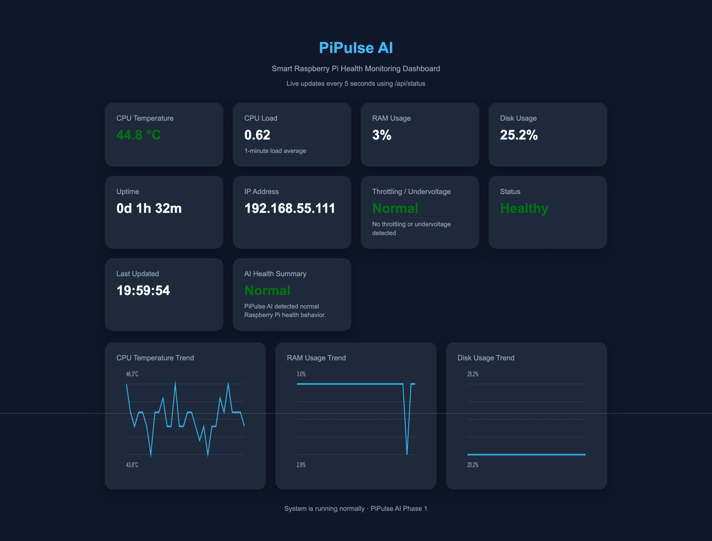

s
# PiPulse AI: A Smart Raspberry Pi Health Monitor with Dashboard and API

Recently, I built **PiPulse AI**, a lightweight Raspberry Pi health monitoring utility designed to make device
monitoring simple, practical, and accessible from anywhere on the local network.

The idea came from a simple problem: when running projects on a Raspberry Pi, especially backend services, IoT apps,
dashboards, or AI experiments, I wanted a clean way to understand how the Pi was performing without repeatedly logging
into the terminal and running commands manually.

So I created PiPulse AI as a small but useful monitoring layer for Raspberry Pi.

It runs on the Pi, collects important system health information, exposes it through APIs, and also hosts a simple
browser-based dashboard where the data can be viewed visually.

## Why I Built PiPulse AI

Raspberry Pi is extremely useful for home servers, IoT projects, automation, dashboards, and edge computing experiments.
But once the Pi is running continuously, it becomes important to monitor its health.

I wanted to quickly answer questions like:

* Is my Raspberry Pi overheating?
* How much CPU and memory is being used?
* Is the disk getting full?
* How long has the Pi been running?
* Are my services stable?
* Can I check the health status from my Mac or phone browser?

Instead of manually checking these values using terminal commands every time, I wanted a simple utility app that keeps
running in the background and gives me the required information through a clean dashboard and API.

That is where PiPulse AI started.

## What PiPulse AI Does

PiPulse AI is designed as a small monitoring service for Raspberry Pi. Once it is installed and started, it can keep
running on the Pi and provide system health information whenever needed.

At a high level, it provides:

* A web dashboard hosted directly from the Raspberry Pi
* REST APIs to access system health data
* CPU temperature monitoring
* CPU usage tracking
* Memory usage information
* Disk usage information
* System uptime details
* Health status indicators
* Graph-friendly response format
* Background service support so it can start automatically when the Raspberry Pi boots

The main goal is to make the Raspberry Pi easier to observe and manage.

## Dashboard for Quick Monitoring

PiPulse AI includes a simple frontend dashboard that can be opened from a browser.

For example, if the Raspberry Pi is connected to the local network, I can open the dashboard from my Mac using the Pi’s
IP address.

The dashboard gives a quick view of the device health without needing to SSH into the Pi every time.

This is especially useful when the Pi is running continuously as a home server, IoT device, or local backend machine.

The dashboard can show useful system information such as:

* CPU temperature
* CPU load
* RAM usage
* Storage usage
* Uptime
* Service status
* Overall health condition

The purpose is not to make it overly complex. I wanted it to be clean, practical, and easy to understand.

## API-First Design

One of the things I wanted from the beginning was an API-first structure.

The Raspberry Pi should not only show a dashboard, but also expose the health data in a structured format so that other
applications can use it.

For example, a frontend, mobile app, automation script, or another backend service can call the API and get the system
status in JSON format.

A typical API response can include details like:

```json
{
  "status": "ok",
  "cpu_temperature": "48.2°C",
  "cpu_usage": "12%",
  "memory_usage": "42%",
  "disk_usage": "58%",
  "uptime": "2 days, 4 hours"
}
```

This makes the project flexible. The dashboard is only one way to use the data. The same data can later be used by
Android apps, automation systems, notification services, or even AI-based monitoring workflows.

## Runs as a Background Service

A useful Raspberry Pi utility should not require manual startup every time.

So PiPulse AI is designed in a way that it can run as a background service. Once configured, the service can start
automatically when the Raspberry Pi is powered on.

That means the workflow becomes simple:

1. Switch on the Raspberry Pi
2. PiPulse AI starts automatically
3. Open the dashboard from a browser
4. Check live system health
5. Use the API whenever required

This makes it feel more like a real utility tool rather than just a development script.

## Why This Is Useful

PiPulse AI can be useful for anyone who runs projects on Raspberry Pi.

For example, it can help with:

* Monitoring a Raspberry Pi home server
* Checking system health while running IoT projects
* Observing temperature during long-running workloads
* Tracking resource usage while testing backend applications
* Keeping an eye on the Pi when it is used as an always-on device
* Building a foundation for future smart alerts and AI-based health analysis

For me, it also fits well with my interest in Android, backend development, IoT, Raspberry Pi, and local AI projects.

It is a small project, but it has a strong practical use case.

## Tech Stack

PiPulse AI is built using a simple and lightweight stack.

The backend handles system monitoring and exposes APIs. The frontend is served from the Raspberry Pi itself, so there is
no need for a separate hosting platform.

A typical stack for this type of project includes:

* Raspberry Pi
* Python
* FastAPI or Flask
* Linux system commands
* JavaScript frontend
* REST APIs
* Systemd service
* Local network access

The focus is on keeping the project lightweight, reliable, and easy to run on Raspberry Pi hardware.

## Project Architecture

The architecture is straightforward:

```text
Browser / Frontend
        ↓
Raspberry Pi hosted dashboard
        ↓
Backend API service
        ↓
System health collector
        ↓
CPU, memory, disk, temperature, uptime data
```

This structure makes the project easy to extend.

For example, later it can support:

* Alerts when CPU temperature is high
* Email or Telegram notifications
* Historical data storage
* Graphs for long-term trends
* Android app integration
* AI-based system health summaries
* Multiple Raspberry Pi monitoring



## Future Improvements

PiPulse AI can be extended in many useful ways.

Some improvements I would like to add later include:

* Historical graphs for CPU temperature and memory usage
* Warning alerts when temperature crosses a threshold
* Low disk space notifications
* Android companion app
* Login/authentication for secure access
* Multi-device dashboard for monitoring more than one Raspberry Pi
* AI-generated health summaries
* Smart suggestions when the Pi is overheating or overloaded

The current version is a strong foundation, and the next step is to make it more intelligent and production-friendly.

## What I Learned

This project helped me connect multiple areas together:

* Raspberry Pi system monitoring
* Backend API development
* Frontend dashboard hosting
* Linux service management
* Local network deployment
* Utility-focused product thinking

It also reminded me that not every useful project needs to be huge. Sometimes a simple tool that solves a real problem
is more valuable than a complicated application.

PiPulse AI is exactly that kind of project for me.

## Final Thoughts

PiPulse AI started as a simple Raspberry Pi monitoring idea, but it has grown into a practical utility project.

It allows a Raspberry Pi to monitor itself, expose health data through APIs, and provide a dashboard that can be
accessed from another device on the same network.

For anyone running Raspberry Pi projects continuously, a tool like this can be very helpful. It gives quick visibility
into the device health and makes it easier to understand what is happening inside the Pi without always using the
terminal.

This project also gives me a strong base for future Raspberry Pi + AI + IoT experiments.

PiPulse AI is small, practical, and extensible — exactly the kind of project I enjoy building.
