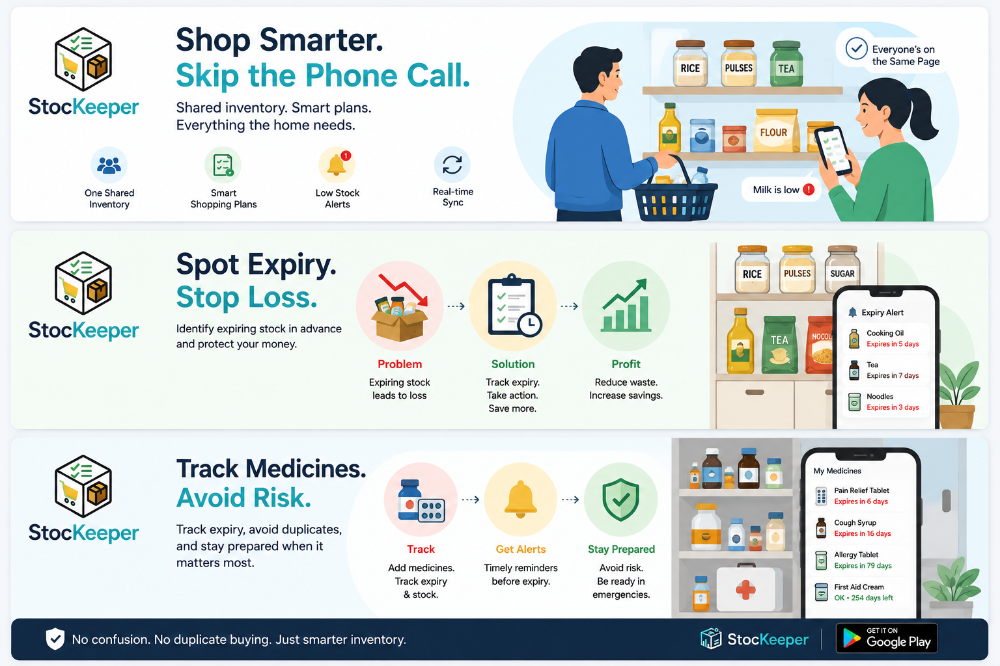
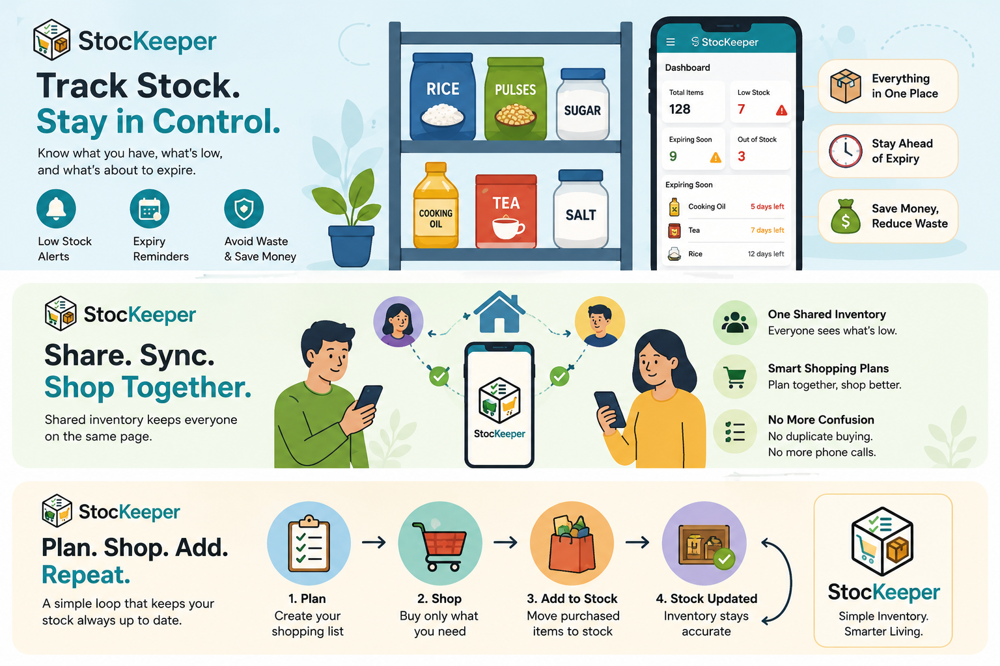
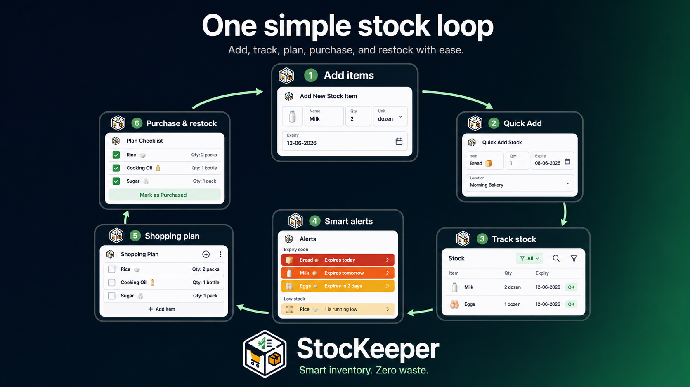

# Why I Built Stockeeper — And the Real Problems It Solves

As an Android developer, I always wanted to build and ship a complete app entirely on my own.

Not just a demo project.  
Not just something to add to my portfolio.  
Not something half-finished that only works in screenshots.

I wanted to build something **real** — something useful, practical, and reliable enough for people to use every day.

So instead of starting with a random app idea, I started by observing real life around me.

> **That is where StocKeeper began.**

---

## The idea started with a simple question

The question was simple:

> **Why is it still so difficult to know what we already have, what is running low, and what is about to expire?**

This problem exists in many places:

| Where it happens      | What usually goes wrong                          |
|-----------------------|--------------------------------------------------|
| **Small shops**       | Items expire quietly on shelves                  |
| **Homes**             | People forget what is finished or duplicated     |
| **Shared flats**      | Multiple people buy the same things accidentally |
| **Medicine cabinets** | Expiry dates are forgotten or lost               |
| **Small offices**     | Supplies run out without anyone noticing         |

At first, the idea looked simple: **build an app to track stock**.

But once I started thinking seriously about it — the database design, how items should be stored, how shopping plans should work, how shared inventory should sync, how notifications should behave, and which backend approach would make sense — I realised the problem was bigger than it looked.

I also noticed something else.

There are already inventory apps out there. Some even use similar names or solve parts of this problem. And of course, large supermarkets and big businesses already have advanced systems to manage stock, expiry, warehouses, billing, suppliers, and reporting.

But those systems are not built for everyone.

They are often complex.  
They need training.  
They may require proper business setup.  
They are designed for larger operations.  
And behind them, there are usually teams of engineers, business processes, and infrastructure keeping everything running.

That made me think differently.

> **I did not want to build a complicated enterprise system.**  
> I wanted to build something lightweight, simple, and easy to understand — something a small business owner, a family,
> a group of friends, or a small office could start using without feeling overwhelmed.

That became the direction for StocKeeper:

- A simple app
- A practical workflow
- A complete loop
- No unnecessary complexity

---

## The small business problem

Walk into any small shop and look at the back shelf.

> You will often find items that expired weeks ago — sometimes even months ago. Not because the owner was careless, but because there was no simple system to track what was bought, when it was bought, how fast it was moving, and when it would expire.

For a small business, this is not a small issue.

If a shop owner knows that an item is expiring in two weeks, they still have options. They can move it to the front, discount it, sell it faster, return it to the supplier, or make a better decision before it becomes waste.

But without that visibility, the item just sits there.

**Quietly.**

Until it becomes a loss.

Multiply that across dozens or hundreds of products, and the impact becomes serious.

> **StocKeeper gives small business owners a straightforward way to track stock, expiry dates, low-stock levels, and
item movement — so they can act early instead of discovering the damage later.**

It is not trying to replace big supermarket systems.

It is for the smaller places where a simple, fast, understandable tool can make a real difference.

---

## The household problem — the phone call nobody wants to make

This happens in almost every home.

Someone steps out to the shop and calls back:

> **“What do we need? What’s finished?”**

Then the person at home starts walking around — checking the fridge, pantry, medicine box, kitchen shelves, bathroom supplies, and storage areas — trying to remember what is low and what needs to be bought.

It works sometimes.

But things still get missed.

And if you live with friends, family, or flatmates, it becomes even more confusing. One person buys something without knowing someone else already bought it. Someone forgets to update the list. Another person goes to a different shop. Suddenly, shopping becomes a guessing game.

That is one of the problems I wanted StocKeeper to solve.

> **With shared inventory, everyone can see the same stock.**  
> The person at the shop does not need to call home. They can simply open the app and see what is low, what is finished,
> what is expiring soon, and what is already planned.

The shopping plan also helps when multiple people are involved. Items can be organised by shop, so one person can go to the supermarket while another handles the pharmacy or household supplies. Each person gets a clear list.

**No confusion.**  
**No duplicate buying.**  
**No stepping on each other’s work.**

And once you have shopped at a store before, the app remembers those patterns. Next time, you can quickly tick what you need, adjust quantities, and build your shopping plan much faster.

> The first trip takes effort.  
> The next one becomes easier.  
> That is exactly how the app is designed to work.

---

## The medicine cabinet nobody understands

Most homes have a medicine drawer, box, or cabinet.

Inside, there are tablets, strips, syrups, creams, ointments, and first-aid items. But very often, nobody really knows when they were bought, whether they are still safe to use, or whether the same medicine already exists somewhere else in the house.

The problem is even worse with expiry dates.

> **Expiry and manufacturing dates are often printed on the outer packaging. Once the strip is removed, the box is
thrown away, or the packaging is torn, that information can disappear.**

If you buy individual strips from a pharmacy, you may not even have the full packaging in the first place.

So when someone needs medicine urgently — maybe during a fever at midnight — they are left guessing:

- Is this still good?
- Did we already buy this?
- Is there another strip somewhere?
- Did this expire months ago?

That is not a good situation.

People may end up buying the same medicine twice. Or worse, they may use something that has already expired without realising it.

> **StocKeeper helps by letting you log medicines with purchase dates, expiry dates, quantities, and alerts.**  
> When something is close to expiry, the app can remind you before it becomes a risk.

That means you can use it in time, replace it when needed, or safely clear it out.

For me, this was not just an inventory feature. It was a real household safety problem worth solving.

---

## Useful beyond homes and shops

The more I thought about the problem, the more I realised it is not limited to just groceries or small shops.

| Use case                 | What StocKeeper can help track                                                                |
|--------------------------|-----------------------------------------------------------------------------------------------|
| **Small office**         | Stationery, cleaning supplies, printer items, pantry stock, cables, tools, basic equipment    |
| **Shared accommodation** | Kitchen items, medicines, household supplies, cleaning products                               |
| **Small business**       | Fast-moving goods, slow-moving items, stock value, expiry dates, shopping or restocking plans |
| **Personal use**         | What you already have before buying more                                                      |

That is why I designed StocKeeper to be flexible. It is not locked to one category. You can use it for groceries, medicines, household items, office supplies, or almost any stock you want to organise.

The goal was not to make the app complicated.

> **The goal was to make the same simple workflow useful in multiple real-life situations.**

---

## Why I kept it simple

One of the biggest product decisions I made was to keep StocKeeper simple.

When you build an inventory app, it is easy to keep adding things:

- Advanced reports
- Complex business logic
- Supplier management
- Invoices
- Barcode workflows
- Multiple warehouse rules
- Deep analytics
- Enterprise-style controls

All of that can be useful in the right context.

But that was not the product I wanted to build first.

> **I wanted StocKeeper to feel light.**

The core workflow is intentionally simple:

1. Open the app
2. Add your stock
3. Set quantity, expiry, and low-stock level
4. Get notified
5. Create a plan
6. Shop
7. Add purchased items back into stock

I wanted a small business owner to understand it quickly. I wanted a family member to use it without training. I wanted a shared flat to coordinate without needing a spreadsheet. I wanted someone managing medicines at home to feel more prepared.

So I focused on making the app clean, catchy, and practical instead of overloaded.

> **Simple does not mean basic.**  
> **Simple means the user can actually use it.**

---

## What StocKeeper actually does

At its core, StocKeeper is a simple inventory management app for individuals, families, shared spaces, small offices,
and small businesses.

It helps you track groceries, medicines, household supplies, office items, business stock, and daily essentials in one
organised place. Instead of guessing what is available, what is running low, or what is about to expire, you get a clear
view of your stock whenever you need it.

The app is built around a practical everyday workflow:

| Feature                    | What it helps with                               |
|----------------------------|--------------------------------------------------|
| **Stock management**       | Add and update stock items                       |
| **Quantity tracking**      | Know how much you have left                      |
| **Expiry tracking**        | Act before items expire                          |
| **Low-stock alerts**       | Avoid running out of important items             |
| **Shopping plans**         | Plan what to buy before shopping                 |
| **Checklist items**        | Tick off items while shopping                    |
| **Move to stock**          | Add purchased items directly back into inventory |
| **Quick Add**              | Re-add frequently used items faster              |
| **Shared group inventory** | Keep family, flatmates, or small teams aligned   |
| **Secure sync**            | Keep data backed up and synced securely          |

This is what connects the app together. It is not just a list of items. It is a complete flow from stock tracking to
alerts, planning, shopping, and updating inventory again.

---

## The only hard day is the first day

I want to be honest about one thing.

> **Setting up an inventory app takes effort.**

On day one, you have to add your existing stock. You need to enter your groceries, medicines, household items, quantities, expiry dates, and low-stock levels. That takes patience.

But the app is built so that this effort does not repeat forever.

After the first setup, StocKeeper starts working with you.

Quick Add helps you re-add frequently used items from your history. Shopping plans remember useful details like shop, item, and quantity. Purchased items can be moved back into stock. Shared inventory keeps everyone aligned.

So the first day may feel like setup.

> **But after that, the app becomes lighter, faster, and more useful with every use.**

In upcoming updates, I also want to make this first-day setup even easier. One idea is to add presets or common item suggestions, so users can quickly add generic everyday items and edit them instead of typing everything from scratch.

For example, someone could quickly add common grocery, medicine, household, or office items from a predefined list, then customise the quantity, expiry date, shop, or category based on their actual use.

That would make onboarding faster and help users reach the useful part of the app sooner.

---

## The loop I wanted to close

While building StocKeeper, I kept coming back to one simple cycle:

> **Stock → Alerts → Plan → Shop → Add to Stock → Back to Stock.**

That loop became the heart of the app.

| Step              | What happens                                     |
|-------------------|--------------------------------------------------|
| **Stock**         | You start with what you already have             |
| **Alerts**        | The app helps you notice what is low or expiring |
| **Plan**          | You create a shopping plan                       |
| **Shop**          | You buy what you need                            |
| **Add to Stock**  | You add purchased items back into stock          |
| **Back to Stock** | Your inventory is updated again                  |

And the cycle continues.

That sounds simple, but it is the part many tools do not complete properly. Some apps help you make a list. Some help you track items. Some remind you about expiry. But if these steps are disconnected, the user still has to manage the real workflow manually.

I wanted StocKeeper to connect the full journey.

**Not just stock tracking.**  
**Not just shopping lists.**  
**Not just reminders.**

> **The complete loop.**  
> Everything in one place. Everything connected. Simple enough to use every day.

That was the product philosophy.

And now, that loop works.

---

## Building, pausing, returning, and finishing

This app was not built in one straight line.

There were moments where I worked on it almost every day, spending a lot of time thinking through the database structure, the user flow, Firebase integration, local storage, group inventory, shopping plans, notifications, and how the screens should connect.

There were also breaks.

Like many personal projects, it would have been easy to stop halfway. Especially after seeing that other apps existed in the same space, I had that thought:

> **Am I building something that already exists?**

But then I came back to the original reason.

I was not trying to build the biggest inventory system.

I was trying to build my version of a simple, complete, practical stock management app — one that solves the everyday loop clearly and works for real users.

So I continued.

I refined the app.  
I completed the main features.  
I worked through the release process.  
I prepared it for the Play Store.  
I finished it properly.

The Play Store release process itself was a learning experience — preparing the app, testing it, handling release requirements, writing store content, checking versions, and finally seeing the app published.

That part mattered to me because shipping is different from building.

> **A project on your local machine is one thing.**  
> **A published app people can install is another.**

StocKeeper helped me experience the full journey.

---

## What I wanted to prove to myself

Beyond the app itself, I wanted to prove something to myself.

I wanted to prove that I could take a real problem I noticed in everyday life and turn it into a complete, published product.

From idea to design.  
From architecture to implementation.  
From local testing to production release.  
From an empty project to something people can actually install and use.

I built StocKeeper using **Kotlin, Jetpack Compose, Room, Firebase, MVVM, Material 3, and modern Android development
practices**.

But more than the tech stack, what matters to me is that it is finished.

It is not a half-built prototype.  
It is not just a GitHub experiment.  
It is not just an interview talking point.

> **It is a real app, built with real use cases in mind.**

StocKeeper is my way of solving a small but common everyday problem — for homes, shared spaces, small offices, and small businesses.

And for me personally, it is proof that I can build, complete, and ship something meaningful on my own.

---

## What comes next

StocKeeper is live, but I do not see it as finished forever.

I see it as a product that can improve based on real feedback.

Some ideas I am already thinking about include faster first-day setup, common item presets, better shop suggestions, smoother Quick Add flows, and more helpful insights without making the app heavy or complicated.

The goal will stay the same:

> **Keep it simple.**  
> **Keep it useful.**  
> **Keep the full loop connected.**

If you try StocKeeper and feel something is missing — a feature, a flow, a shortcut, or a better way to manage a certain type of stock — I would genuinely like to hear it.

That feedback can help shape the next version.

[Play Store link](https://play.google.com/store/apps/details?id=com.vishnu.stockeeper)
