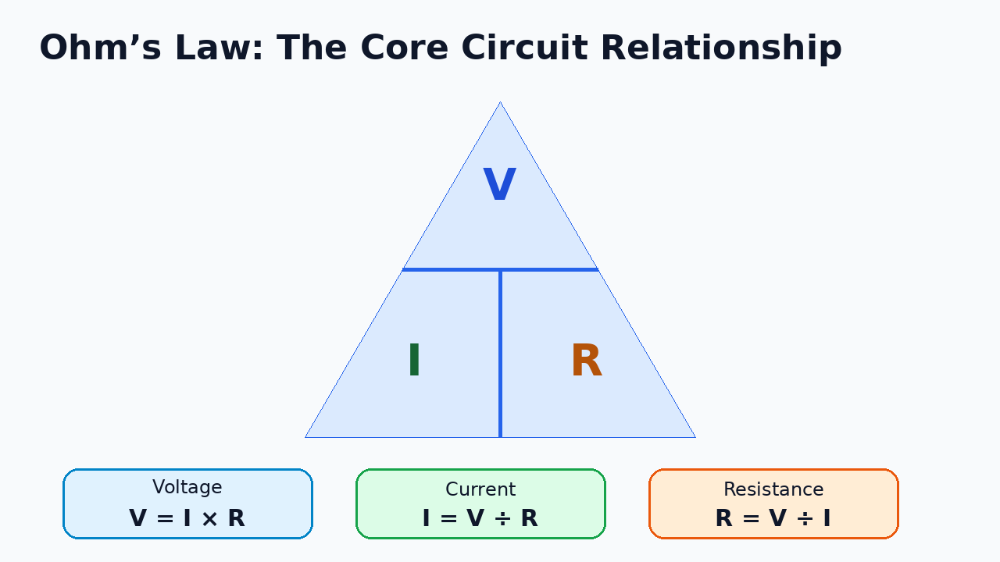
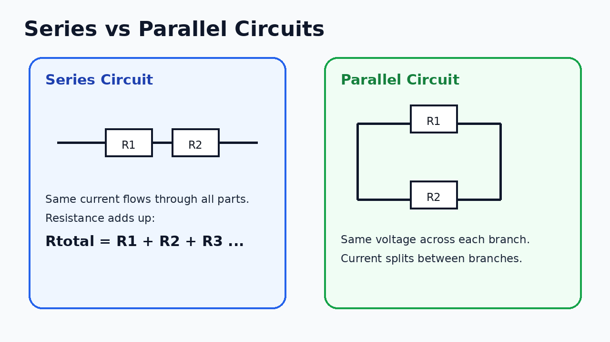
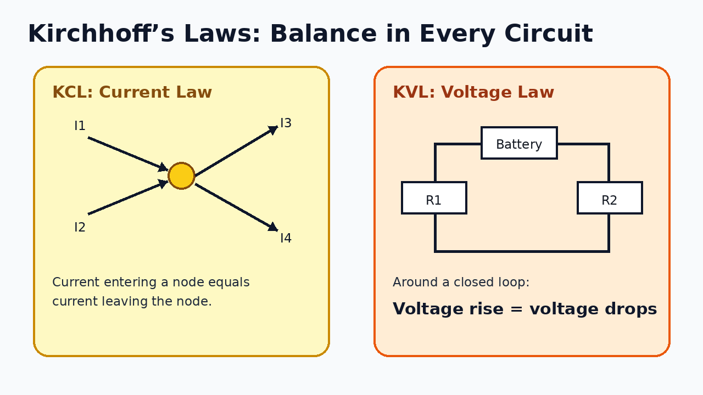
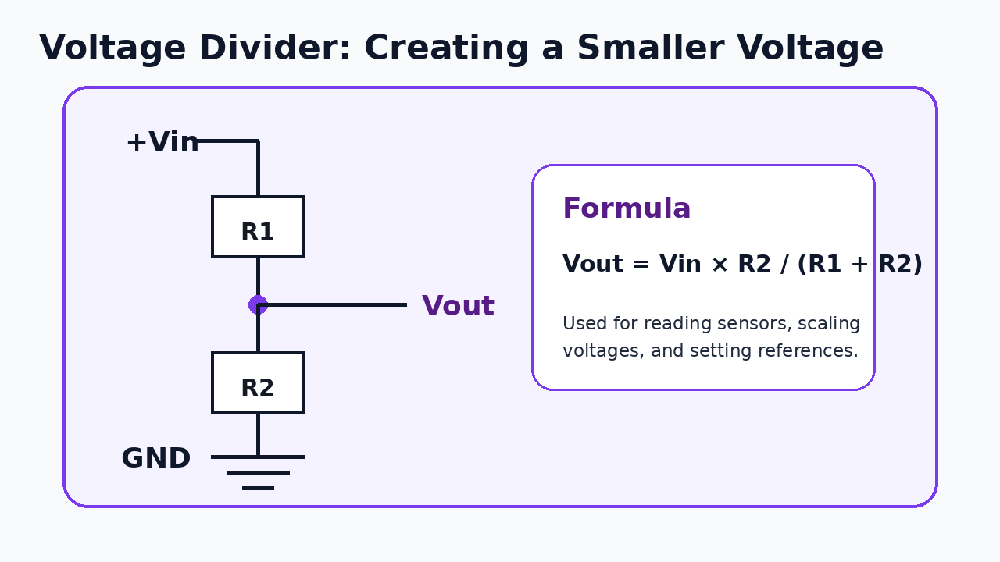
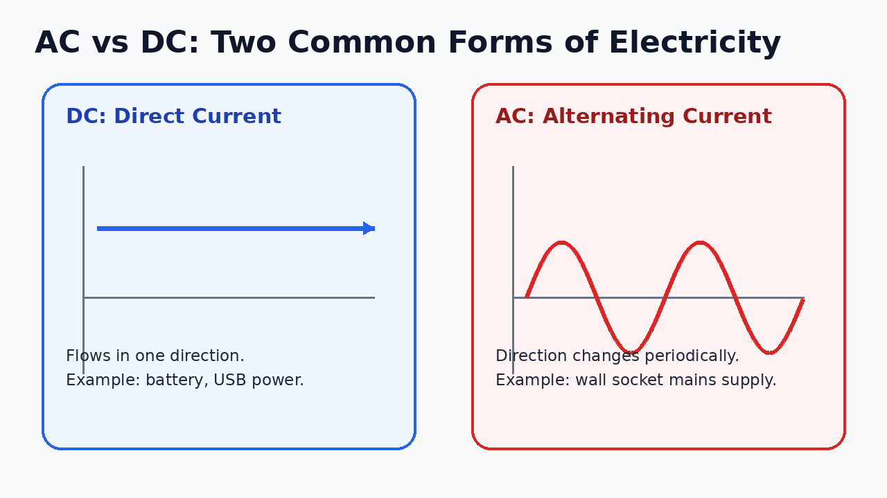

# Basic Electronics Every ECE & IoT Student Must Understand

Many students study **Electronics and Communication Engineering (ECE)**, **Internet of Things (IoT)**, embedded systems,
robotics, or automation, but still feel confused when they look at a real circuit.

They may know theory from college, but when someone asks:

- Why do we use a resistor?
- What is voltage actually?
- Why does current flow?
- What is the difference between series and parallel?
- Why do we need ground?
- Why does a short circuit damage a board?
- Why does a sensor need 3.3V or 5V?
- How do we debug a circuit with a multimeter?

They suddenly lose confidence.

This blog is written to solve that problem.

The goal is not to make you an expert analog electronics designer in one day. The goal is to help you build a **strong
practical foundation** so that you can understand, build, test, and debug basic electronic circuits confidently.

---

## 1. Why basic electronics still matters

If you are an ECE, IoT, embedded systems, robotics, or automation student, electronics is your base layer.

Even if you later become a software developer, firmware engineer, IoT cloud engineer, product support engineer, or
automation engineer, you will still work with systems that depend on electrical signals.

A basic IoT system looks like this:

```text
Sensor → Microcontroller → Communication Module → Cloud / App / Dashboard
```

But before the microcontroller reads anything, the sensor must be powered correctly. The signal must be stable. The
ground must be common. The voltage level must be safe. The circuit must not draw too much current.

That is why basic electronics is not optional. It is the foundation.

---

## 2. The three core quantities: voltage, current, and resistance

Almost every basic circuit starts with these three terms:

| Concept    | Symbol |   Unit | Simple meaning                              |
|------------|-------:|-------:|---------------------------------------------|
| Voltage    |      V |   Volt | Electrical pressure or potential difference |
| Current    |      I | Ampere | Flow of electric charge                     |
| Resistance |      R |    Ohm | Opposition to current flow                  |

A simple analogy is water flowing through a pipe:

| Electrical circuit | Water analogy                   |
|--------------------|---------------------------------|
| Voltage            | Water pressure                  |
| Current            | Water flow                      |
| Resistance         | Narrowness/blockage in the pipe |

This analogy is not perfect, but it is useful for beginners.

If voltage is high, it can push more current.  
If resistance is high, it reduces current.  
If resistance is low, more current can flow.

---

## 3. Voltage: the electrical push

**Voltage** is the potential difference between two points.

A battery does not simply “contain current.” Instead, it provides a voltage difference between its positive and negative
terminals.

For example:

- AA battery: around 1.5V
- USB power: usually 5V
- Arduino Uno logic: usually 5V
- ESP32 logic: usually 3.3V
- Car battery: around 12V
- Home mains supply: much higher AC voltage, depending on the country

In circuits, voltage is always measured **between two points**.

You do not just say “the voltage is 5V” without context. You usually mean:

> This point is 5V with respect to ground.

That is why ground is important.

---

## 4. Current: the actual flow

**Current** is the flow of electric charge.

Current is measured in amperes:

- 1 A = one ampere
- 1 mA = one milliampere = 0.001 A
- 1 µA = one microampere = 0.000001 A

In electronics, many circuits use small currents:

| Device/component      | Typical current idea        |
|-----------------------|-----------------------------|
| Small LED             | 5 mA to 20 mA               |
| Sensor module         | few mA to tens of mA        |
| Microcontroller board | tens to hundreds of mA      |
| Motor                 | hundreds of mA to several A |
| Relay module          | tens of mA for coil/control |

A common beginner mistake is to power motors, relays, or many modules directly from a microcontroller pin. This can
damage the board because GPIO pins can provide only limited current.

---

## 5. Resistance: controlling current

**Resistance** limits current flow.

Resistors are used to:

- Protect LEDs
- Create voltage dividers
- Pull signals up or down
- Limit current
- Set biasing conditions
- Create timing circuits with capacitors
- Provide safe signal paths

The unit of resistance is ohm, written as Ω.

Common values:

| Value | Meaning                                 |
|------:|-----------------------------------------|
|  220Ω | Often used with LEDs                    |
|   1kΩ | Common signal/current-limiting resistor |
| 4.7kΩ | Common pull-up resistor                 |
|  10kΩ | Very common pull-up/pull-down resistor  |
| 100kΩ | High resistance, low current path       |

---

## 6. Ohm’s Law: the most important beginner formula

Ohm’s Law connects voltage, current, and resistance.



```text
V = I × R
I = V / R
R = V / I
```

Where:

- V = voltage in volts
- I = current in amperes
- R = resistance in ohms

### Example: LED resistor calculation

Suppose you have:

- Supply voltage = 5V
- LED forward voltage = 2V
- Desired LED current = 10mA = 0.01A

The resistor must drop the remaining voltage:

```text
Voltage across resistor = 5V - 2V = 3V
```

Now apply Ohm’s Law:

```text
R = V / I
R = 3V / 0.01A
R = 300Ω
```

So you can use a nearby standard resistor value like **330Ω**.

### Why this matters

Without a resistor, the LED may draw too much current and burn out. The resistor is not just an extra component. It
protects the LED and the circuit.

---

## 7. Electrical power: why components heat up

Power tells us how much electrical energy is used or converted per second.

```text
P = V × I
```

Where:

- P = power in watts
- V = voltage
- I = current

You can also combine this with Ohm’s Law:

```text
P = I² × R
P = V² / R
```

### Example

If a resistor has 5V across it and 0.02A flowing:

```text
P = V × I
P = 5 × 0.02
P = 0.1W
```

A 0.25W resistor is safe here.

But if power becomes higher than the resistor rating, the resistor can heat up, burn, or fail.

### Practical lesson

When designing circuits, always check:

- Voltage rating
- Current rating
- Power rating
- Heat dissipation
- Component limits

This is especially important for motors, relays, power supplies, LEDs, and voltage regulators.

---

## 8. Series circuits

In a **series circuit**, components are connected one after another.



In series:

- The same current flows through all components.
- Voltage is divided across components.
- Total resistance increases.

```text
Rtotal = R1 + R2 + R3 + ...
```

### Example

If three resistors are connected in series:

```text
R1 = 100Ω
R2 = 220Ω
R3 = 330Ω
```

Then:

```text
Rtotal = 100 + 220 + 330 = 650Ω
```

### Practical examples of series use

- LED with current-limiting resistor
- Battery cells connected in series to increase voltage
- Sensor protection resistor
- Voltage divider circuit

---

## 9. Parallel circuits

In a **parallel circuit**, components are connected across the same two points.

In parallel:

- The same voltage appears across each branch.
- Current splits between branches.
- Total resistance decreases.

For two resistors:

```text
1/Rtotal = 1/R1 + 1/R2
```

For two resistors only, you can use:

```text
Rtotal = (R1 × R2) / (R1 + R2)
```

### Example

If two resistors are in parallel:

```text
R1 = 100Ω
R2 = 100Ω
```

Then:

```text
Rtotal = 50Ω
```

### Practical examples of parallel use

- Home electrical wiring
- Multiple sensors powered from the same supply
- Multiple LEDs with separate resistors
- Power rails on a PCB

### Important warning

Do not connect LEDs directly in parallel without individual current-limiting resistors. Small differences between LEDs
can cause uneven current sharing.

---

## 10. Kirchhoff’s Current Law and Voltage Law

Kirchhoff’s Laws help us analyze circuits logically.



---

### Kirchhoff’s Current Law: KCL

KCL says:

> The total current entering a node equals the total current leaving the node.

A node is a connection point where wires or components meet.

Example:

```text
Current entering = I1 + I2
Current leaving = I3 + I4

I1 + I2 = I3 + I4
```

### Why KCL matters

KCL helps you understand:

- How current splits in parallel circuits
- Why one branch draws more current than another
- How to debug unexpected current consumption
- Why power supply current rating matters

---

### Kirchhoff’s Voltage Law: KVL

KVL says:

> Around any closed loop, the total voltage rises equal the total voltage drops.

Example:

```text
Battery voltage = voltage drop across R1 + voltage drop across R2
```

If a 9V battery powers two series resistors:

```text
9V = V1 + V2
```

### Why KVL matters

KVL helps you understand:

- Voltage drops
- Series circuits
- Battery-powered circuits
- Why components receive less voltage in series
- How to debug missing voltage

---

## 11. Ground: the common reference point

Ground is one of the most misunderstood concepts.

In most beginner circuits, **ground is the 0V reference point**.

When we say:

```text
This pin is 5V
```

we usually mean:

```text
This pin is 5V compared to ground.
```

### Why common ground matters

Suppose you connect a sensor to an Arduino:

- Sensor VCC → Arduino 5V
- Sensor GND → Arduino GND
- Sensor signal → Arduino input pin

If the sensor and Arduino do not share ground, the signal may not be understood correctly.

### Practical rule

When two electronic modules communicate, they usually need a common ground unless they are intentionally isolated.

Examples:

- Arduino + sensor
- Raspberry Pi + external module
- ESP32 + relay module
- Microcontroller + motor driver
- USB-to-serial adapter + target board

---

## 12. Open circuit and short circuit

### Open circuit

An open circuit means the path is broken.

Current cannot flow.

Examples:

- Broken wire
- Loose jumper
- Switch turned off
- Bad solder joint
- Disconnected ground

Symptoms:

- LED does not turn on
- Sensor not detected
- No voltage at expected point
- Circuit appears dead

---

### Short circuit

A short circuit means current gets an unintended low-resistance path.

This can be dangerous because very high current may flow.

Examples:

- VCC directly connected to GND
- Solder bridge between power pins
- Wrong jumper wire
- Damaged component
- Reversed module connection

Symptoms:

- Board heats up
- Power supply shuts down
- USB port disconnects
- Burning smell
- Component failure

### Practical rule

Before powering a circuit, check continuity between VCC and GND using a multimeter. If it beeps like a direct short, do
not power it.

---

## 13. Capacitors: storing and smoothing energy

A capacitor stores electrical energy temporarily.

Capacitors are used for:

- Filtering noise
- Stabilizing power supply
- Smoothing voltage
- Timing circuits
- Debouncing
- Coupling/decoupling signals

Common capacitor types:

| Type                   | Common use                    |
|------------------------|-------------------------------|
| Ceramic capacitor      | Noise filtering, decoupling   |
| Electrolytic capacitor | Power smoothing, bulk storage |
| Tantalum capacitor     | Compact filtering/storage     |
| Supercapacitor         | Larger energy storage         |

### Decoupling capacitor

A very common use is placing a small capacitor near the power pin of an IC or microcontroller.

Example:

```text
0.1µF ceramic capacitor between VCC and GND
```

This helps reduce sudden voltage dips and noise.

### Important note

Electrolytic capacitors are usually polarized. That means positive and negative terminals must be connected correctly.
Reversing them can damage the capacitor.

---

## 14. Inductors: resisting current changes

An inductor stores energy in a magnetic field.

Inductors are used in:

- Power supplies
- Filters
- Motors
- Transformers
- RF circuits
- DC-DC converters

A beginner does not need to deeply master inductors immediately, but should remember this:

> Capacitors resist sudden voltage changes.  
> Inductors resist sudden current changes.

This idea is useful when working with motors, relays, switching regulators, and noise filtering.

---

## 15. Diodes: one-way current flow

A diode allows current to flow mostly in one direction.

Common diode uses:

- Reverse polarity protection
- Rectification
- Flyback protection for relays/motors
- Signal protection
- Voltage clamping

### LED is also a diode

LED means Light Emitting Diode.

It lights up when current flows in the correct direction, but it still needs current limiting.

### Flyback diode

When using a relay or motor, a diode is often placed across the coil/load to protect the circuit from voltage spikes.

Without this diode, switching off the relay or motor can create a high-voltage spike that may damage the microcontroller
or transistor.

---

## 16. Transistors: electronic switches and amplifiers

A transistor can act like a switch or amplifier.

For beginners, the most important use is switching.

A microcontroller pin cannot directly power a motor or relay. But it can control a transistor, and the transistor can
switch the larger current.

Common transistor types:

| Type   | Common beginner use                               |
|--------|---------------------------------------------------|
| BJT    | Simple low-current switching                      |
| MOSFET | Efficient switching for motors, LEDs, power loads |

### Example use case

```text
Microcontroller pin → resistor → transistor gate/base
Transistor → controls motor/relay/LED strip
External power supply → powers the load
Common ground → connects everything safely
```

### Practical lesson

Use the microcontroller to control.  
Use the transistor or driver circuit to deliver power.

---

## 17. Relays: controlling high-power devices

A relay is an electrically controlled switch.

It allows a low-power control signal to switch a higher-power circuit.

Relays are used for:

- Lights
- Pumps
- Fans
- AC appliances
- Industrial control systems

### Important safety note

Working with mains AC voltage can be dangerous. Beginners should not directly experiment with high-voltage AC circuits
without proper supervision, isolation, enclosures, fuses, and safety knowledge.

For learning, use low-voltage DC loads first.

---

## 18. Voltage divider: a simple but powerful circuit

A voltage divider uses two resistors to create a smaller voltage from a larger voltage.



Formula:

```text
Vout = Vin × R2 / (R1 + R2)
```

### Example

Suppose:

```text
Vin = 5V
R1 = 10kΩ
R2 = 10kΩ
```

Then:

```text
Vout = 5 × 10000 / (10000 + 10000)
Vout = 2.5V
```

### Practical uses

Voltage dividers are used for:

- Reading analog sensors
- Scaling voltage for ADC input
- Battery voltage measurement
- Reference voltage creation
- Light sensor circuits with LDR

### Important warning

A voltage divider is not a power supply. It is useful for signals, not for powering heavy loads.

---

## 19. Pull-up and pull-down resistors

Digital input pins should not be left floating.

A floating pin means the input is not clearly HIGH or LOW. It may randomly change due to noise.

### Pull-up resistor

A pull-up resistor connects the input to HIGH by default.

```text
VCC
 |
[10kΩ]
 |
Input pin ---- Switch ---- GND
```

When the switch is open, the input reads HIGH.  
When the switch is pressed, the input reads LOW.

### Pull-down resistor

A pull-down resistor connects the input to LOW by default.

```text
Input pin ---- Switch ---- VCC
 |
[10kΩ]
 |
GND
```

When the switch is open, the input reads LOW.  
When the switch is pressed, the input reads HIGH.

### Practical lesson

Use pull-up or pull-down resistors whenever a digital input may otherwise float.

Many microcontrollers also have internal pull-up or pull-down options.

---

## 20. AC vs DC



### DC: Direct Current

DC flows in one direction.

Examples:

- Battery
- USB power
- Solar panel output
- Arduino/ESP32 power
- Most electronics boards

### AC: Alternating Current

AC changes direction periodically.

Examples:

- Home wall socket
- Power grid
- Transformers
- AC motors

### Practical difference

Most electronic circuits internally use DC. Even if the input is AC from the wall, it is usually converted to DC using a
power supply adapter.

---

## 21. Power supply basics

A power supply provides the required voltage and current for a circuit.

Important terms:

| Term           | Meaning                                        |
|----------------|------------------------------------------------|
| Output voltage | Voltage provided by the supply                 |
| Current rating | Maximum current the supply can safely provide  |
| Regulation     | Ability to maintain stable voltage             |
| Ripple         | Small unwanted variation in output voltage     |
| Efficiency     | How much energy is wasted as heat              |
| Protection     | Short-circuit, overcurrent, thermal protection |

### Common beginner mistake

Using the correct voltage but insufficient current.

Example:

A circuit needs:

```text
5V and 2A
```

But you use:

```text
5V and 500mA
```

The voltage looks correct, but the current capacity is too low. The circuit may reset, behave randomly, or fail when
motors/Wi-Fi modules turn on.

### Rule

Voltage must match.  
Current rating must be equal or higher than required.

---

## 22. Voltage regulators

A voltage regulator converts one voltage level into another stable voltage.

Examples:

- 12V to 5V
- 5V to 3.3V
- Battery voltage to stable microcontroller voltage

Common regulator types:

| Type                 | Simple explanation                    |
|----------------------|---------------------------------------|
| Linear regulator     | Simple, low noise, but can waste heat |
| Buck converter       | Efficient step-down converter         |
| Boost converter      | Step-up converter                     |
| Buck-boost converter | Can step voltage up or down           |

### Practical example

If you use an ESP32, many modules require 3.3V logic. Supplying 5V directly to a 3.3V-only pin can damage it.

Always check the datasheet.

---

## 23. Logic levels: 3.3V vs 5V

Many beginner circuit issues happen because of logic-level mismatch.

Examples:

- Arduino Uno: usually 5V logic
- ESP32: 3.3V logic
- Raspberry Pi GPIO: 3.3V logic only

A 5V signal going into a 3.3V GPIO pin can damage the device.

Solutions:

- Use level shifter
- Use voltage divider for simple one-way signals
- Use 3.3V-compatible modules
- Check datasheets before connecting

### Practical rule

Never assume signal voltage is safe. Verify the logic level.

---

## 24. Reading a basic circuit diagram

When you see a circuit diagram, do not panic.

Follow this order:

1. Find the power source.
2. Find ground.
3. Identify main components.
4. Trace current path.
5. Check resistor values.
6. Identify input and output signals.
7. Look for protection components.
8. Check voltage levels.
9. Check whether components are in series or parallel.
10. Compare the circuit with the datasheet.

This method makes even complex diagrams easier.

---

## 25. Using a multimeter

A multimeter is one of the most important tools for electronics.

You can measure:

- Voltage
- Current
- Resistance
- Continuity
- Diode direction
- Sometimes capacitance/frequency

### Most useful beginner checks

Before powering:

- Check continuity between VCC and GND.
- Check resistor values.
- Check loose wires.
- Check polarity of diode/capacitor.

After powering:

- Check supply voltage.
- Check voltage at sensor VCC.
- Check voltage at microcontroller pins.
- Check whether ground is common.
- Check if expected signals change.

### Warning

Voltage is measured in parallel.  
Current is measured in series.

Many beginners damage multimeters by trying to measure current like voltage.

---

## 26. Common beginner mistakes

Here are mistakes every beginner should avoid:

| Mistake                          | Why it is a problem              |
|----------------------------------|----------------------------------|
| Connecting LED without resistor  | LED may burn                     |
| No common ground                 | Signals may not work             |
| Reversing power pins             | Module may be damaged            |
| Using 5V signal on 3.3V pin      | GPIO may be damaged              |
| Powering motors from GPIO        | Board may reset or fail          |
| No flyback diode for relay/motor | Voltage spike can damage circuit |
| Using weak power supply          | Random resets and instability    |
| Ignoring current rating          | Overheating or failure           |
| Loose breadboard wiring          | Intermittent bugs                |
| Not reading datasheet            | Wrong assumptions                |

---

## 27. Basic circuit debugging checklist

When a circuit does not work, use this checklist.

### Step 1: Visual inspection

Check:

- Loose wires
- Wrong pin connections
- Component orientation
- Burn marks
- Solder bridges
- Breadboard row mistakes

### Step 2: Power check

Measure:

- Supply voltage
- Ground connection
- Voltage at module VCC
- Voltage regulator output

### Step 3: Continuity check

Check:

- VCC path
- GND path
- Signal path
- Accidental short between VCC and GND

### Step 4: Signal check

Check:

- Is input changing?
- Is output changing?
- Is the microcontroller pin configured correctly?
- Is the sensor address/protocol correct?

### Step 5: Reduce the system

Disconnect extra parts and test one module at a time.

Do not debug five unknowns together.

---

## 28. Minimum electronics concepts every ECE/IoT student should remember

Here is the quick revision table.

| Concept          | Must remember                                  |
|------------------|------------------------------------------------|
| Voltage          | Potential difference between two points        |
| Current          | Flow of charge                                 |
| Resistance       | Opposition to current                          |
| Ohm’s Law        | V = I × R                                      |
| Power            | P = V × I                                      |
| Series circuit   | Same current, voltage divides                  |
| Parallel circuit | Same voltage, current divides                  |
| KCL              | Current entering node = current leaving node   |
| KVL              | Voltage rises = voltage drops around a loop    |
| Ground           | Common 0V reference                            |
| Short circuit    | Dangerous low-resistance path                  |
| Open circuit     | Broken path, no current                        |
| Capacitor        | Stores charge, smooths voltage                 |
| Inductor         | Stores magnetic energy, resists current change |
| Diode            | Allows current mainly one way                  |
| Transistor       | Switch or amplifier                            |
| Relay            | Electrically controlled switch                 |
| Voltage divider  | Creates smaller signal voltage                 |
| Pull-up/down     | Prevents floating digital input                |
| Regulator        | Provides stable voltage                        |
| Logic level      | 3.3V and 5V signals must be handled carefully  |

---

## 29. Simple practice circuits to build

To become confident, build these small circuits:

1. LED with resistor
2. Two LEDs in series and parallel
3. Push button with pull-up resistor
4. Potentiometer as voltage divider
5. LDR light sensor circuit
6. Thermistor temperature sensing circuit
7. Relay control using transistor
8. Motor control using MOSFET
9. 5V to 3.3V regulator circuit
10. Battery voltage measurement using voltage divider

For each circuit, write down:

- Circuit diagram
- Components used
- Expected voltage
- Expected current
- Actual measured voltage
- What happened
- What you learned

This builds real engineering confidence.

---

## 30. Final thoughts

Basic electronics is not about memorizing formulas. It is about understanding how energy and signals move through a
circuit.

If you understand voltage, current, resistance, power, series and parallel circuits, grounding, components, and basic
debugging, you can confidently move into:

- Embedded systems
- IoT development
- Robotics
- Automation
- Hardware testing
- Firmware development
- Product support
- Edge computing
- Smart devices

The best engineers are not the ones who only know theory. They are the ones who can look at a real circuit, ask the
right questions, measure the right points, and explain what is happening.

Start simple. Build small circuits. Measure everything. Read datasheets. Make mistakes safely. Debug patiently.

That is how electronics becomes clear.

---

## Quick confidence statement

After learning these basics, you should be able to say:

> I understand the foundation of circuits. I can explain voltage, current, resistance, power, Ohm’s Law, Kirchhoff’s
> Laws, series and parallel circuits, grounding, basic components, and safe debugging. I can connect sensors and modules
> more confidently because I understand what is happening electrically.

That is the starting point every ECE and IoT student needs.
