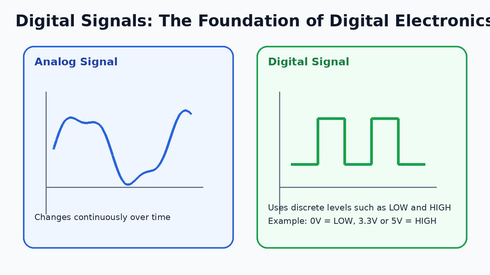
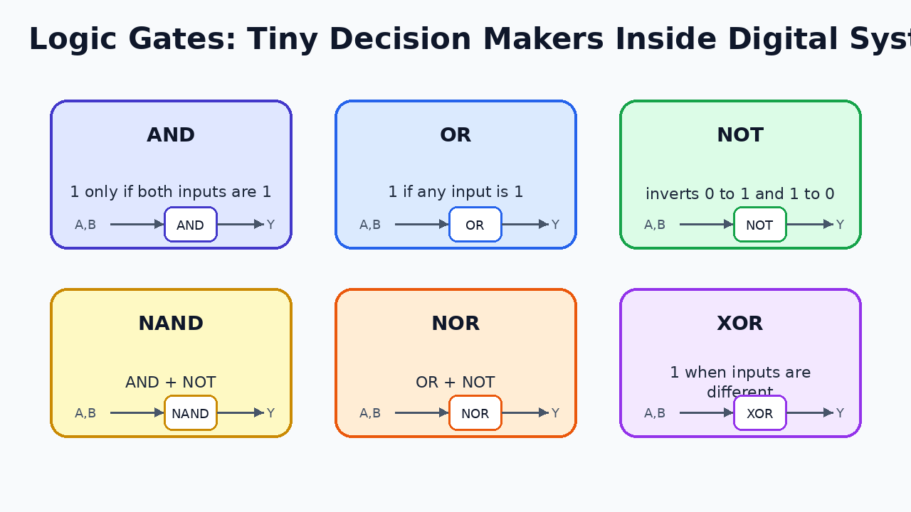
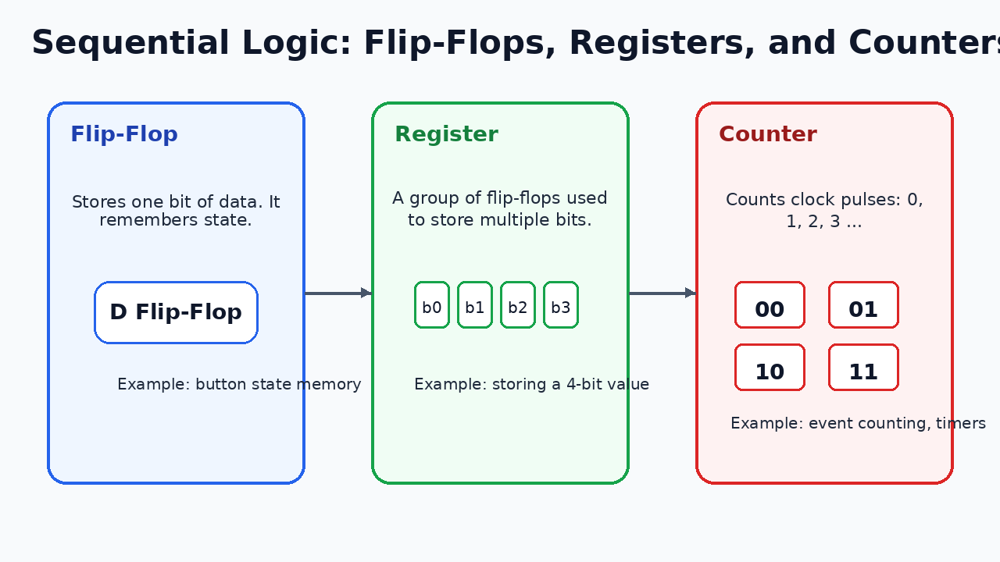
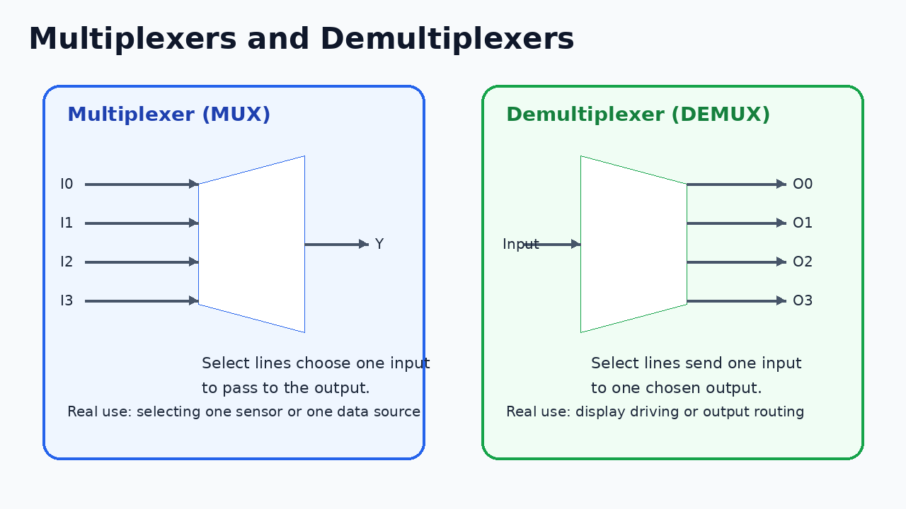
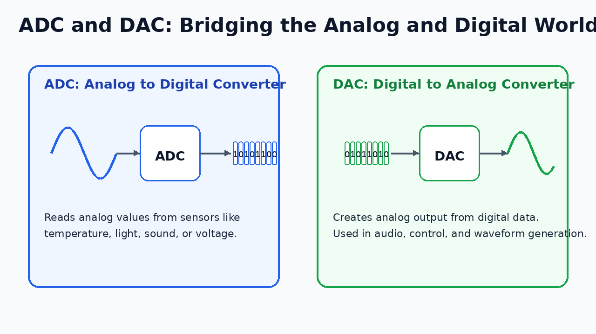
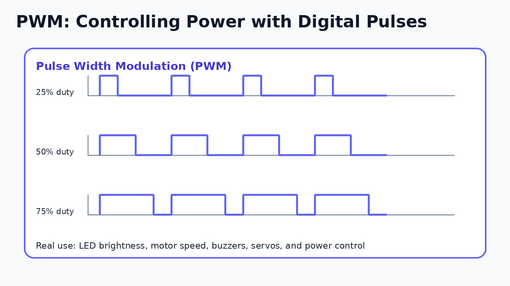
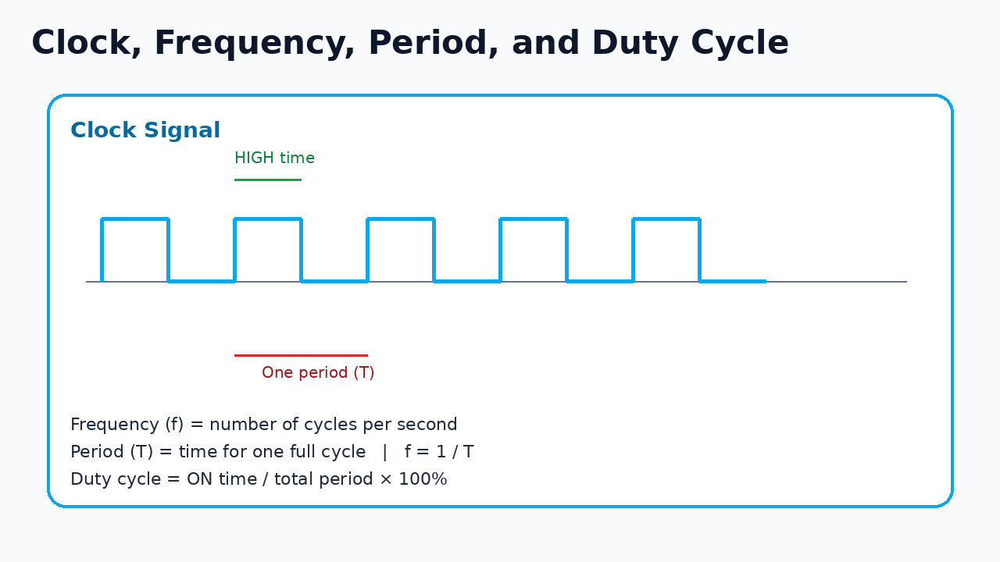
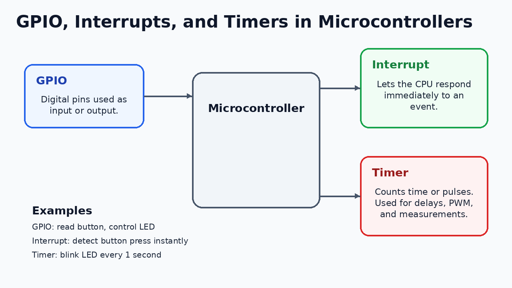
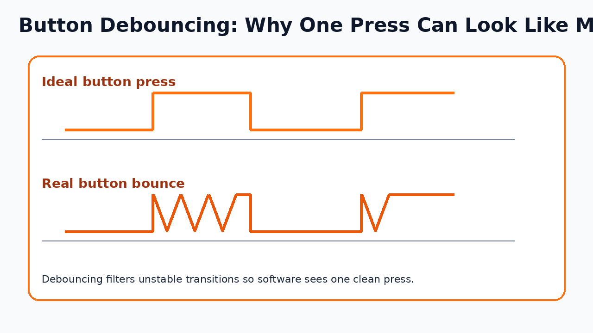
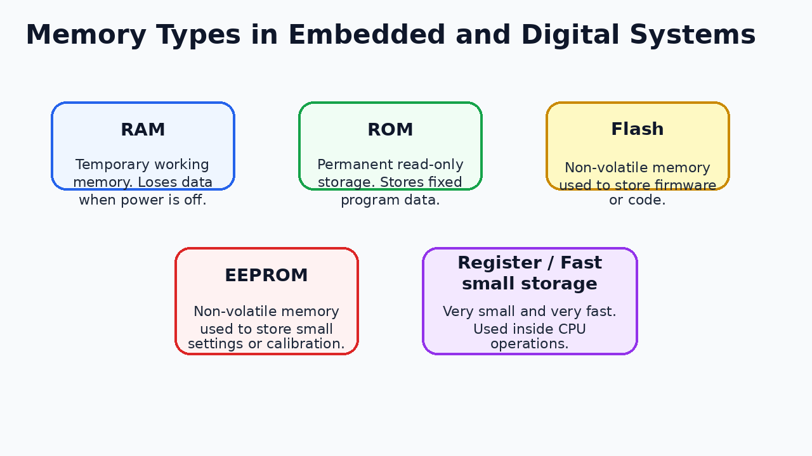

# Digital Electronics Basics Every ECE, IoT, and Embedded Learner Should Understand

If you are from **ECE**, **IoT**, **embedded systems**, **robotics**, **automation**, or even a **software background
working close to hardware**, digital electronics is one of the most important foundations you can build.

A lot of learners study microcontrollers, Arduino, ESP32, Raspberry Pi, STM32, sensors, and communication protocols, but
they often use them without clearly understanding what is happening underneath.

That becomes a problem very quickly.

At some point, you will face questions like these:

- Why does a digital pin read only HIGH or LOW?
- What exactly is a logic gate?
- Why do counters and timers matter so much?
- How does a microcontroller read analog sensor data?
- What is PWM, and why can it control brightness or speed?
- Why does a push button sometimes trigger multiple times?
- What is the real difference between RAM, Flash, and EEPROM?
- Why do interrupts feel “instant” compared to polling?

This blog is written to answer those questions in a clear, structured, beginner-to-intermediate way.

The goal is not only to define terms. The goal is to help you understand how the concepts connect to **real embedded
systems, IoT devices, and electronics-based products**.

---

## 1. Why digital electronics matters so much

Digital electronics is what allows a system to **store, process, control, and communicate information**.

Without digital electronics:

- a microcontroller cannot make decisions,
- a button press cannot be detected reliably,
- a display cannot be updated,
- a counter cannot count events,
- a PWM signal cannot control a motor,
- and a sensor reading cannot be converted into useful digital data.

In real systems, digital electronics sits at the center of many products:

- smart home devices
- traffic systems
- industrial controllers
- smart energy meters
- medical devices
- automotive control units
- access control systems
- wearables
- drones
- robotics and IoT systems

If you understand digital electronics well, you can move more confidently into:

- embedded systems
- firmware development
- IoT engineering
- hardware testing
- robotics
- electronics product support
- automation
- edge computing
- device application development

---

## 2. The big picture: analog world, digital processing

The real world is mostly **analog**.

Temperature changes continuously. Light intensity changes continuously. Sound varies continuously. Battery voltage
changes continuously.

But digital systems process information in discrete states, usually represented as:

- **0** and **1**
- **LOW** and **HIGH**
- **OFF** and **ON**

That is why digital systems often sit between the analog world and the software world.



A common flow looks like this:

```text
Real-world input → Sensor → ADC / digital interface → Microcontroller → Decision → Output
```

Example:

```text
Temperature → Temperature sensor → Microcontroller reads value → Fan control logic → Motor or relay output
```

This is the core of many embedded and IoT products.

---

## 3. Digital signals and logic levels

A digital signal usually uses a small number of fixed voltage levels.

For example:

- 0V may represent **LOW**
- 3.3V or 5V may represent **HIGH**

The exact thresholds depend on the system, but the main idea is simple:

> A digital circuit does not care about every tiny continuous value. It interprets values as logical states.

This gives digital systems two huge advantages:

1. **Reliability**  
   Small noise does not usually change the meaning of the signal.

2. **Easy processing**  
   States such as ON/OFF or YES/NO are easier to store, process, and transmit.

### Real-world example

A push button connected to a microcontroller is usually read as:

- button not pressed → LOW
- button pressed → HIGH

or the opposite, depending on the circuit design.

This simple HIGH/LOW idea is the base of digital electronics.

---

## 4. Binary: the language of digital systems

Digital systems internally use **binary**, which means only two digits:

```text
0 and 1
```

A single binary digit is called a **bit**.

### Common terms

| Term   | Meaning                                             |
|--------|-----------------------------------------------------|
| Bit    | One binary digit: 0 or 1                            |
| Nibble | 4 bits                                              |
| Byte   | 8 bits                                              |
| Word   | Group of bits processed together, depends on system |

### Why binary matters

Binary makes storage and processing easier because real circuits can represent two states very clearly:

- no signal / signal
- low voltage / high voltage
- switch open / switch closed

### Example

A 4-bit binary value can represent numbers like:

```text
0000 = 0
0001 = 1
0010 = 2
0011 = 3
...
1111 = 15
```

This matters in counters, registers, memory, and microcontroller operations.

---

## 5. Logic gates: the basic building blocks of decisions

Logic gates are the **smallest decision-making building blocks** in digital electronics.

Each logic gate takes one or more digital inputs and produces a digital output.



The most important gates are:

- AND
- OR
- NOT
- NAND
- NOR
- XOR

### AND gate

An AND gate gives output 1 only when **both inputs are 1**.

#### Real-world understanding

A machine should run only if:

- main power is available, **and**
- safety door is closed

That is an AND condition.

#### If you understand this, you can do things like:

- create safety interlocks,
- enable a motor only under multiple valid conditions,
- build permission-based control logic.

### OR gate

An OR gate gives output 1 when **at least one input is 1**.

#### Real-world understanding

An alarm may turn on if:

- temperature is too high, **or**
- gas is detected, **or**
- smoke is detected

That is an OR condition.

### NOT gate

A NOT gate inverts the input.

If the input is 0, the output becomes 1.  
If the input is 1, the output becomes 0.

This is useful for active-low signals and reverse logic.

### NAND and NOR gates

These are:

- NAND = AND followed by NOT
- NOR = OR followed by NOT

These are heavily used in practical digital circuits.

### XOR gate

XOR gives output 1 when inputs are **different**.

This is useful for:

- change detection,
- toggling,
- parity logic,
- comparison behavior.

---

## 6. Combinational logic vs sequential logic

This distinction is very important.

### Combinational logic

The output depends only on the **current inputs**.

Examples:

- logic gates
- multiplexers
- decoders
- adders

### Sequential logic

The output depends on:

- current inputs, **and**
- previous state or memory

Examples:

- flip-flops
- registers
- counters
- state machines

A traffic light controller is a good example of sequential logic because it remembers its current state and then moves
to the next one.

---

## 7. Flip-flops: remembering one bit

A flip-flop is one of the most important sequential logic elements.

A flip-flop stores **one bit** of information.



That means it can remember either:

- 0
- 1

This is a huge step beyond simple logic gates. Logic gates only react to current inputs. Flip-flops can **remember**.

### Why that matters

Memory is what makes digital systems useful.

Without memory:

- you cannot count
- you cannot store previous states
- you cannot build registers
- you cannot track control logic properly

### Real-world analogy

A flip-flop is like a tiny memory cell that says:

> “I will hold this value until I am told to change it.”

### If you understand this, you can:

- store a button state,
- capture data at a clock edge,
- understand the basis of registers and memory cells.

---

## 8. Registers: storing multiple bits together

A register is a group of flip-flops used together to store multiple bits.

For example:

- 4 flip-flops = 4-bit register
- 8 flip-flops = 8-bit register

Registers are everywhere in microcontrollers and processors.

### What registers do

Registers can:

- hold a number temporarily
- store sensor data
- store control bits
- store configuration values
- hold intermediate results

### Real-world example

Suppose a microcontroller reads a sensor and gets a digital value. That value is often stored in a register before
software uses it.

### If you understand this, you can:

- understand microcontroller datasheets better,
- understand control and status registers,
- understand how data is held before processing.

---

## 9. Counters: counting events automatically

A counter is a digital circuit that counts pulses or events.

Examples:

- 0, 1, 2, 3, 4 ...
- or in binary:
    - 0000
    - 0001
    - 0010
    - 0011

### Why counters matter

Counters are used in:

- timers
- digital clocks
- event counting
- production line counting
- encoder reading
- frequency measurement

### Real-world example

Imagine an automatic production line. Every time a package passes a sensor, one pulse is generated. A counter can count
total packages automatically.

### If you understand this, you can:

- count button presses,
- count external pulses,
- understand timer peripherals more clearly.

---

## 10. Multiplexers and demultiplexers

Multiplexers and demultiplexers help route signals efficiently.



### Multiplexer (MUX)

A multiplexer selects **one of many inputs** and passes it to one output.

#### Simple idea

```text
Many inputs → one selected input → one output
```

#### Real-world use

- selecting one sensor line
- choosing one data source
- sharing limited input channels

### Demultiplexer (DEMUX)

A demultiplexer takes **one input** and sends it to **one chosen output**.

#### Real-world use

- driving one selected output
- sending data to one display section
- routing one control signal to one target

### If you understand MUX/DEMUX, you can:

- reduce pin usage,
- understand signal routing,
- understand how systems choose and distribute data paths.

---

## 11. ADC: converting analog values into digital data

The real world is analog, but microcontrollers usually process digital values.

ADC stands for:

**Analog to Digital Converter**



An ADC converts a continuously varying analog signal into a digital number.

### Real-world examples

An ADC is used when a microcontroller reads:

- potentiometers
- temperature sensors
- light sensors
- battery voltage
- sound level
- gas sensors

### Important beginner ideas

When learning ADC, remember:

- **resolution**: how many digital steps are available
- **reference voltage**: maximum input range
- **sampling**: how often the signal is measured

### Example

If a 12-bit ADC reads 0V to 3.3V, it can convert that range into values from:

```text
0 to 4095
```

This is why microcontrollers can “understand” analog sensor readings in software.

### If you understand ADC, you can:

- read analog sensors correctly,
- build monitoring systems,
- understand battery measurement,
- interpret sensor values more confidently.

---

## 12. DAC: converting digital values into analog output

DAC stands for:

**Digital to Analog Converter**

A DAC does the opposite of an ADC.

It takes a digital value and creates an analog output.

### Real-world uses

DAC is used in:

- audio output systems
- waveform generation
- analog control circuits
- programmable voltage generation

### If you understand DAC, you can:

- understand audio output better,
- understand how digital systems produce analog behavior,
- connect embedded systems to analog control applications.

---

## 13. PWM: one of the most useful concepts in embedded systems

PWM means:

**Pulse Width Modulation**

It is one of the most practical digital electronics concepts used in embedded and IoT work.



PWM rapidly switches a signal between HIGH and LOW. Instead of smoothly changing voltage, it changes how long the signal
stays HIGH.

That percentage is called the **duty cycle**.

### Duty cycle examples

- 25% duty cycle → low average power
- 50% duty cycle → medium average power
- 75% duty cycle → high average power

### Real-world uses of PWM

- LED brightness control
- motor speed control
- buzzer tones
- servo control
- fan control

### Example: LED brightness

A low duty cycle makes the LED look dim. A higher duty cycle makes it appear brighter.

### Example: motor speed

A PWM signal can change the effective average power delivered to a motor, which helps control its speed.

### If you understand PWM, you can:

- build dimmers,
- control motors and fans,
- generate simple wave-based control signals.

---

## 14. Clock, frequency, period, and duty cycle

Digital systems depend heavily on timing.



A **clock** is a repeating signal used to coordinate digital operations.

### Frequency

Frequency tells how many cycles happen per second.

Unit:

```text
Hertz (Hz)
```

### Period

Period is the time for one full cycle.

```text
T = 1 / f
```

### Duty cycle

Duty cycle tells how much of the cycle the signal stays HIGH.

```text
Duty cycle = ON time / total period × 100%
```

### Real-world uses

These timing ideas are used in:

- CPU clocks
- PWM signals
- periodic interrupts
- timer scheduling
- communication timing

### If you understand this, you can:

- configure timers properly,
- calculate PWM frequency,
- set blinking rates correctly,
- understand embedded timing much more clearly.

---

## 15. GPIO: the doorway between software and hardware

GPIO stands for:

**General Purpose Input/Output**

GPIO pins are among the most important features of a microcontroller.



They allow software to interact with the real world.

### GPIO as input

A pin reads from:

- push buttons
- switches
- sensor outputs
- digital modules

### GPIO as output

A pin controls:

- LEDs
- buzzers
- relay drivers
- transistors
- indicator lines

### Practical examples

- read a door switch
- turn on an LED
- detect a PIR sensor
- trigger a relay module

### If you understand GPIO, you can:

- build most beginner microcontroller projects,
- interact with sensors and actuators,
- understand the first layer of hardware-software interaction.

---

## 16. Interrupts: handling urgent events quickly

An interrupt lets the processor respond quickly to an event.

Instead of repeatedly checking a signal in a loop, the event can notify the CPU immediately.

### Polling vs interrupt

#### Polling

The CPU keeps asking:

```text
Has the button been pressed?
Has data arrived?
Has the sensor changed?
```

#### Interrupt

The event tells the CPU:

```text
Something happened — handle it now.
```

### Real-world examples

Interrupts are used for:

- button presses
- encoder signals
- UART receive events
- sensor triggers
- timer overflow events

### Why interrupts matter

They improve:

- responsiveness
- efficiency
- event reliability

### If you understand interrupts, you can:

- build systems that react quickly,
- avoid missing important events,
- write better embedded applications.

---

## 17. Timers: hidden workhorses inside microcontrollers

Timers are extremely useful peripherals.

A timer usually counts clock pulses or time intervals.

### What timers are used for

Timers can be used for:

- delays
- PWM generation
- periodic tasks
- measuring pulse width
- counting events
- frequency measurement
- generating interrupts

### Real-world examples

- blink an LED every 1 second
- generate a buzzer tone
- create PWM for fan control
- measure how long a pulse stays HIGH
- trigger a task every 10 ms

### If you understand timers, you can:

- avoid poor delay-based code,
- build periodic systems,
- generate PWM cleanly,
- measure time accurately.

---

## 18. Debouncing: why one button press can look like many

A push button does not always switch cleanly. Mechanical contacts bounce for a short time.

That creates multiple rapid transitions.



### What this causes

One press may look like multiple presses.

That can create:

- skipped menu items
- double counting
- unwanted repeated actions

### Debouncing methods

#### Hardware debouncing

Using:

- resistor
- capacitor
- Schmitt trigger

#### Software debouncing

Using logic such as:

- wait for a short stable time,
- ignore rapid repeated transitions,
- confirm stable readings.

### If you understand debouncing, you can:

- make button-based systems reliable,
- avoid false triggers,
- build cleaner user interfaces in embedded devices.

---

## 19. Memory basics: RAM, ROM, Flash, EEPROM

Memory is another important digital electronics concept.



### RAM

RAM is temporary working memory.

It is used while the system is running and usually loses data when power is removed.

#### Used for

- variables
- buffers
- temporary data
- stack and heap

### ROM

ROM stores fixed program-related data.

It is the classic concept of permanent read-only storage.

### Flash

Flash is non-volatile memory used to store:

- program code
- firmware
- constant data

When you upload code to a microcontroller, it is usually stored in Flash.

### EEPROM

EEPROM is non-volatile memory often used for small values that need to be saved and updated.

Examples:

- user settings
- saved thresholds
- calibration data
- stored preferences

### If you understand memory types, you can:

- choose the right place for code and data,
- understand what survives power loss,
- design smarter embedded systems.

---

## 20. How these concepts appear in real systems

Here are a few practical examples.

### Example 1: Smart room light controller

Concepts involved:

- GPIO → read switch and control light
- Interrupt → detect button press instantly
- Debouncing → avoid multiple false presses
- Timer → auto-off feature
- Memory → save last mode

### Example 2: IoT fan controller

Concepts involved:

- ADC → read temperature sensor
- PWM → control fan speed
- Timer → sample every few seconds
- GPIO → control output driver
- Memory → save threshold values

### Example 3: Digital people counter

Concepts involved:

- Counter → count entries
- Interrupt → detect beam breaks quickly
- Debouncing/filtering → avoid false counts
- Register → hold current count
- Memory → store total count if needed

### Example 4: Battery monitor

Concepts involved:

- ADC → read battery voltage
- Timer → periodic measurement
- GPIO → warning LED
- Memory → save calibration or limits

### Example 5: Access control device

Concepts involved:

- GPIO → sensor and lock control
- Logic decisions → allow or deny access
- Timer → lock timeout
- Interrupts → tamper or button events
- Memory → store settings and system state

---

## 21. What knowing these concepts lets you do

If you understand the concepts in this blog, you will be able to do more than answer theory questions.

You will be able to:

- explain digital logic clearly
- read simple timing behavior
- understand microcontroller peripherals better
- design cleaner sensor and button interfaces
- read analog values using ADC
- control motors or LEDs using PWM
- configure timers with more confidence
- understand where data is stored
- debug hardware-software issues more logically

That is why these are must-know concepts for:

- ECE students
- IoT students
- embedded learners
- firmware developers
- robotics learners
- automation engineers
- hardware testers
- software engineers working close to devices

---

## 22. Common beginner mistakes in digital electronics

| Mistake                                          | Why it causes trouble             |
|--------------------------------------------------|-----------------------------------|
| Treating analog and digital signals as the same  | Leads to wrong interfacing        |
| Ignoring logic levels                            | Can damage 3.3V devices           |
| Not debouncing buttons                           | Causes false triggers             |
| Using delay loops everywhere                     | Makes systems slow and unreliable |
| Not understanding interrupts                     | Leads to missed events            |
| Using PWM without understanding duty cycle       | Causes poor control               |
| Confusing Flash, RAM, and EEPROM                 | Causes wrong storage decisions    |
| Ignoring timer configuration                     | Creates bad timing behavior       |
| Treating GPIO like a power output source         | Pins have current limits          |
| Memorizing definitions without building circuits | Concepts remain weak              |

---

## 23. How to practice these concepts properly

Theory becomes strong only when you connect it to simple working systems.

### Good practice activities

1. Build truth table exercises for logic gates
2. Use a button and LED with debouncing
3. Read a potentiometer using ADC
4. Use PWM to control LED brightness
5. Use PWM to control motor speed through a driver
6. Use a timer to blink an LED without blocking delays
7. Use an interrupt to count button presses
8. Save a setting in non-volatile memory
9. Measure a pulse width using a timer
10. Build a small menu system with buttons and display

### A good learning pattern

For each concept, ask:

- What problem does it solve?
- What hardware uses it?
- What is the signal flow?
- How is it used in code?
- What can go wrong?
- How can I test it?

That is how theory becomes practical skill.

---

## 24. A simple learning roadmap

If you are a beginner, this is a good order.

### Stage 1: Foundation

Learn:

- digital signals
- binary
- logic levels
- basic logic gates

### Stage 2: State and storage

Learn:

- flip-flops
- registers
- counters
- memory basics

### Stage 3: Real embedded use

Learn:

- GPIO
- ADC
- PWM
- timers
- interrupts
- debouncing

### Stage 4: Integration

Build small projects that combine the concepts.

That is much easier than studying topics randomly.

---

## 25. Final thoughts

Digital electronics is not just an academic subject. It is a practical language of embedded and IoT systems.

When you understand logic gates, memory, timing, signal conversion, and microcontroller peripherals, you stop seeing
projects as magic. You start seeing how real devices actually work.

That confidence helps in:

- projects
- interviews
- debugging
- firmware development
- IoT product building
- electronics troubleshooting
- system design discussions

The strongest learners are not the ones who only memorize definitions. They are the ones who can say:

- what the concept means,
- where it appears in real systems,
- how it behaves in hardware,
- how it is used in software,
- and how to debug it when something goes wrong.

That is the level you should aim for.

---

## 26. Quick revision summary

| Concept        | Core idea                                  |
|----------------|--------------------------------------------|
| Digital signal | Uses discrete states such as HIGH and LOW  |
| Binary         | Uses 0 and 1 to represent information      |
| Logic gates    | Make basic digital decisions               |
| Flip-flop      | Stores one bit                             |
| Register       | Stores multiple bits                       |
| Counter        | Counts events or pulses                    |
| MUX            | Selects one of many inputs                 |
| DEMUX          | Routes one input to one selected output    |
| ADC            | Converts analog input to digital data      |
| DAC            | Converts digital data to analog output     |
| PWM            | Controls effective power using pulse width |
| Clock          | Provides timing for digital operations     |
| Frequency      | Number of cycles per second                |
| Period         | Time for one cycle                         |
| Duty cycle     | Percentage of ON time in a cycle           |
| GPIO           | Interface pins for input and output        |
| Interrupt      | Immediate response to an event             |
| Timer          | Measures time or counts pulses             |
| Debouncing     | Cleans unstable button transitions         |
| RAM            | Temporary working memory                   |
| Flash          | Non-volatile program storage               |
| EEPROM         | Non-volatile settings storage              |

---

## 27. Confidence statement

After understanding the concepts in this guide, you should be able to say:

> I understand the digital electronics concepts that sit behind embedded systems and IoT devices. I can explain logic
> gates, sequential logic, ADC, DAC, PWM, clock timing, GPIO, interrupts, timers, debouncing, and memory in a practical
> way, and I know how these ideas appear in real products and projects.

That is a strong foundation for anyone moving toward ECE, IoT, embedded systems, firmware, or device-focused software
work.
