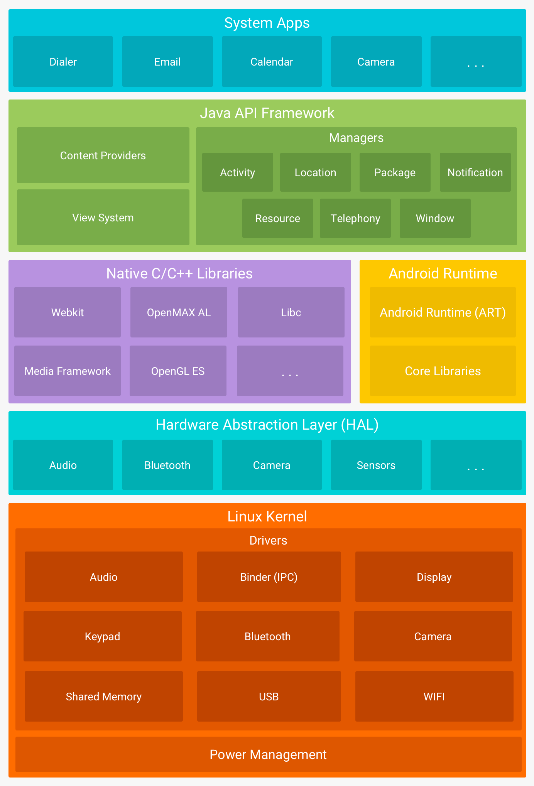

# Technical interview questions

#### DAY 1 Android Fundamentals & System Internals Part 2

1. Explain Android architecture layers (Linux Kernel, HAL, Native Libraries, ART, Framework, Apps).
2. What is the difference between **Dalvik** and **ART** runtime?
3. What is the **Zygote** process in Android and why is it important?
4. What is the **System Server** process and what does it do?
5. What happens internally during an Android app **cold start vs warm start**?
6. What is an Android **process**, and how does Android prioritize/kills processes (OOM adjustment)?
7. What is **ANR** and what are the common triggers?
8. What is the **Looper**, **MessageQueue**, and **Handler** in Android main thread model?
9. What is the difference between **Application class** and **Activity class**?
10. What is **Context** in Android and what are the types of context?
11. Difference between **Activity context vs Application context**?
12. What is the difference between **Intent**, **PendingIntent**, and **Broadcast**?
13. What is the difference between **Service**, **BroadcastReceiver**, and **ContentProvider** at system level?
14. What are the different types of **Services** in Android (started/bound/foreground)?
15. Explain **BroadcastReceiver** types (manifest-registered vs dynamic).
16. What is an **explicit broadcast vs implicit broadcast**?
17. What is Android **IPC** and what mechanisms exist for IPC?
18. What is the **Binder** framework in Android?
19. What is **AIDL** and when would you use it?
20. What is the role of **PackageManager** and **ActivityManager**?
21. Explain Android **APK structure** (classes.dex, resources.arsc, manifest, assets, lib).
22. What is **DEX** and why is it needed?
23. What is **MultiDex** and when does it happen?
24. What are **launchModes** in Android (standard, singleTop, singleTask, singleInstance)?
25. What is the difference between **taskAffinity** and launchMode?
26. What is the Android **back stack** and how is it managed?
27. What is the difference between **finish()** and **finishAffinity()**?
28. Explain how **configuration changes** work internally.
29. What is `android:exported` and why did it become mandatory (Android 12+)?
30. What are **intent-filters** matching rules (action/category/data/priority)?
31. Explain `onSaveInstanceState()` and what Android saves automatically.
32. What is the difference between **resources in res/** and **assets/** at build/runtime?
33. What is **R.java / R class**, and how it is generated?
34. Explain **AAPT vs AAPT2** (what changed and why).
35. What is the difference between **APK** and **AAB** in delivery model?

## Answers:

#### Part 2 Answers

# Android Fundamentals & System Internals — Notes 



## 1) Android Architecture Layers (Linux Kernel → Apps)

Android is a **layered OS stack** built on top of the Linux kernel.

### ✅ 1. Linux Kernel
- Base OS layer: **process/thread scheduling, memory management, networking, file system**
- Includes **device drivers** (display, camera, audio, Bluetooth, Wi‑Fi, USB)
- Android adds kernel features like:
    - **Binder driver** (fast IPC)
    - **ASHMEM** (older shared memory mechanism)
    - **cgroups / namespaces** (resource control & isolation)

### ✅ 2. HAL (Hardware Abstraction Layer)
- A set of **standard interfaces** used by Android Framework to talk to hardware.
- Allows framework to call hardware without knowing vendor implementation details.

**Example:**  
Framework calls `CameraService` → HAL implementation from vendor → camera driver in kernel.

### ✅ 3. Native Libraries (C/C++)
- Performance-critical components written in C/C++.
- Used by framework and apps via JNI.
- Examples:
    - **Bionic libc** (Android’s libc)
    - **OpenGL ES / Vulkan**
    - **Media framework** (codecs)
    - **SQLite**
    - **WebKit/Chromium**

### ✅ 4. ART (Android Runtime)
- Runs **DEX bytecode** (Android app code).
- Provides:
    - Garbage collection
    - JIT (Just-In-Time)    /AOT (Ahead-Of-Time)  compilation
    - Runtime verification
    - Profiling

### ✅ 5. Android Framework
- High-level Java/Kotlin APIs exposed to apps:
    - `ActivityManager`, `PackageManager`
    - `WindowManager`
    - `ContentResolver`
    - `NotificationManager`
    - `LocationManager`
- System services live here + in System Server.

### ✅ 6. Apps
- System apps + user-installed apps.
- Use the framework APIs.
- Each app runs in its **own Linux process and sandbox (UID)** by default.

### 🚀 JIT vs. AOT vs. Hybrid (Modern ART)

| Feature              | JIT (Just-In-Time)                            | AOT (Ahead-Of-Time)                       | Hybrid (Profile-Guided)              |
|:---------------------|:----------------------------------------------|:------------------------------------------|:-------------------------------------|
| **Full Form**        | Just-In-Time                                  | Ahead-Of-Time                             | JIT + AOT + Profiles                 |
| **When it compiles** | During **Runtime** (as the app is being used) | During **Installation**                   | Initial JIT, then AOT when idle      |
| **App Startup**      | Slower (must compile code to start)           | **Fastest** (pre-compiled machine code)   | Fast (improves over time)            |
| **Install Time**     | Very Fast                                     | **Slowest** (compilation takes time)      | Very Fast                            |
| **Disk Space**       | Low (stores Bytecode)                         | **High** (stores large binary files)      | Optimized (only compiles "hot" code) |
| **Battery Life**     | Higher consumption (CPU works to compile)     | **Lower consumption** (CPU just executes) | Balanced                             |
| **Android Version**  | Dalvik (Legacy)                               | ART (Android 5.0 - 6.0)                   | **Modern ART (7.0+)**                |

---

### 💡 The Senior Developer Nuance: Profile-Guided Optimization (PGO)
In modern Android (ART), the system doesn't choose just one. It uses a **Hybrid** approach:
1. **Initial Phase:** When you first install an app, it is **uncompiled**. ART uses **JIT** to run it.
2. **Profiling:** While you use the app, ART tracks which methods are "hot" (frequently used).
3. **Background AOT:** When the phone is **idle and charging**, the system runs a daemon that performs **AOT compilation** on only those "hot" methods based on the collected profile.
4. **Result:** The app gets faster the more you use it, without wasting disk space on code you never touch.
---

## 2) Difference Between Dalvik and ART Runtime

### Dalvik (older runtime)
- **JIT-only** (Just-In-Time compilation)
- App bytecode compiled during execution
- Pros: smaller install size, faster installation
- Cons: slower runtime startup, more CPU usage at runtime

### ART (Android Runtime)
- Supports **AOT + JIT + profile-guided compilation**
- Initially Android 5.0: mostly **AOT** (Ahead-Of-Time)
- Modern Android: **hybrid**
    - Installs quickly
    - Improves over time using profile-based compilation

✅ **Key Interview Line:**  
**Dalvik = JIT at runtime**  
**ART = AOT/JIT with profile-guided optimization (better performance & battery)**

---

## 3) Zygote Process (What & Why)

**Zygote** is the **parent process** of all app processes.

### How it works
- At boot, system starts Zygote.
- Zygote:
    - loads common framework classes
    - preloads resources (to reduce app startup cost)
- When an app starts → system asks Zygote to **fork()** a new process.

### Why it matters
- **Fast app startup**: copy-on-write memory sharing
- **Lower memory**: shared preloaded classes across apps
- Safe isolation: each fork gets separate app sandbox

✅ Interview line:
> “Zygote improves startup and memory efficiency by forking preloaded processes.”

---

## 4) System Server Process

After Zygote starts, it forks a special process called **System Server**.

### What it does
System Server hosts core Android system services:
- ActivityManagerService (AMS)
- PackageManagerService (PMS)
- WindowManagerService (WMS)
- PowerManagerService
- NotificationManagerService
- InputManagerService
- LocationManagerService

### Why it matters
- Apps depend on these services via Binder IPC.
- If System Server crashes, Android may:
    - restart system services
    - or reboot into recovery depending on severity

✅ Interview line:
> “System Server is the brain of Android services; apps talk to it via Binder.”

---

## 5) App Cold Start vs Warm Start (Internal flow)

### ✅ Cold Start (slowest)
App not in memory.

**Steps:**
1. Launcher sends intent to start app
2. AMS checks process exists → no
3. Zygote forks new app process
4. App loads classes/resources (DEX, libs)
5. `Application` created
6. `Activity` created → `onCreate()` → `onStart()` → `onResume()`
7. First frame drawn (Time To Initial Display - TTID)

**Bottlenecks:** DEX loading, class verification, first layout inflation, DI graph creation.

---

### ✅ Warm Start
Process exists in memory but activity needs recreation.

Examples:
- activity was destroyed but process alive
- returning after config changes

Less expensive than cold start:
- no fork
- no full app init usually

---

### ✅ Hot Start (fastest)
Activity already in back stack and still alive.

- just `onRestart()` → `onStart()` → `onResume()`
- minimal work

✅ One-liner:
> Cold = new process + full init  
> Warm = process alive, activity recreated  
> Hot = activity alive, just resume

---

## 6) Android Process & OOM Priority (How Android kills apps)

An Android app runs in a **Linux process** (PID) with its own memory.

Android uses **OOM adjustment (oom_adj / oom_score_adj)** to decide kill order.

### Priority order (most important → least)
1. **Foreground process**
    - current activity, running service with user interaction
2. **Visible process**
    - activity visible but not focused
3. **Service process**
    - background service (playing music etc.)
4. **Cached process**
    - in memory for quick relaunch (back stack)

When memory is low:
- Android kills **cached** first, then services, etc.

✅ Interview line:
> “Android kills based on oom_score_adj — cached processes die first.”

---

## 7) ANR (Application Not Responding)

ANR occurs when **main thread is blocked too long**.

### Common triggers
- Activity/Fragment **input dispatch timeout (~5s)**
- BroadcastReceiver not finished:
    - **~10s** (foreground broadcast)
    - **~60s** (background broadcast)
- Service:
    - foreground service not responding ~20s (varies by version)

### Typical causes
- network on main thread
- heavy DB query / JSON parsing on main
- deadlocks / waiting on locks
- infinite loops in UI thread
- too much work in `onCreate()` / `onResume()`

✅ Prevention:
- move work to background (coroutines/WorkManager)
- keep UI thread for UI only
- use StrictMode in debug

---

## 8) Looper, MessageQueue, Handler (Main Thread Model)

### MessageQueue
- Queue of messages/events for a thread.

### Looper
- Runs an infinite loop:
    - picks message from queue
    - dispatches it to handler/callback

### Handler
- Posts messages/runnables to a thread’s queue.

**Main thread** has a Looper called **MainLooper**.

Example:
```kotlin
Handler(Looper.getMainLooper()).post {
    textView.text = "Updated on UI"
}
```

✅ Interview line:
> “Looper drives the event loop; MessageQueue stores events; Handler posts work to it.”

---

## 9) Application Class vs Activity Class

### Application
- Created once per app process.
- Represents app-level state.
- Good for:
    - initializing DI (Hilt), logging, analytics
    - app-wide singletons

⚠️ Avoid heavy work: affects cold start.

### Activity
- UI screen lifecycle.
- Can be destroyed/recreated often.
- Holds window, views, interaction.

✅ Interview line:
> “Application is process-wide singleton lifecycle; Activity is UI lifecycle per screen.”

---

## 10) Context in Android (and Types)

**Context** is a reference to the **current app environment**.
It gives access to **system-level services and app-level resources**, and acts as the entry point for many framework APIs.

✅ Interview one-liner:

> “Context is the gateway to Android framework — it provides access to resources, system services, and component launching.”

---

### What Context is used for

* Accessing **resources** (`getString()`, `getColor()`, `Resources`)
* Accessing **themes & styles**
* Launching components:

    * `startActivity()`
    * `startService()` / `bindService()`
    * `sendBroadcast()`
* Getting **system services**:

    * `NotificationManager`, `LocationManager`, `ConnectivityManager`
* Accessing app storage:

    * `filesDir`, `cacheDir`, `SharedPreferences`
* Creating UI objects that require theme:

    * `LayoutInflater`, `Dialog`, `Toast`

---

### Types of Context (Common types)

- **Application Context**
- **Activity Context**
- **Service Context**
- **BroadcastReceiver context** (temporary)

#### 1) Application Context

* Lives as long as the app process lives
* Not tied to any UI screen
* Safe for long-lived objects

Use for:

* singletons
* database / repositories
* WorkManager / AlarmManager
* Broadcast registration for whole app

Get it via:

```kotlin
applicationContext
```

---

#### 2) Activity Context

* Tied to an Activity UI + lifecycle
* Has access to Activity theme
* Can show UI components

Use for:

* inflating UI
* showing dialogs
* starting activities

Get it via:

```kotlin
this  // inside Activity
```

⚠️ Don’t store it in singletons → memory leak risk.

---

#### 3) Service Context

* Context of a Service component
* App-level context but intended for background work

Use for:

* foreground service notifications
* background tasks

---

#### 4) BroadcastReceiver Context (temporary)

* Context passed to `onReceive()`
* Valid only during that callback execution

Use for:

* triggering notification
* delegating work to WorkManager

⚠️ Avoid long operations (runs on main thread, can ANR).

---

### Quick rule (very interview useful)

✅ **Need UI / theme / dialog? → Activity context**
✅ **Need long-lived / global object? → Application context**

### Context Mistakes

| Mistake                                                           | Why it’s bad                                         | Correct approach                                 |
|-------------------------------------------------------------------|------------------------------------------------------|--------------------------------------------------|
| Storing **Activity Context** in a singleton/static variable       | Activity cannot be GC’d → **memory leak**            | Store `applicationContext` instead               |
| Using **Application Context** to show Dialog                      | App context has no UI theme/window → crash or bad UI | Use **Activity context**                         |
| Passing Activity context to long-lived objects (DB, repositories) | survives longer than Activity → leaks                | use `applicationContext`                         |
| Doing heavy work inside `BroadcastReceiver.onReceive()`           | runs on **main thread**, may cause **ANR**           | delegate to **WorkManager / Foreground Service** |
| Using wrong context for inflating themed views                    | wrong theme/style applied                            | use Activity/Fragment context                    |

---

### Leak Example (Don’t do this ❌)

```kotlin
object MySingleton {
    var ctx: Context? = null   // ❌ holds Activity reference forever
}
```

✅ Fix:

```kotlin
object MySingleton {
    lateinit var ctx: Context

    fun init(context: Context) {
        ctx = context.applicationContext // ✅ safe
    }
}
```

### Interview-ready one-liner

> “Rule of thumb: UI needs Activity context; long-lived objects use application context; never store Activity context globally.”

### Fragment Context Types (When to use what)

### 1) `context`

* Nullable: `Context?`
* Available only when Fragment is attached

Use when:

* safe optional usage
* you already handle null

```kotlin
context?.getSystemService(Context.LAYOUT_INFLATER_SERVICE)
```

### 2) `requireContext()`

* Non-null `Context`
* Throws `IllegalStateException` if Fragment not attached

Use when:

* Fragment must be attached for this code
* you want crash-fast behavior

```kotlin
val prefs = requireContext().getSharedPreferences("x", MODE_PRIVATE)
```

### 3) `activity`

* Nullable: `FragmentActivity?`
* Available only when Fragment is attached to activity

Use when:

* optional access to activity

```kotlin
activity?.title = "Home"
```

### 4) `requireActivity()`

* Non-null `FragmentActivity`
* Throws if not attached

Use when:

* you need Activity reference for sure

```kotlin
val navController = findNavController()
```

or

```kotlin
requireActivity().onBackPressedDispatcher
```

### 5) `requireParentFragment()`

* Non-null parent fragment
* Throws if no parent

Use when:

* nested fragments communicate with parent

```kotlin
val parent = requireParentFragment()
```

### 6) `viewLifecycleOwner` (super important ✅✅)

Not a context, but **lifecycle owner for fragment UI**.

Use for:

* LiveData observing
* collecting flows tied to view lifecycle

```kotlin
viewModel.data.observe(viewLifecycleOwner) { }
```

✅ Interview one-liner:

> “In fragments we should observe LiveData with viewLifecycleOwner to avoid leaks after onDestroyView.”

## Quick rule 

* ✅ use `requireContext()` / `requireActivity()` when Fragment must be attached
* ✅ use `context?` / `activity?` when you need safe nullable behavior
* ✅ use `viewLifecycleOwner` for UI observers/collectors


## 11) Activity Context vs Application Context

### Activity Context
- tied to activity lifecycle
- has theme + UI window
- use for:
    - inflating UI
    - dialogs
    - launching activity

### Application Context
- tied to process
- safe for long-living objects
- use for:
    - singletons
    - repositories
    - WorkManager init
    - storing preferences

✅ Rule of thumb:
> “UI stuff → Activity context. Long-lived stuff → Application context.”

---

## 12) Intent vs PendingIntent vs Broadcast

### Intent
Message to request action.
- start Activity
- start Service
- send Broadcast

### PendingIntent
✅ A token that lets **another app/system** execute the intent **as if it were your app** later.
Used in:
- notifications
- alarm manager
- widgets

### Broadcast
Intent sent to many receivers (system-wide messaging).

Example:
- low battery broadcast
- connectivity change

✅ Interview line:
> “PendingIntent = deferred intent executed by system/other app with your identity.”

Here are **2 real-life PendingIntent examples** 👇

### ✅ Example 1: Notification click opens an Activity

Most common use-case: when user taps notification → open screen.

```kotlin
val intent = Intent(this, DetailActivity::class.java).apply {
    putExtra("id", 101)
}

val pendingIntent = PendingIntent.getActivity(
    this,
    0,
    intent,
    PendingIntent.FLAG_UPDATE_CURRENT or PendingIntent.FLAG_IMMUTABLE
)

val notification = NotificationCompat.Builder(this, CHANNEL_ID)
    .setSmallIcon(R.drawable.ic_notification)
    .setContentTitle("Order Update")
    .setContentText("Tap to view details")
    .setContentIntent(pendingIntent)   // ✅ system triggers this later
    .setAutoCancel(true)
    .build()

NotificationManagerCompat.from(this).notify(1, notification)
```

---

### ✅ Example 2: AlarmManager triggers a BroadcastReceiver later

Real use-case: schedule a reminder at specific time.

```kotlin
val intent = Intent(this, ReminderReceiver::class.java).apply {
    action = "REMINDER"
}

val pendingIntent = PendingIntent.getBroadcast(
    this,
    0,
    intent,
    PendingIntent.FLAG_UPDATE_CURRENT or PendingIntent.FLAG_IMMUTABLE
)

val alarmManager = getSystemService(Context.ALARM_SERVICE) as AlarmManager

alarmManager.setExactAndAllowWhileIdle(
    AlarmManager.RTC_WAKEUP,
    System.currentTimeMillis() + 10_000, // 10 sec later
    pendingIntent                         // ✅ system triggers later
)
```

Receiver:

```kotlin
class ReminderReceiver : BroadcastReceiver() {
    override fun onReceive(context: Context, intent: Intent) {
        // show notification / start work
    }
}
```

Takeaway:

> “PendingIntent is used when the action must be executed later by system—Notification actions, alarms, widgets, etc.”
---

## 13) Service vs BroadcastReceiver vs ContentProvider (System Level)

### Service
- background component for long running work
- can be started or bound
- runs on main thread by default

### BroadcastReceiver
- reactive component for events
- short work only (else ANR)
- process may be created just to deliver broadcast

### ContentProvider
- structured data sharing between apps
- uses URIs and permissions
- supports queries, insert/update/delete
- can be accessed across processes safely

---

## 14) Types of Services

### Started Service
- `startService()` / `startForegroundService()`
- runs until stopped

### Bound Service
- `bindService()`
- client-server pattern, component binds and interacts
- dies when no clients bound

### Foreground Service
- must show notification
- used for user-visible long work (music, navigation)

---

## 15) BroadcastReceiver Types

### Manifest-registered
- declared in `AndroidManifest.xml`
- can receive even if app not running (subject to background limits)

### Dynamic (runtime registered)
- registered using `registerReceiver()`
- only active while your component is alive
- best for in-app events

---

## 16) Explicit vs Implicit Broadcast

### Explicit broadcast
Targets a specific app/component:
```kotlin
intent.setComponent(ComponentName(pkg, cls))
sendBroadcast(intent)
```

### Implicit broadcast
No explicit target; system resolves receivers by intent-filters.

⚠️ Many implicit broadcasts are restricted since Android 8+ for performance.

---

## 17) Android IPC & IPC Mechanisms ✅

IPC = Inter Process communication.

Mechanisms:
- **Binder** (core IPC)
- AIDL (Android Interface Definition Language) - (Binder interface generation)
- Messenger (Binder with Message objects)
- ContentProvider (structured data IPC)
- Broadcast intents
- Socket / Shared memory (rare)

---

## 18) Binder Framework

Binder is Android’s **high-performance IPC**.

### Key ideas
- client uses a **proxy**
- server exposes a **stub**
- calls are marshalled/unmarshalled automatically
- uses kernel Binder driver

Benefits:
- fast
- secure with UID/PID identity
- supports synchronous calls

---

## 19) AIDL (Android Interface Definition Language)

AIDL generates code for binder communication.

Use AIDL when:
- you need **true cross-process service API**
- you need synchronous method calls + callbacks
- your service is used by other apps

Avoid when:
- single app modules only (use in-process interfaces)
- simple commands → use Messenger/Intent

---

## 20) Role of PackageManager vs ActivityManager ✅

### PackageManager (PMS)
- manages installed packages
- provides:
    - app info, permissions
    - resolving intent-filters
    - installation & updates metadata

### ActivityManager (AMS)
- manages:
    - process lifecycle
    - activities/tasks/back stack
    - services & broadcast delivery
    - memory trim, killing processes

✅ Line:
> “PMS knows what apps exist; AMS manages what’s running.”

---

## 21) APK Structure

### Key parts
- `AndroidManifest.xml` → component + permissions (compiled binary xml)
- `classes.dex` → bytecode
- `resources.arsc` → compiled resources table
- `res/` → resources compiled into `resources.arsc`
- `assets/` → raw files untouched
- `lib/` → native `.so` libraries (per ABI)

---

## 22) What is DEX and Why Needed?

DEX = **Dalvik Executable** bytecode format.

- Java `.class` files are converted into `.dex`
- optimized for:
    - low memory
    - quick loading
    - shared constant pool

Toolchain:
`javac/kotlinc` → `.class` → D8/R8 → `classes.dex`

---

## 23) MultiDex (What & When)

Older Android limit:
- **65,536 methods** per dex (reference limit)

If app exceeds limit:
- multiple dex files generated:
    - `classes.dex`
    - `classes2.dex`, etc.

Today:
- Most apps use minSdk 21+ → native multidex support (no extra work)
- For minSdk < 21:
    - enable multidex + install MultiDex in Application

---

## 24) launchModes (standard / singleTop / singleTask / singleInstance)

Launch modes control **how Activities are instantiated and placed in the task/back stack**.

### `standard` (default)

* Every `startActivity()` creates a **new instance**
* Multiple copies can exist in the same task/back stack

📌 Example:
A → B → A → A (possible)

### `singleTop`

* If the Activity is **already at the top of stack**, reuse it
* Instead of new instance, it calls:

    * `onNewIntent(intent)`

📌 Example:
A → B → B (reused, `onNewIntent()`)

⚠️ If it’s **not on top**, a new instance is created:
A → B → A (new A created)

### `singleTask`

* Only **one instance** of that Activity exists **per task**
* If Activity already exists in the task:

    * system brings it to front
    * **clears all activities above it**
    * calls `onNewIntent()`

📌 Example:
A → B → C → (launch A)
Result: A (B, C removed)

Common use-case:

* App “Home/Dashboard” screen
* Deep link entry screen

### `singleInstance`

* Activity runs in its **own separate task**
* That task contains **only that activity**
* Any new activity launched from it goes to **another task**

📌 Example:
Task1: A (singleInstance)
Task2: B → C (normal)

Common use-case:

* very rare today
* external entry screens like “incoming call UI” style behavior

### Super important interview note ✅

All reuse cases call:

> `onNewIntent(intent)`
> but only if Activity instance is reused.

## launchModes Summary Table  — **mini table + launchMode vs taskAffinity**

| launchMode     | New instance created? | Reuse when?                   | What happens if already exists?           | Callback      |
|----------------|-----------------------|-------------------------------|-------------------------------------------|---------------|
| standard       | ✅ Always              | Never                         | Just adds new instance to stack           | onCreate()    |
| singleTop      | ✅ Usually             | If already on top             | Reuse top instance                        | onNewIntent() |
| singleTask     | ❌ No (per task)       | If exists anywhere in task    | Bring to front + clear above it           | onNewIntent() |
| singleInstance | ❌ No                  | Always single in its own task | Own task only, no other activities inside | onNewIntent() |

## 25) taskAffinity vs launchMode

### taskAffinity

* Defines **which task an Activity prefers to belong to**
* Used by the system when deciding **task grouping**
* Does **not** control instance creation
* Most relevant when used with:

    * `FLAG_ACTIVITY_NEW_TASK`
    * `singleTask` / `singleInstance`
    * deep links & external app launches
    * document mode / multi-window behavior

```xml
android:taskAffinity="com.example.auth"
```

📌 Important note:

> taskAffinity alone does nothing unless the activity is launched into a new task.

---

### launchMode

* Controls **how Activity instances are created and reused**
* Directly affects the **back stack behavior**

```xml
android:launchMode="singleTask"
```

Examples:

* `standard` → always new instance
* `singleTop` → reuse if on top
* `singleTask` → one instance per task
* `singleInstance` → one instance in its own task

### ✅ one-liner

> “**launchMode** controls **instance creation and reuse**; **taskAffinity** influences which task an activity is placed into.”

### Common interview trap ⚠️

> taskAffinity **does not** prevent multiple instances — launchMode does.

## 26) Android Back Stack & How it’s Managed

Back stack = history of activities in a task.

Managed by:
- ActivityManager + TaskManager
- Navigation actions push/pop stack
- back press pops top activity

Flags like:
- `FLAG_ACTIVITY_CLEAR_TOP`
- `FLAG_ACTIVITY_NEW_TASK`
  affect stack behavior.

---

## 27) finish() vs finishAffinity()

### finish()
- closes current activity only

### finishAffinity()
- finishes this activity + all others in the same affinity (task)
- typically used for:
    - logout flows
    - exit app behavior

---

## 28) Configuration Changes (Internal)

Config change examples:
- rotation
- locale change
- font scale
- dark mode
- screen size

### What happens by default
1. activity destroyed
2. new activity instance created
3. state restored via:
    - `onSaveInstanceState()`
    - view hierarchy state
    - FragmentManager restores fragments

### Avoid recreation
Use:
- `android:configChanges` (not recommended for most cases)
  Modern approach:
- keep state in **ViewModel**
- use Compose/state holder

---

## 29) `android:exported` (Mandatory in Android 12+)

From Android 12 (API 31):
- Any component with an **intent-filter** must explicitly declare:
    - `android:exported="true/false"`

Reason:
- Security clarity: prevents accidental component exposure.

✅ Rule:
- If component should be reachable outside app → true
- otherwise → false

---

## 30) Intent-Filter Matching Rules

System resolves implicit intents using:
- **Action**
- **Category**
- **Data** (URI + mimeType)

### Matching basics
- Intent action must match filter action
- All filter categories must be in intent (DEFAULT required for startActivity)
- Data:
    - scheme/host/path must match (if declared)
    - mimeType rules apply

### Priority
- `android:priority` influences which receiver gets chosen first (broadcast).
- For activities, system may show chooser if multiple match.

---

## 31) `onSaveInstanceState()` + What Android Saves Automatically

### `onSaveInstanceState(Bundle outState)`
- called before activity may be destroyed
- save small UI state (ids/strings), not big objects

Android automatically saves:
- view hierarchy state (e.g., EditText text)
- fragment state (if added properly)
- RecyclerView scroll position (usually)

Not saved automatically:
- background work
- network responses
- large lists
- custom objects unless `Parcelable`/`Serializable`

✅ Best practice:
- UI state → Bundle
- data/state → ViewModel + repository

---

## 32) `res/` vs `assets/`

### `res/`
- compiled and referenced via `R`
- supports qualifiers:
    - `layout-sw600dp`
    - `drawable-night`
    - `values-en`

### `assets/`
- raw files, not compiled
- accessed via `AssetManager`
- no resource ids

Example:
```kotlin
assets.open("config.json")
```

✅ Line:
> “res = compiled and type-safe; assets = raw and manual access.”

---

## 33) R.java / R class (How Generated)

`R` is a generated class containing IDs for:
- layouts, strings, drawables, ids, etc.

Generated by:
- `aapt2` during build
- IDs map to compiled resource table (`resources.arsc`)

---

## 34) AAPT vs AAPT2

### AAPT (old)
- monolithic resource processing step
- slower incremental builds

### AAPT2 (new)
- separates compile and link steps:
    - compile resources individually
    - link at the end

Benefits:
- faster incremental builds
- better error messages
- supports resource namespacing

✅ Interview line:
> “AAPT2 makes Android builds faster via incremental resource compilation.”

---

## 35) APK vs AAB (Delivery Model)

### APK
- complete installable package
- contains all resources/ABIs/densities

### AAB (Android App Bundle)
- publishing format to Play Store
- Play generates **split APKs** per device:
    - only required ABI/resources delivered

Benefits:
- smaller download size
- dynamic feature modules possible

✅ Line:
> “AAB is for Play delivery optimization; APK is the final install artifact.”

---

# Quick Interview Cheat Sheet (30-sec recap)

- Android stack: Kernel → HAL → Native libs → ART → Framework → Apps
- Zygote forks app processes for fast startup
- System Server hosts core services (AMS, PMS, WMS)
- Cold start = fork + Application + Activity init
- OOM kills cached processes first via oom_score_adj
- ANR = main thread blocked too long (5s input)
- Looper/MessageQueue/Handler = event loop model
- Intent vs PendingIntent = immediate vs delegated execution
- Binder = core IPC; AIDL = binder interface generation
- APK vs AAB = install package vs Play optimized bundle

---
