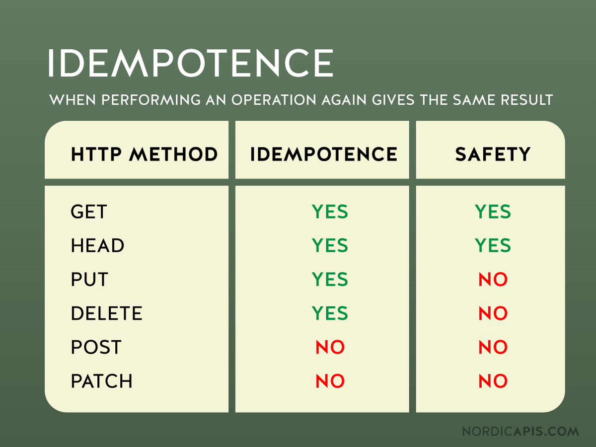

# DAY 5 — Networking, Data Storage & Background Work

## 📚 Table of Contents

- [Networking](#networking)
    - [RESTful APIs](#restful-apis)
        - [Core principles](#core-principles)
        - [Typical REST request anatomy (Android perspective)](#typical-rest-request-anatomy-android-perspective)
        - [HTTP Status Codes (MUST know for interviews)](#http-status-codes-must-know-for-interviews)
        - [Authentication & Authorization](#authentication--authorization)
        - [Pagination (very common)](#pagination-very-common)
        - [Pagination (ELABORATED)](#pagination)
        - [Filtering & Sorting](#filtering--sorting)
        - [REST API versioning](#rest-api-versioning)
        - [Idempotency (important concept)](#idempotency-important-concept)
        - [Idempotency (ELABORATED)](#idempotency)
        - [Idempotency Examples (ELABORATED)](#idempotencyex)
        - [Error handling strategy (Android side)](#error-handling-strategy-android-side)
        - [REST vs GraphQL (interview comparison)](#rest-vs-graphql-interview-comparison)
        - [What Android devs MUST know about REST](#what-android-devs-must-know-about-rest)
        - [Final senior interview summary (15 seconds)](#final-senior-interview-summary-15-seconds)
        - [REST API Interview Traps (Senior Level)](#restapiinterviewtraps)
    - [Retrofit](#retrofit)
    - [OkHttp](#okhttp)
    - [JSON Parsing (Gson & Moshi)](#json-parsing-gson--moshi)
    - [Handling Network Connectivity Changes](#handling-network-connectivity-changes)
    - [WebSockets](#websockets)
        - [Are WebSockets deprecated or still used? (ELABORATED)](#websockets)
- [Data Storage](#data-storage)
    - [SharedPreferences](#sharedpreferences)
    - [SQLite](#sqlite)
    - [Room Persistence Library](#room-persistence-library)
    - [File Storage (Internal & External)](#file-storage-internal--external)
    - [DataStore & EncryptedSharedPreferences](#datastore--encryptedsharedpreferences)
- [Background & Paging](#background--paging)
    - [WorkManager](#workmanager)
    - [Paging Library](#paging-library)
        - [Pagination on Android (Modern approach)](#paginationmodernapproach)
- [Final Senior Summary](#final-senior-summary)
- [Technical Interview Q&A (Day 5)](#q&a)
- [Final Interview Summary (30 seconds)](#final-interview-summary-30-seconds)

---

## Networking

### RESTful APIs

REST (Representational State Transfer) is an **architectural style** used for building **scalable,
stateless, client–server APIs**, most commonly over HTTP.

In Android, REST APIs are the **primary way apps communicate with backend servers** for data such as
users, products, authentication, analytics, etc.

---

#### Core principles

* **Resource-based URLs**
  Everything is treated as a *resource*.

  ```text
  /users
  /users/42
  /orders/202
  ```

* **HTTP verbs define intent**

    * `GET` → read data (no side effects)
    * `POST` → create new resource
    * `PUT` → replace entire resource
    * `PATCH` → partial update
    * `DELETE` → remove resource

* **Stateless**

    * Server does **not store client session state**
    * Every request contains all required info (headers, tokens, params)

* **JSON as data format**

    * Lightweight
    * Language-agnostic
    * Easy to parse on Android

---

#### Typical REST request anatomy (Android perspective)

```http
GET /users/42 HTTP/1.1
Host: api.example.com
Authorization: Bearer <token>
Accept: application/json
```

Response:

```json
{
  "id": 42,
  "name": "Vishnu",
  "email": "vishnu@example.com"
}
```

---

#### HTTP Status Codes (MUST know for interviews)

| Code | Meaning      | When you see it       |
|------|--------------|-----------------------|
| 200  | OK           | Successful GET        |
| 201  | Created      | POST success          |
| 204  | No Content   | DELETE success        |
| 400  | Bad Request  | Client error          |
| 401  | Unauthorized | Token missing/invalid |
| 403  | Forbidden    | No permission         |
| 404  | Not Found    | Resource missing      |
| 500  | Server Error | Backend failure       |

Senior line:

> “Always handle both success and error HTTP codes explicitly.”

---

#### Authentication & Authorization

Most REST APIs use **token-based auth**.

Common patterns:

* **Bearer token (JWT)** in header

```http
Authorization: Bearer eyJhbGciOiJIUzI1...
```

* Token stored securely:

    * EncryptedSharedPreferences
    * NOT plain SharedPreferences

---

#### Pagination (very common)

Backend sends data in chunks.

Example:

```http
GET /users?page=2&limit=20
```

Response:

```json
{
  "data": [
    ...
  ],
  "page": 2,
  "totalPages": 10
}
```

Android:

* Used with **Paging 3**
* Prevents loading large datasets at once

<div id="Pagination"></div>
<details>
<summary><b>🔴 <font color="red">Pagination (ELABORATED)</font> 🔴</b></summary>
<br>
<blockquote>

#### Pagination (very common)

**Pagination** is a technique where the backend sends **data in smaller chunks (pages)** instead of
returning the full dataset at once.

This is **critical for mobile apps** due to:

* limited memory
* slower networks
* smooth scrolling requirements

---

##### Why pagination is mandatory in Android apps

Without pagination:

* large responses → **high memory usage**
* slow app startup
* UI jank / ANRs
* unnecessary data transfer

Senior insight:

> “On mobile, loading everything at once is almost always a design flaw.”

---

##### Common pagination request patterns

###### Page-based pagination

```http
GET /users?page=2&limit=20
```

###### Offset-based pagination

```http
GET /users?offset=40&limit=20
```

###### Cursor-based pagination (preferred for large data)

```http
GET /users?cursor=eyJpZCI6NDB9&limit=20
```

Cursor-based benefits:

* better performance
* avoids duplicate/missing items when data changes
* ideal for infinite scrolling

---

##### Typical pagination response structure

```json
{
  "data": [
    {
      "id": 21,
      "name": "User A"
    },
    {
      "id": 22,
      "name": "User B"
    }
  ],
  "page": 2,
  "pageSize": 20,
  "totalPages": 10,
  "totalCount": 200
}
```

Important fields Android devs care about:

* `data` → actual items
* `page / cursor` → next request
* `totalPages / hasNext` → stop condition

---

##### Pagination failure scenarios (interview traps)

* Duplicate items when scrolling
* Missing items after refresh
* Data inconsistency when backend data changes
* Incorrect “end of list” detection

Senior handling:

* rely on backend metadata
* avoid client-side guesswork
* reset pagination on refresh

> [⬆️ Back to Top / Close](#Pagination)
</blockquote>
</details>

---

#### Filtering & Sorting

```http
GET /products?category=mobile&sort=price_desc
```

Handled via:

* Query parameters
* Optional request fields

---

#### REST API versioning

Used to avoid breaking old apps.

Examples:

```text
/api/v1/users
/api/v2/users
```

Senior insight:

> “Versioning allows backend evolution without breaking existing clients.”

---

#### Idempotency (important concept)

* `GET`, `PUT`, `DELETE` → idempotent
  (same request → same result)
* `POST` → not idempotent

Why it matters:

* retries
* network failures
* WorkManager retries

---

#### Error handling strategy (Android side)

Never assume success.

```kotlin
try {
    val response = api.getUsers()
} catch (e: HttpException) {
    // server error (4xx / 5xx)
} catch (e: IOException) {
    // network failure
}
```

<div id="Idempotency"></div>
<details>
<summary><b>🔴 <font color="red">Idempotency (ELABORATED)</font> 🔴</b></summary>
<br>
<blockquote>

#### Idempotency (important concept)

**Idempotency** means that **making the same request multiple times produces the same result as
making it once**.

In simple terms:

> “Repeating the request does not change the final state.”

---

##### Idempotent vs non-idempotent HTTP methods

* **Idempotent methods**

    * `GET` → read-only (no state change)
    * `PUT` → replaces resource completely
    * `DELETE` → removes resource (once removed, repeated deletes do nothing)

* **Non-idempotent methods**

    * `POST` → creates a new resource each time

Example:

```http
DELETE /orders/123
```

* First call → order deleted
* Second call → order already gone (no new side effects)

---

##### Why `POST` is not idempotent

```http
POST /orders
```

Each request may:

* create a **new order**
* charge user again
* trigger duplicate side effects

This is dangerous when:

* network retries occur
* user taps “Pay” twice
* WorkManager retries a failed job

---

##### Why idempotency matters in Android apps

###### 1) Network retries

Mobile networks are unreliable.
If a request times out, the client may retry.

* Safe to retry:

    * `GET`, `PUT`, `DELETE`
* Dangerous to retry blindly:

    * `POST`

Senior insight:

> “Retries without idempotency can cause duplicate backend actions.”



---

###### 2) WorkManager retries

WorkManager automatically retries failed work.

```kotlin
return Result.retry()
```

If the work contains a `POST` request:

* order may be created twice
* duplicate uploads
* inconsistent backend state

---

###### 3) App crashes / process death

* App may crash after sending request
* User reopens app
* Request sent again

Without idempotency → **duplicate operations**

---

##### Idempotency keys (real-world solution)

Backend-supported solution:

* Client sends a **unique idempotency key**
* Backend stores & deduplicates requests

```http
POST /payments
Idempotency-Key: 8f2e9c1a-3d2e-4b6a
```

Backend behavior:

* same key → same result returned
* no duplicate side effects

Android use cases:

* payments
* order creation
* uploads
* form submissions

---

##### Android best practices

✅ Use idempotent methods when possible
✅ Add idempotency keys for POST requests
✅ Be cautious with automatic retries
✅ Log request IDs for debugging

❌ Blind retries for POST
❌ Assuming network failure = request not processed

---

##### Interview trap

❓ *“If a POST fails, can we safely retry it?”*

❌ Wrong:

> “Yes, retry until success.”

✅ Correct:

> “Only if backend supports idempotency keys; otherwise retries can cause duplicates.”

---

##### Senior interview one-liner (memorize)

> “Idempotency ensures safe retries in unreliable networks. In Android, it’s crucial for POST
> requests, WorkManager retries, and crash recovery to avoid duplicate backend operations.”


<div id="Idempotencyex"></div>
<details>
<summary><b>🔴 <font color="red">Idempotency Examples (ELABORATED)</font> 🔴</b></summary>
<br>
<blockquote>

---

1. [ ] Explain idempotency + WorkManager in real projects
2. [ ] Show idempotent REST design patterns
3. [ ] Give real production bugs caused by missing idempotency

## 1️⃣ Idempotency + WorkManager (Real Projects)

### The real problem

WorkManager is **guaranteed execution**:

* retries automatically
* can run again after:

    * app kill
    * device reboot
    * network loss

```kotlin
return Result.retry()
```

If your Worker does a **non-idempotent POST**:

```http
POST /orders
```

💥 You risk:

* duplicate orders
* double payments
* multiple uploads of same file

---

### Real-world example (Payment / Order sync)

```kotlin
class SyncOrderWorker(...) : CoroutineWorker(...) {

    override suspend fun doWork(): Result {
        api.createOrder(order) // POST
        return Result.success()
    }
}
```

❌ What can go wrong:

* network timeout after server processed request
* WorkManager retries
* order created **again**

---

### ✅ Correct approach (Idempotent)

**Add idempotency key per logical operation**

```kotlin
val idempotencyKey = order.id // stable unique ID

api.createOrder(
    order,
    headers = mapOf("Idempotency-Key" to idempotencyKey)
)
```

Backend behavior:

* same key → return previous result
* no duplicate side effects

✅ Senior takeaway:

> “Any WorkManager task that mutates backend state must be idempotent.”

---

## 2️⃣ Idempotent REST Design Patterns (Backend + Client)

### Pattern 1: Prefer PUT over POST when possible

❌ Non-idempotent:

```http
POST /profile
```

✅ Idempotent:

```http
PUT /profile/42
```

* same payload → same final state
* safe to retry

---

### Pattern 2: Client-generated IDs

Instead of backend generating IDs:

```http
POST /orders
```

Use:

```http
PUT /orders/{clientGeneratedId}
```

Android:

```kotlin
val orderId = UUID.randomUUID().toString()
```

Backend:

* create if not exists
* update if exists

---

### Pattern 3: Idempotency keys (most common)

Used for:

* payments
* uploads
* form submissions

```http
POST /payments
Idempotency-Key: <UUID>
```

Backend stores:

* key → response mapping

---

### Pattern 4: Server-side deduplication

Backend checks:

* request hash
* timestamps
* user + payload uniqueness

Android still should **not rely on this alone**.

---

## 3️⃣ Real Production Bugs Caused by Missing Idempotency

These are **actual scenarios interviewers love**.

---

### 🐞 Bug 1: Double payment charged

**What happened**

* user taps “Pay”
* network timeout
* retry triggers second POST
* card charged twice

**Root cause**

* POST without idempotency key

**Fix**

* add idempotency key
* backend deduplication

---

### 🐞 Bug 2: Duplicate file uploads

**What happened**

* WorkManager uploads image
* app killed mid-upload
* retry uploads again
* backend stores duplicate files

**Fix**

* hash-based deduplication
* idempotent upload endpoint

---

### 🐞 Bug 3: Multiple push notifications sent

**What happened**

* POST `/sendNotification`
* retry after timeout
* users receive same notification twice

**Fix**

* server ensures one notification per key/event

---

### 🐞 Bug 4: Order sync mismatch

**What happened**

* offline order created
* sync retries on reconnection
* same order appears twice in backend

**Fix**

* client-generated order ID
* PUT-based sync

---

## 🔥 Senior Interview Gold Lines (Memorize)

> **“In Android, retries are inevitable due to unstable networks and WorkManager. Any non-idempotent
operation must be protected using idempotency keys or idempotent REST design to prevent duplicate
side effects.”**

Short version:

> **“Retries without idempotency cause real money bugs.”**

---

## When interviewers ask follow-ups…

❓ *“How do you ensure safe retries?”*
✅ “Use idempotent HTTP methods or idempotency keys.”

❓ *“Why is this critical on mobile?”*
✅ “Because mobile networks fail often and background work retries automatically.”

---

> [⬆️ Back to Top / Close](#Idempotencyex)
</blockquote>
</details>


> [⬆️ Back to Top / Close](#Idempotency)
</blockquote>
</details>

---

#### REST vs GraphQL (interview comparison)

| REST                   | GraphQL          |
|------------------------|------------------|
| Multiple endpoints     | Single endpoint  |
| Over-fetching possible | Precise queries  |
| Simple & common        | More complex     |
| Widely used            | Growing adoption |

Senior answer:

> “REST is simpler and widely adopted; GraphQL is useful for complex data needs.”

---

#### What Android devs MUST know about REST

✅ Understand:

* HTTP methods & status codes
* headers vs body vs query params
* authentication flows
* pagination
* error handling
* retries & idempotency

❌ Avoid:

* network calls on main thread
* assuming 200 always
* ignoring offline scenarios

---

#### Final senior interview summary (15 seconds)

> “REST APIs are stateless, resource-based HTTP services using standard verbs and JSON. As an
> Android dev, I handle authentication, pagination, error states, retries, and map responses safely
> using Retrofit and coroutines.”

---

<div id="RESTAPIInterviewTraps"></div>
<details>
<summary><b>🔴 <font color="red">REST API Interview Traps (Senior Level) (ELABORATED)</font> 🔴</b></summary>
<br>
<blockquote>

## **REST API Interview Traps (Senior Level)**

### 1️⃣ “GET requests are always safe, right?”

❌ **Trap**

* GET **should not** modify server state
* But bad APIs sometimes violate this

✅ Correct answer:

> “GET is *intended* to be safe and idempotent, but clients should never rely on side effects.”

---

### 2️⃣ “If the response is 200, the API call succeeded”

❌ **Trap**

* Some APIs return:

    * `200 OK` with error body
    * custom `status` fields inside JSON

✅ Correct approach:

* Check:

    * HTTP status code
    * response body structure

```json
{
  "success": false,
  "error": "Invalid token"
}
```

Senior line:

> “HTTP status + body validation is mandatory.”

---

### 3️⃣ “POST is always for creating data”

❌ **Trap**

* POST is **not idempotent**
* Sometimes used for:

    * searches
    * login
    * batch operations

✅ Correct understanding:

> “POST means ‘process this request’, not strictly create.”

---

### 4️⃣ “PUT and PATCH are the same”

❌ **Trap**

| PUT                     | PATCH                 |
|-------------------------|-----------------------|
| Replace entire resource | Update partial fields |
| Idempotent              | Usually idempotent    |
| Requires full payload   | Partial payload       |

Senior answer:

> “PUT replaces, PATCH modifies.”

---

### 5️⃣ “We don’t need pagination on mobile”

❌ **Trap**

* Mobile memory is limited
* Large payloads → OOM / slow UI

✅ Correct:

> “All list APIs must be paginated on mobile.”

---

### 6️⃣ “Retry failed network calls blindly”

❌ **Trap**

* Can cause:

    * duplicate orders
    * double payments

✅ Correct:

* Retry only:

    * idempotent requests
    * safe failures
* Use:

    * idempotency keys
    * backend support

---

### 7️⃣ “401 and 403 are basically the same”

❌ **Trap**

| Code | Meaning                     |
|------|-----------------------------|
| 401  | Not authenticated           |
| 403  | Authenticated but forbidden |

Senior response:

> “401 is identity problem, 403 is permission problem.”

---

### 8️⃣ “REST APIs don’t care about caching”

❌ **Trap**

* REST is **cache-friendly by design**
* Headers matter:

    * `Cache-Control`
    * `ETag`
    * `If-Modified-Since`

Android angle:

* OkHttp caching
* Reduced network calls

---

### 9️⃣ “Versioning is optional”

❌ **Trap**

* Breaking API changes without versioning breaks apps

Correct:

```text
/api/v1/users
/api/v2/users
```

Senior line:

> “APIs evolve; versioning protects clients.”

---

### 🔟 “Stateless means no authentication”

❌ **Trap**

* Stateless ≠ no auth
* Auth is sent **every request** via headers

```http
Authorization: Bearer <token>
```

---

### 1️⃣1️⃣ “REST guarantees JSON format”

❌ **Trap**

* REST ≠ JSON
* JSON is just the most common representation

Correct statement:

> “REST is format-agnostic; JSON is convention.”

---

### 1️⃣2️⃣ “Client errors are always client’s fault”

❌ **Trap**

* 4xx may also indicate:

    * backend validation issues
    * version mismatch
    * bad error mapping

Senior approach:

* Log
* Graceful fallback
* User-friendly message

---

## 🔥 Final Senior Interview Line (Memorize)

> “In REST APIs, I don’t assume success from 200 responses, I handle pagination, retries carefully,
> distinguish auth vs permission errors, and design clients defensively against backend
> inconsistencies.”

Prepare for:

* **Retrofit interview traps**
* **OkHttp interceptor pitfalls**
* **Network error handling patterns**
* **Offline-first REST strategy**

> [⬆️ Back to Top / Close](#RESTAPIInterviewTraps)
</blockquote>
</details>

---

### Retrofit 

> [DAY 5 Retrofit.md](DAY%205%20Retrofit.md) and [DAY 5 Implementing SSL Pinning with OkHttp and Retrofit.md](DAY%205%20Implementing%20SSL%20Pinning%20with%20OkHttp%20and%20Retrofit.md)

Retrofit is a **high-level, type-safe HTTP client** built on top of OkHttp.

Why it’s preferred:

- Declarative API definitions
- Automatic JSON serialization/deserialization
- Native support for **coroutines** and **Flow**
- Clean separation of networking layer

Example:

```kotlin
interface ApiService {
    @GET("users")
    suspend fun getUsers(): List<User>
}
```

Initialization:

```kotlin
val retrofit = Retrofit.Builder()
    .baseUrl("https://api.example.com/")
    .addConverterFactory(MoshiConverterFactory.create())
    .build()

val api = retrofit.create(ApiService::class.java)
```

Best practice:

- Keep Retrofit interfaces **pure**
- Handle errors in repository layer

---

### OkHttp

OkHttp is the **low-level HTTP engine** used by Retrofit.

Responsibilities:

- Connection pooling
- Request/response interception
- Caching
- TLS handling
- WebSocket support

Interceptor example:

```kotlin
val client = OkHttpClient.Builder()
    .addInterceptor { chain ->
        val request = chain.request()
            .newBuilder()
            .addHeader("Authorization", "Bearer token")
            .build()
        chain.proceed(request)
    }
    .build()
```

Senior insight:
> Retrofit handles API contracts; OkHttp handles transport-level concerns.

---

### JSON Parsing (Gson & Moshi)

Used to convert **JSON ↔ Kotlin objects**.

#### Gson

- Reflection-based
- Simple setup
- Slower, weaker Kotlin null-safety

#### Moshi (recommended)

- Kotlin-first
- Better null safety
- Faster with code generation

Example:

```kotlin
@JsonClass(generateAdapter = true)
data class User(
    val id: Int,
    val name: String
)
```

---

### Handling Network Connectivity Changes

Modern Android approach uses **ConnectivityManager callbacks**.

```kotlin
val cm = getSystemService(Context.CONNECTIVITY_SERVICE) as ConnectivityManager

cm.registerDefaultNetworkCallback(object : ConnectivityManager.NetworkCallback() {
    override fun onAvailable(network: Network) {
        // Network available
    }

    override fun onLost(network: Network) {
        // Network lost
    }
})
```

Avoid:

- `CONNECTIVITY_ACTION` broadcast (deprecated)

Best practice:

- Observe connectivity
- Retry via WorkManager when offline

---

### WebSockets

WebSockets provide **persistent, two-way communication** between client and server.

Use cases:

- Chat applications
- Live dashboards
- Real-time updates

OkHttp WebSocket example:

```kotlin
val request = Request.Builder()
    .url("wss://example.com/socket")
    .build()

client.newWebSocket(request, object : WebSocketListener() {})
```

<div id="websockets"></div>
<details>
<summary><b>🔴 <font color="red">🔴🔴🔴Are WebSockets deprecated or still used? (ELABORATED)🔴🔴🔴</font> 🔴</b></summary>
<br>
<blockquote>

### Are WebSockets deprecated or still used?

### ✅ **WebSockets are NOT deprecated**

They are:

* part of the official **web standard**
* fully supported on Android
* actively used in production apps today (2026)

Android support:

* **OkHttp WebSocket API** → actively maintained
* Widely used by large-scale apps

---

## When WebSockets are used (real-world)

WebSockets are used when you need **real-time, bidirectional communication** without repeatedly
polling the server.

### Common use cases

* **Chat / messaging apps** (WhatsApp, Slack-like apps)
* **Live dashboards** (stocks, analytics, delivery tracking)
* **Multiplayer games**
* **Live collaboration** (document editing, presence updates)
* **IoT / device monitoring**

Interview line:

> “WebSockets are used when low-latency, real-time updates are required.”

---

## Why WebSockets are still relevant

Compared to REST:

* REST → request/response, stateless
* WebSocket → persistent connection, event-driven

Benefits:

* Lower latency
* Fewer network calls
* Efficient for continuous updates

---

## Android WebSocket support (current)

### OkHttp WebSocket (recommended)

```kotlin
val request = Request.Builder()
    .url("wss://example.com/socket")
    .build()

client.newWebSocket(
    request,
    object : WebSocketListener() {
        override fun onMessage(webSocket: WebSocket, text: String) {
            // receive message
        }
    }
)
```

* `wss://` → secure WebSocket (TLS)
* Works with:

    * foreground services
    * background restrictions (carefully)
    * lifecycle-aware wrappers

---

## Important Android considerations (senior-level)

### 1️⃣ Lifecycle management

* WebSocket must be:

    * opened in foreground
    * closed when not needed

❌ Leaving socket open in background → battery drain / killed by system

---

### 2️⃣ Background execution limits

* WebSockets **cannot run freely in background**
* If needed:

    * use **Foreground Service**
    * or reconnect on app resume

Interview line:

> “On Android, WebSockets must respect lifecycle and background execution limits.”

---

### 3️⃣ WebSocket vs alternatives (interview comparison)

| Technology                    | Status         | Use case                   |
|-------------------------------|----------------|----------------------------|
| WebSockets                    | ✅ Active       | Real-time bidirectional    |
| REST polling                  | ⚠️ Inefficient | Simple updates             |
| Server-Sent Events (SSE)      | ⚠️ Limited     | One-way streaming          |
| Firebase Realtime / Firestore | ✅ Active       | Managed real-time          |
| MQTT                          | ✅ Active       | IoT, lightweight messaging |

---

## Why WebSockets are NOT deprecated (important)

Some devs think they’re deprecated because:

* background restrictions tightened
* push notifications are preferred for background events

But:

* **Push notifications ≠ real-time streams**
* WebSockets are still essential for foreground real-time UX

---

## Final interview answer (15 seconds)

> **“WebSockets are not deprecated. They’re actively used for real-time, bidirectional communication
like chat and live updates. On Android, they’re typically managed with OkHttp and must respect
lifecycle and background execution limits.”**

If you want next, I can:

* Explain **WebSocket vs Push Notifications**
* Show **how to manage WebSockets with ViewModel**
* Explain **reconnection strategies**
* Give **WebSocket interview traps**

Just say 👍

> [⬆️ Back to Top / Close](#websockets)
</blockquote>
</details>

---

## Data Storage

### SharedPreferences

Used for **small key-value data**.

```kotlin
val prefs = getSharedPreferences("prefs", MODE_PRIVATE)
prefs.edit().putString("theme", "dark").apply()
```

Use for:

- feature flags
- user settings

Limitations:

- Not type-safe
- Not encrypted
- Synchronous IO internally

---

### SQLite

Low-level relational database API.

Pros:

- Full SQL control

Cons:

- Boilerplate-heavy
- Manual cursor handling
- Error-prone

Rarely used directly in modern apps.

---

### Room Persistence Library

Room is a **safe abstraction over SQLite**.

Advantages:

- Compile-time query validation
- Type safety
- Coroutine & Flow support
- Clear architecture separation

Example:

```kotlin
@Entity
data class User(
    @PrimaryKey val id: Int,
    val name: String
)
```

DAO:

```kotlin
@Dao
interface UserDao {
    @Query("SELECT * FROM user")
    fun observeUsers(): Flow<List<User>>
}
```

Senior insight:
> Room eliminates most runtime SQL crashes.

---

### File Storage (Internal & External)

#### Internal Storage

- App-private
- Removed on uninstall

```kotlin
File(filesDir, "data.txt")
```

#### External Storage

- Shared access
- Governed by **scoped storage** (Android 10+)

Use:

- MediaStore
- Storage Access Framework (SAF)

Avoid:

- Direct file paths

---

### DataStore & EncryptedSharedPreferences

[DAY 5 DataStore, SharedPrefs and EncryptedPrefs Guide.md](DAY%205%20DataStore%2C%20SharedPrefs%20and%20EncryptedPrefs%20Guide.md)

#### DataStore

- Modern replacement for SharedPreferences
- Coroutine-based
- Thread-safe
- Type-safe (Proto)

```kotlin
val dataStore = context.dataStore
```

#### EncryptedSharedPreferences

- Encrypts keys & values
- Used for tokens, secrets

```kotlin
EncryptedSharedPreferences.create(...)
```

---

## Background & Paging

### WorkManager

[WorkManager.md](DAY%205%20WorkManager.md)
and [DAY 5 Android Background Tasks.md](DAY%205%20Android%20Background%20Tasks.md)

Used for **deferrable, guaranteed background work**.

Best for:

- sync jobs
- retries
- background uploads

```kotlin
val request = OneTimeWorkRequestBuilder<SyncWorker>().build()
WorkManager.getInstance(context).enqueue(request)
```

Senior insight:
> WorkManager chooses the best scheduler under the hood.


---

### Paging Library

[DAY 5 Paging 3 — Complete Android Pagination Guide.md](DAY%205%20Paging%203%20%E2%80%94%20Complete%20Android%20Pagination%20Guide.md)

> Read below file for complete Pagination understanding.

Paging loads large datasets **incrementally**.

Core components:

- `PagingSource`
- `Pager`
- `PagingDataAdapter`

Example:

```kotlin
Pager(
    config = PagingConfig(pageSize = 20),
    pagingSourceFactory = { UserPagingSource(api) }
).flow
```

Benefits:

- Reduced memory usage
- Smooth scrolling
- Automatic loading states

<div id="PaginationModernapproach"></div>
<details>
<summary><b>🔴🔴🔴🔴🔴 <font color="red">Pagination on Android (Modern approach)</font> 🔴🔴🔴🔴🔴🔴🔴</b></summary>
<br>
<blockquote>

##### Pagination on Android (Modern approach)

[Paging Library](#paging-library)

Android uses **Paging 3 library** to handle pagination efficiently.

Why Paging 3:

* loads data on demand
* handles errors & retries
* lifecycle-aware
* integrates with Coroutines & Flow

Conceptual flow:

```
UI → PagingDataAdapter
   → Pager
   → PagingSource
   → Backend API
```

---

##### PagingSource responsibility (conceptual)

* request page from backend
* return:

    * data
    * previous key
    * next key

Key idea:

> Android does NOT load all pages — it loads **only what the user scrolls to**.

---

##### Pagination + network failures

Best practices:

* show loading indicators
* allow retry on failure
* cache previous pages if possible
* combine with Room for offline support

Senior insight:

> “Pagination logic must survive network failures and retries gracefully.”

---

##### Pagination + sorting / filtering

Important rule:

* **changing filters or sort order resets pagination**

Example:

```http
GET /users?sort=name&page=1
```

If sort/filter changes:

* clear existing list
* restart pagination from page 1

---

##### Pagination interview one-liner (memorize)

> “Pagination prevents large payloads, improves performance, and is mandatory on mobile. Modern
> Android apps use Paging 3 with backend-supported pagination to load data incrementally and
> reliably.”

---

##### Common mistakes to avoid

❌ Loading all pages eagerly
❌ Manual pagination logic in UI layer
❌ Assuming fixed page sizes
❌ Ignoring backend pagination metadata

✅ Use Paging 3
✅ Handle refresh & retry
✅ Reset pagination correctly

---

If you want next, I can:

* Deep dive **Paging 3 internals**
* Explain **PagingSource vs RemoteMediator**
* Show **offline-first pagination with Room**
* Give **pagination interview traps (Paging-specific)**

> [⬆️ Back to Top / Close](#PaginationModernapproach)
</blockquote>
</details>

---

## Final Senior Summary

> “Modern Android apps use Retrofit with OkHttp for networking, Moshi for JSON parsing, Room and
> DataStore for persistence, and WorkManager for reliable background execution. Paging optimizes
> large
> data loading while respecting lifecycle and performance constraints.”

---


<div id="Q&A"></div>
<details>
<summary><b>🔴 <font color="red">Technical Interview Q&A (Day 5))</font> 🔴</b></summary>
<br>
<blockquote>

## Technical Interview Q&A (Day 5)

### 1. Ways to store data in Android

- SharedPreferences / DataStore
- SQLite / Room
- Files
- Cloud / backend

---

### 2. Push notifications

- Firebase Cloud Messaging (FCM)
- Notification + PendingIntent

---

### 3. Android NDK

- Write C/C++ code
- Used for performance-critical or native libs

---

### 4. Handling network operations

- Retrofit + Coroutines
- Off main thread

---

### 5. Location-based services

- FusedLocationProviderClient
- Runtime permissions

---

### 6. SharedPreferences vs SQLite

- Preferences → small key-value
- SQLite → structured data

---

### 7. PendingIntent

- Deferred intent executed by system/other apps

---

### 8. Room vs SQLiteOpenHelper

- Room is safer, cleaner, compile-time verified

---

### 9. WorkManager purpose

- Guaranteed background execution with constraints

---

### 10. Handling connectivity changes

- ConnectivityManager callbacks

---

### 11. Deep linking

- Intent-filters + App Links

---

### 12. Storage options

- Internal, External, DB, Preferences, Cloud

---

### 13. DataStore & Encrypted preferences

- DataStore → async, safe
- Encrypted prefs → sensitive data

---

> [⬆️ Back to Top / Close](#Q&A)
</blockquote>
</details>

## Final Interview Summary (30 seconds)

> “Modern Android uses Retrofit with OkHttp for networking, Room for local persistence, DataStore
> for preferences, and WorkManager for reliable background tasks. Paging optimizes large data
> loading,
> and platform APIs like ConnectivityManager and FCM handle connectivity and messaging efficiently.”

---
