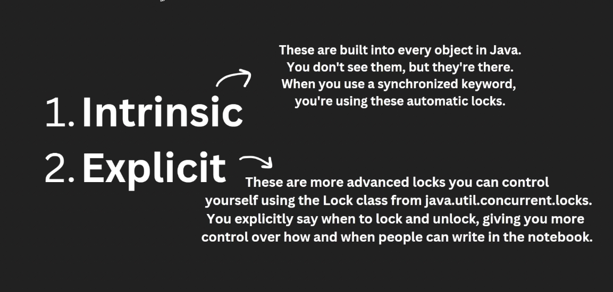

Here’s a corporate-level breakdown of *all major topics* covered in the **Java Multithreading** video you linked (from *Engineering Digest* on YouTube), including **example code snippets** for each concept. The video spans fundamentals → advanced concurrency tools, with clear real-world usage examples. ([YouTube][1])

---

## 📌 1. Java Multithreading Basics

**Concept:** Thread creation and execution in Java.
**Example: Create threads via `Thread` and `Runnable`**

```java
class MyTask implements Runnable {
    @Override
    public void run() {
        System.out.println("Running in: " + Thread.currentThread().getName());
    }
}

public class Main {
    public static void main(String[] args) {
        Thread thread = new Thread(new MyTask());
        thread.start();
    }
}
```

---

## 📌 2. Thread Lifecycle

**Concept:** States — NEW, RUNNABLE, BLOCKED, WAITING, TIMED_WAITING, TERMINATED

```java
Thread t = new Thread(() -> { });
System.out.println(t.getState());  // NEW
t.start();
System.out.println(t.getState());  // RUNNABLE or TERMINATED
```

### 🧵 Thread Lifecycle – Printing All States
### ✅ Complete Example

```java
public class ThreadStateDemo {

    private static final Object lock = new Object();

    public static void main(String[] args) throws Exception {

        Thread worker = new Thread(() -> {
            try {
                // TIMED_WAITING (sleep)
                Thread.sleep(1000);

                // WAITING (wait)
                synchronized (lock) {
                    lock.wait();
                }

            } catch (InterruptedException e) {
                Thread.currentThread().interrupt();
            }
        });

        // 1️⃣ NEW
        System.out.println("State after creation: " + worker.getState());

        worker.start();

        // Small delay to ensure thread starts running
        Thread.sleep(100);

        // 2️⃣ RUNNABLE (may briefly appear)
        System.out.println("State after start: " + worker.getState());

        // 3️⃣ TIMED_WAITING (because of sleep)
        Thread.sleep(200);
        System.out.println("State during sleep: " + worker.getState());

        // Wait until sleep finishes and thread enters WAITING
        Thread.sleep(1200);
        System.out.println("State during wait(): " + worker.getState());

        // Create BLOCKED state
        Thread blockedThread = new Thread(() -> {
            synchronized (lock) {
                System.out.println("Blocked thread acquired lock");
            }
        });

        synchronized (lock) {
            blockedThread.start();
            Thread.sleep(100);
            System.out.println("Blocked thread state: " + blockedThread.getState());
        }

        // Wake up worker thread
        synchronized (lock) {
            lock.notify();
        }

        worker.join();
        blockedThread.join();

        // 6️⃣ TERMINATED
        System.out.println("Worker thread final state: " + worker.getState());
        System.out.println("Blocked thread final state: " + blockedThread.getState());
    }
}
```

---

## 🧠 What’s Happening Internally

| State             | Why It Happens Here                     |
|-------------------|-----------------------------------------|
| **NEW**           | Thread created but `start()` not called |
| **RUNNABLE**      | JVM scheduled thread to run             |
| **TIMED_WAITING** | `Thread.sleep()`                        |
| **WAITING**       | `Object.wait()` without timeout         |
| **BLOCKED**       | Waiting to acquire a monitor lock       |
| **TERMINATED**    | `run()` method finished                 |

---

### 🎯 Senior Interview Insight

Interviewers love this follow-up:

> **“Why might RUNNABLE not always be visible?”**

Because **RUNNABLE includes both ready-to-run and actually-running**, and transitions happen so fast you might miss it unless you sample repeatedly.


## 🧵 Java Thread Lifecycle Diagram (Interview-Grade View)


Here’s the **mental model interviewers expect** — not just states, but **how transitions happen and why**.

---

## 🔄 State Transition Flow

```
        start()
 NEW  ----------->  RUNNABLE  <----------------------+
                      |   ^                           |
                      |   |                           |
                      |   | lock released              |
                      |   +---------------------------+
                      |
                      | tries to enter synchronized block
                      v
                   BLOCKED
                      |
                      | lock acquired
                      v
                   RUNNABLE
                      |
          +-----------+-----------+
          |                       |
   wait() / join()         sleep()/wait(timeout)
          |                       |
          v                       v
       WAITING             TIMED_WAITING
          |                       |
          +-----------+-----------+
                      |
                      v
                   RUNNABLE
                      |
                      | run() finishes
                      v
                  TERMINATED
```

---

## 🧠 What Triggers Each Transition

| From → To                    | Trigger                                     | What JVM Is Doing                |
|------------------------------|---------------------------------------------|----------------------------------|
| **NEW → RUNNABLE**           | `start()`                                   | Thread registered with scheduler |
| **RUNNABLE → BLOCKED**       | Waiting for monitor lock                    | Competing for `synchronized`     |
| **BLOCKED → RUNNABLE**       | Lock acquired                               | Can execute again                |
| **RUNNABLE → WAITING**       | `wait()`, `join()`                          | Waiting indefinitely             |
| **RUNNABLE → TIMED_WAITING** | `sleep()`, `wait(timeout)`, `join(timeout)` | Waiting with timeout             |
| **WAITING → RUNNABLE**       | `notify()`, `notifyAll()`, thread finishes  | Condition satisfied              |
| **TIMED_WAITING → RUNNABLE** | Timeout expires or notify                   | Timer or signal                  |
| **RUNNABLE → TERMINATED**    | `run()` completes                           | Thread exits                     |

---

## 🎯 Senior-Level Insights Interviewers Look For

### 1️⃣ **RUNNABLE ≠ Running**

It means **eligible to run**, not guaranteed CPU execution.

### 2️⃣ **BLOCKED vs WAITING**

| BLOCKED                         | WAITING                            |
|---------------------------------|------------------------------------|
| Waiting for a **monitor lock**  | Waiting for a **signal/condition** |
| Happens at `synchronized` entry | Happens inside `wait()` / `join()` |

### 3️⃣ **sleep() does NOT release locks**

Classic trick question.

### 4️⃣ **wait() releases monitor**

That’s why it's used for inter-thread communication.

### 5️⃣ TERMINATED is final

Thread cannot be restarted.

---

If you'd like, next I can show:

✅ How these states appear in a **real thread dump**
✅ How to **debug deadlocks using thread states**

---

<div id=“concurrency”></div>
<details>
<summary><b>🔴🔴🔴 <font color="red">🌍📄 2. Thread Lifecycle methods </font> 🔴🔴🔴</b></summary>
<br>
<blockquote>

Here is the comparison between `interrupt()` and `yield()` in a structured Markdown format.

## Comparison: `interrupt()` vs `yield()` in Java

In Java multithreading, these two methods are used to communicate with the **Thread Scheduler**, but they represent very different levels of urgency.

---

### 1. `interrupt()` — The "Stop" Signal

The `interrupt()` method is a mechanism to notify a thread that it should stop what it is doing. It is **cooperative**, meaning the thread isn't killed instantly; it is simply "flagged."

* **How it works:** It sets an internal **boolean flag** to `true`.
* **The Blocking Catch:** If a thread is "sleeping" (`Thread.sleep()`) or "waiting" (`Object.wait()`), calling `interrupt()` will wake it up immediately by throwing an `InterruptedException`.
* **Best Practice:** You should always check the flag using `Thread.currentThread().isInterrupted()` to exit loops cleanly.

### 2. `yield()` — The "After You" Hint

The `yield()` method is a **non-blocking** hint to the JVM. It tells the scheduler that the current thread is willing to give up its remaining time slice so other threads can run.

* **How it works:** It moves the thread from the **Running** state back to the **Runnable** (Ready) state.
* **Reliability:** It is purely a "hint." The Thread Scheduler is allowed to ignore it completely if there are no other threads waiting or if the waiting threads have lower priority.
* **Modern Usage:** It is rarely used in high-level application code today, as the OS and JVM handle thread scheduling very efficiently.

---

### Summary Table

| Feature          | `interrupt()`                                           | `yield()`                                        |
|------------------|---------------------------------------------------------|--------------------------------------------------|
| **Intent**       | To request a thread to stop or cancel its task.         | To give other threads a chance to execute.       |
| **Thread State** | Moves from **Blocked** to **Runnable** (via Exception). | Moves from **Running** back to **Runnable**.     |
| **Exception**    | Throws `InterruptedException` if thread is blocked.     | Never throws an exception.                       |
| **Control**      | Controlled by the developer (logical flag).             | Controlled by the Thread Scheduler (hint).       |
| **Effect**       | Persistent until the flag is cleared.                   | Temporary (only affects the current time slice). |

---

### Practical Code Examples

#### Handling an Interrupt

```java
Thread worker = new Thread(() -> {
    while (!Thread.currentThread().isInterrupted()) {
        try {
            // Simulate work
            System.out.println("Working...");
            Thread.sleep(1000); 
        } catch (InterruptedException e) {
            // Re-interrupt because sleep clears the flag
            Thread.currentThread().interrupt();
            System.out.println("Woken up from sleep! Cleaning up...");
        }
    }
});
worker.start();
worker.interrupt(); // The request to stop

```

#### Using Yield

```java
Runnable task = () -> {
    for (int i = 0; i < 3; i++) {
        System.out.println(Thread.currentThread().getName() + " is processing.");
        Thread.yield(); // "I'm okay with pausing here if someone else needs the CPU."
    }
};
new Thread(task, "Thread-A").start();
new Thread(task, "Thread-B").start();

```

**Would you like me to explain why `Thread.sleep()` clears the interrupt flag and how to handle that properly?**

> [⬆️ Back to Top / Close](#concurrency)
</blockquote>
</details>

---

## 📌 3. Thread vs Runnable

**Concept:** `Thread` adds overhead; `Runnable` separates logic from execution.

```java
Runnable r = () -> System.out.println("Runnable running");
new Thread(r).start();
```

---

## 📌 4. Synchronization

**Concept:** Prevent shared-state corruption with `synchronized`.

```java
public class Counter {
    private int count = 0;
    public synchronized void increment() {
        count++;
    }
}
```

<div id="synchronization"></div>
<details>
<summary><b>🔴🔴🔴 <font color="red">🌍📄 Synchronization</font> 🔴🔴🔴</b></summary>
<br>
<blockquote>

# 📌 4. Synchronization in Java

## 🔹 Concept: Prevent Shared-State Corruption with `synchronized`

When multiple threads access **shared mutable data**, inconsistent results can occur due to **race conditions**. Java provides the `synchronized` keyword to ensure that **only one thread at a time** executes a critical section of code.

---

## 🧠 Why Synchronization is Needed

### ❌ Problem: Race Condition

A race condition happens when multiple threads read and write shared data simultaneously, causing unpredictable results.

Example without synchronization:

```java
public class Counter {
    private int count = 0;

    public void increment() {
        count++;  // Not atomic!
    }
}
```

`count++` is actually **three steps**:
1. Read value of `count`
2. Add 1
3. Write updated value back

If two threads run this at the same time, updates can be **lost**.

---

## ✅ Solution: Using `synchronized`

```java
public class Counter {
    private int count = 0;

    public synchronized void increment() {
        count++;
    }
}
```

Now:
- Only **one thread** can execute `increment()` at a time
- Other threads must **wait** until the lock is released

---

## 🔒 What Exactly Does `synchronized` Do?

Every Java object has an intrinsic lock (monitor).

When a thread enters a synchronized method/block:
1. It **acquires the object's monitor lock**
2. Executes the code
3. Releases the lock when exiting

Other threads attempting to enter must **block** until the lock is free.

---

# 🧩 Types of Synchronization

## 1️⃣ Synchronized Instance Method

Locks the **current object (`this`)**

```java
public synchronized void increment() {
    count++;
}
```

Lock = current instance

---

## 2️⃣ Synchronized Block

More flexible, allows locking on a specific object.

```java
public void increment() {
    synchronized(this) {
        count++;
    }
}
```

### Why use blocks instead of method-level sync?
✔ Smaller critical section  
✔ Better performance  
✔ More granular control

---

## 3️⃣ Static Synchronization

Locks on the **Class object**, not instance.

```java
public static synchronized void log() {
    // Only one thread across ALL instances
}
```

Equivalent to:

```java
synchronized(Counter.class) {
    // critical section
}
```

---

# ⚙️ How Locks Work Internally

Java uses **monitor locks**:
- Each object has a monitor
- A thread must **own** the monitor to enter synchronized code
- Locks are **reentrant**

### Reentrant Means:
A thread holding a lock can re-enter other synchronized methods on the same object.

```java
public synchronized void methodA() {
    methodB(); // allowed
}

public synchronized void methodB() {}
```

---

# 🚦 Thread States with Synchronization

| State         | Meaning                         |
|---------------|---------------------------------|
| BLOCKED       | Waiting to acquire monitor lock |
| RUNNABLE      | Acquired lock and executing     |
| WAITING       | Waiting via wait()              |
| TIMED_WAITING | Waiting with timeout            |

---

# ⏳ wait(), notify(), notifyAll()

Used for **inter-thread communication**. Must be called inside synchronized context.

## `wait()`
Releases the lock and puts thread in WAITING state.

## `notify()`
Wakes one waiting thread.

## `notifyAll()`
Wakes all waiting threads.

```java
synchronized(lock) {
    while(!condition) {
        lock.wait();
    }
    // proceed
}
```

---

# ⚠️ Common Problems

## ❌ Deadlock

Two threads waiting on each other’s locks forever.

```java
Thread 1: lock A → waiting for B  
Thread 2: lock B → waiting for A
```

### Prevention:
- Lock ordering
- Timeout locks
- Avoid nested locks

---

## ❌ Thread Starvation

One thread never gets CPU or lock access due to priority or unfair locking.

---

## ❌ Livelock

Threads keep responding to each other but make no progress.

---

# 📈 Performance Considerations

| Factor                    | Impact             |
|---------------------------|--------------------|
| Large synchronized blocks | Slower performance |
| High contention           | More blocking      |
| Fine-grained locking      | Better scalability |

---

# 🆚 synchronized vs Lock API

| Feature             | synchronized | ReentrantLock |
|---------------------|--------------|---------------|
| Simplicity          | Easy         | More control  |
| Fairness            | No           | Optional      |
| Try lock            | No           | Yes           |
| Interruptible       | No           | Yes           |
| Multiple conditions | No           | Yes           |


---

# 🧪 Best Practices

* ✔ Keep synchronized blocks small  
* ✔ Avoid locking on `this` in public APIs  
* ✔ Prefer private final lock objects  
* ✔ Avoid nested locks  
* ✔ Use concurrent collections when possible

---

# 🧠 Interview One‑Liners

- "`synchronized` ensures mutual exclusion and memory visibility."
- "Each Java object has a monitor lock."
- "Locks in Java are reentrant."
- "`wait()` releases the lock; `sleep()` does not."
- "Use synchronized for simple locking, Lock API for advanced control."

---

# 🎯 Summary

Synchronization in Java prevents data corruption by allowing only one thread at a time to execute critical sections. It uses intrinsic object monitors, supports reentrancy, and works closely with wait/notify for thread coordination. Proper use improves thread safety but must be balanced against performance risks like contention and deadlocks.

> [⬆️ Back to Top / Close](#synchronization)
</blockquote>
</details>

---

## 📌 5. Locks (`ReentrantLock`)

**Concept:** Flexible locking with try-lock, fairness policies.

```java
Lock lock = new ReentrantLock();
lock.lock();
try {
    // critical section
} finally {
    lock.unlock();
}
```

<div id="locktypes"></div>
<details>
<summary><b>🔴🔴🔴 <font color="red">🌍📄 📌 Locks in Java — Real-World Usage Guide</font> 🔴🔴🔴</b></summary>
<br>
<blockquote>

Perfect topic — **Locks** is a *favorite deep-dive area* in Java interviews. Let’s build this like real production scenarios, not textbook fluff.

---

# 📌 Locks in Java — Real-World Usage Guide

Java locking falls into **two major categories**:

| Type                | Also Called                  | Examples                                        |
|---------------------|------------------------------|-------------------------------------------------|
| **Intrinsic Locks** | Monitor Locks                | `synchronized`                                  |
| **Explicit Locks**  | `java.util.concurrent.locks` | `ReentrantLock`, `ReadWriteLock`, `StampedLock` |

---

# 🔒 PART 1 — INTRINSIC LOCKS (`synchronized`)

Every Java object has a **monitor lock**.

---

## 🏦 Real Scenario 1: Bank Account Transfer (Thread Safety)

Multiple ATMs updating the same account balance.


```java
public class BankAccount {
    private int balance = 1000;

    // intrinsic lock on 'this'
    public synchronized void withdraw(int amount) {
        if (balance >= amount) {
            balance -= amount;  // critical section
            System.out.println(Thread.currentThread().getName() + " withdrew " + amount);
        } else {
            System.out.println("Insufficient balance");
        }
    }
}
```

### 💡 Why synchronized works here

* Only **one ATM thread** updates balance at a time
* Prevents **double withdrawal bug**

---

## 🧾 Scenario 2: Printing Service Queue

Only one document should be printed at a time.


```java
public class PrinterService {

    public void printDocument(String docName) {
        synchronized (this) {  // lock on printer object
            System.out.println("Printing: " + docName);
            try { Thread.sleep(2000); } catch (InterruptedException e) {}
            System.out.println("Finished: " + docName);
        }
    }
}
```

---

## 🏢 Scenario 3: Company-wide Static Resource

Shared report generator across all branches.

```java
public class ReportGenerator {

    // Class-level lock
    public static synchronized void generateAnnualReport() {
        System.out.println("Generating company-wide report...");
    }
}
```

Lock is on `ReportGenerator.class` — only **one thread in entire JVM** can run it.

---

# 🚀 PART 2 — EXPLICIT LOCKS

More control, more power.

---

## 🔁 1. ReentrantLock — Smart Bank Counter

Used when we need **tryLock, fairness, interruptible lock**

```java
import java.util.concurrent.locks.ReentrantLock;

public class SmartBankAccount {
    private int balance = 1000;
    private final ReentrantLock lock = new ReentrantLock();

    public void withdraw(int amount) {
        lock.lock();  // acquire lock manually
        try {
            if (balance >= amount) {
                balance -= amount;
                System.out.println("Withdrawn: " + amount);
            }
        } finally {
            lock.unlock(); // MUST release
        }
    }
}
```

### 🌟 Real Advantage Over synchronized

| Feature       | Benefit                   |
|---------------|---------------------------|
| `tryLock()`   | Avoid waiting forever     |
| Fair lock     | First-come-first-serve    |
| Interruptible | Can cancel waiting thread |

---

## 🚦 Scenario 4: Traffic Signal System (tryLock)

Avoids deadlock at intersections.


```java
public void passIntersection(ReentrantLock roadLock) {
    if (roadLock.tryLock()) { // don't wait forever
        try {
            System.out.println("Car passing...");
        } finally {
            roadLock.unlock();
        }
    } else {
        System.out.println("Road busy, rerouting...");
    }
}
```

---

## 📖 2. ReadWriteLock — Library System

Many readers, few writers.


```java
import java.util.concurrent.locks.ReentrantReadWriteLock;

public class LibraryDatabase {
    private String book = "Java Concurrency";
    private final ReentrantReadWriteLock rwLock = new ReentrantReadWriteLock();

    public void readBook() {
        rwLock.readLock().lock();
        try {
            System.out.println("Reading: " + book);
        } finally {
            rwLock.readLock().unlock();
        }
    }

    public void updateBook(String newBook) {
        rwLock.writeLock().lock();
        try {
            book = newBook;
            System.out.println("Updated Book");
        } finally {
            rwLock.writeLock().unlock();
        }
    }
}
```

### 📌 Why this is powerful

✔ Multiple readers allowed
❌ Only one writer allowed
✔ Improves performance for read-heavy systems

---

## ⚡ 3. StampedLock — High Performance Cache

Optimistic reads (very fast)


```java
import java.util.concurrent.locks.StampedLock;

public class Cache {
    private int data = 42;
    private final StampedLock lock = new StampedLock();

    public int readData() {
        long stamp = lock.tryOptimisticRead();
        int current = data;

        if (!lock.validate(stamp)) { // if write occurred
            stamp = lock.readLock();
            try {
                current = data;
            } finally {
                lock.unlockRead(stamp);
            }
        }
        return current;
    }

    public void updateData(int newData) {
        long stamp = lock.writeLock();
        try {
            data = newData;
        } finally {
            lock.unlockWrite(stamp);
        }
    }
}
```
Read to test method is below it main method to run.
```java
import java.util.concurrent.locks.StampedLock;

public class Cache {
    private int data = 42;
    private final StampedLock lock = new StampedLock();

    // Optimistic read (very fast if no writer)
    public int readData() {
        long stamp = lock.tryOptimisticRead();  // no blocking
        int current = data;

        // If a write happened after we took the stamp
        if (!lock.validate(stamp)) {
            // Fallback to real read lock
            stamp = lock.readLock();
            try {
                current = data;
            } finally {
                lock.unlockRead(stamp);
            }
        }
        return current;
    }

    // Exclusive write
    public void updateData(int newData) {
        long stamp = lock.writeLock(); // blocks readers & writers
        try {
            System.out.println(Thread.currentThread().getName() +
                    " updating data to " + newData);
            data = newData;
            Thread.sleep(1000); // simulate write delay
        } catch (InterruptedException e) {
            Thread.currentThread().interrupt();
        } finally {
            lock.unlockWrite(stamp);
        }
    }

    public static void main(String[] args) throws Exception {
        Cache cache = new Cache();

        // Reader task
        Runnable reader = () -> {
            for (int i = 0; i < 10; i++) {
                int value = cache.readData();
                System.out.println(Thread.currentThread().getName() +
                        " read value: " + value);
                try {
                    Thread.sleep(300); // simulate read frequency
                } catch (InterruptedException e) {
                    Thread.currentThread().interrupt();
                }
            }
        };

        // Writer task
        Runnable writer = () -> {
            for (int i = 1; i <= 5; i++) {
                cache.updateData(i * 100);
            }
        };

        // Start multiple readers
        Thread r1 = new Thread(reader, "Reader-1");
        Thread r2 = new Thread(reader, "Reader-2");
        Thread r3 = new Thread(reader, "Reader-3");

        // Single writer
        Thread w1 = new Thread(writer, "Writer");

        r1.start();
        r2.start();
        r3.start();

        Thread.sleep(500); // let readers start first
        w1.start();

        r1.join();
        r2.join();
        r3.join();
        w1.join();

        System.out.println("Cache simulation complete.");
    }
}
```
where you can actually *see optimistic reads vs writes* happening.

We’ll create:

* Multiple **reader threads** (very fast optimistic reads)
* One **writer thread** (occasionally updates data)

## 🧠 What You’ll Observe

### 🟢 When no write is happening

Readers run **without locking** (super fast)

```
Reader-1 read value: 42
Reader-2 read value: 42
Reader-3 read value: 42
```

### 🔴 When writer updates

Optimistic read **fails validation**, readers retry with real read lock

```
Writer updating data to 100
Reader-1 read value: 100
Reader-2 read value: 100
```

---

## 🎯 Interview Explanation

> “StampedLock allows optimistic reads without blocking. If a write occurs, validation fails and the reader falls back to a real read lock. This is ideal for read-heavy, low-write systems like caches or analytics engines.”

---

## 🚀 Key Advantage Over ReadWriteLock

| Feature          | StampedLock                     |
|------------------|---------------------------------|
| Optimistic reads | ✅                               |
| Reentrant        | ❌                               |
| Performance      | Very high in read-heavy systems |
| Complexity       | Higher                          |

---

If you want next, I can show
👉 When **optimistic read fails frequently** (bad case)
👉 **Deadlock with StampedLock (conversion pitfalls)**
👉 Performance comparison: synchronized vs RWLock vs StampedLock

Used in **in-memory caches, analytics engines**

---

# 🧠 Interview Comparison Table

| Lock Type       | Use Case                 | Pros               | Cons                      |
|-----------------|--------------------------|--------------------|---------------------------|
| `synchronized`  | Simple critical sections | Easy, safe         | No timeout, less flexible |
| `ReentrantLock` | Advanced control         | tryLock, fairness  | Must unlock manually      |
| `ReadWriteLock` | Read-heavy systems       | Parallel reads     | Write blocking            |
| `StampedLock`   | High performance reads   | Optimistic locking | Complex, not reentrant    |

---

# 🎯 Key Interview Lines

* “Intrinsic locks are easier but less flexible.”
* “ReentrantLock provides interruptible and timed locking.”
* “ReadWriteLock improves performance in read-heavy workloads.”
* “StampedLock uses optimistic reads for ultra-low latency.”

---

If you want, next I can give
👉 **Deadlock real examples**
👉 **Producer–Consumer using Locks**
👉 **Condition variables with ReentrantLock**


Excellent catch — this is a **very common interview trap question**.

When you see:

```java
catch (InterruptedException e) {
    Thread.currentThread().interrupt();
}
```

👉 This is called **"restoring the interrupt status"**

Let’s break it down properly.

---

# 🧠 What Is an Interrupt?

In Java, **interrupting a thread** is a polite way of saying:

> "Hey thread, please stop what you're doing when it's safe."

It **does NOT forcibly kill the thread**.
It sets an **internal interrupt flag** on the thread.

---

# ⚠️ The Problem

Some methods like:

* `Thread.sleep()`
* `Object.wait()`
* `BlockingQueue.take()`
* `join()`

**throw `InterruptedException` AND clear the interrupt flag**.

That means when you catch the exception, the thread **is no longer marked as interrupted**.

So if you do nothing, higher-level code has **no idea** the thread was asked to stop.

---

# ✅ Why We Call `Thread.currentThread().interrupt()`

We call it to **restore the interrupt flag** so that:

✔ Higher-level logic can detect interruption
✔ Executors / thread pools can stop tasks properly
✔ The thread can exit gracefully later

---

## 🔍 Real Flow Example

```java
try {
    Thread.sleep(1000);
} catch (InterruptedException e) {
    // Sleep cleared the interrupt flag!
    Thread.currentThread().interrupt(); // Restore it
}
```

Without restoring:
🚫 The interruption request is **lost**

With restoring:
✅ The thread still remembers it was interrupted

---

# 🏢 Real-World Scenario

Imagine a **server shutting down**:

1. ExecutorService calls `thread.interrupt()`
2. Your thread is sleeping
3. `InterruptedException` is thrown
4. If you DON’T restore it → thread keeps running ❌
5. If you restore it → higher-level shutdown logic works ✅

---

# 📌 Interview One-Liner

> "InterruptedException clears the thread’s interrupt flag. Calling `Thread.currentThread().interrupt()` restores it so the interruption can be handled further up the call stack."

---

# ❓ When Should You NOT Restore It?

If you are **fully handling the interruption right there**, for example:

```java
catch (InterruptedException e) {
    System.out.println("Stopping thread...");
    return; // exiting thread intentionally
}
```

Then restoring is not required because you're already stopping.

---

# 🧩 Summary

| Action                                      | Effect             |
|---------------------------------------------|--------------------|
| Thread is interrupted                       | Interrupt flag set |
| Blocking method throws InterruptedException | Flag is cleared    |
| Calling `.interrupt()` again                | Flag restored      |

---

If you'd like, next I can show:
🔹 How thread interruption works with ExecutorService
🔹 Difference between `isInterrupted()` vs `interrupted()`
🔹 Proper shutdown pattern for thread pools


> [⬆️ Back to Top / Close](#locktypes)
</blockquote>
</details>

---