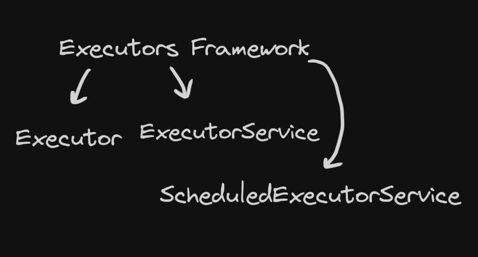
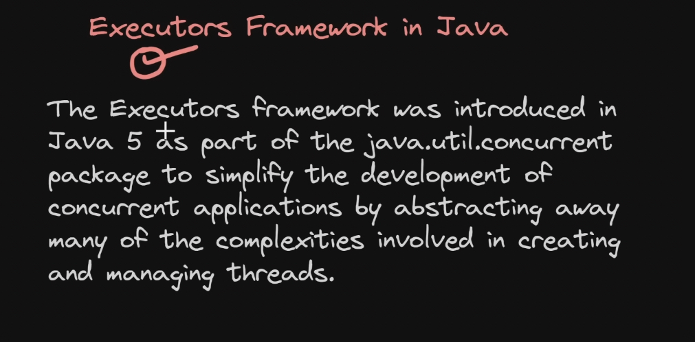
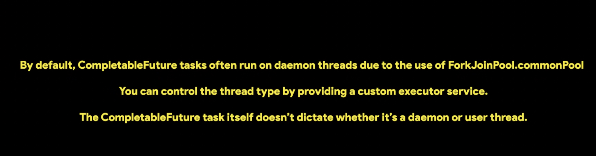
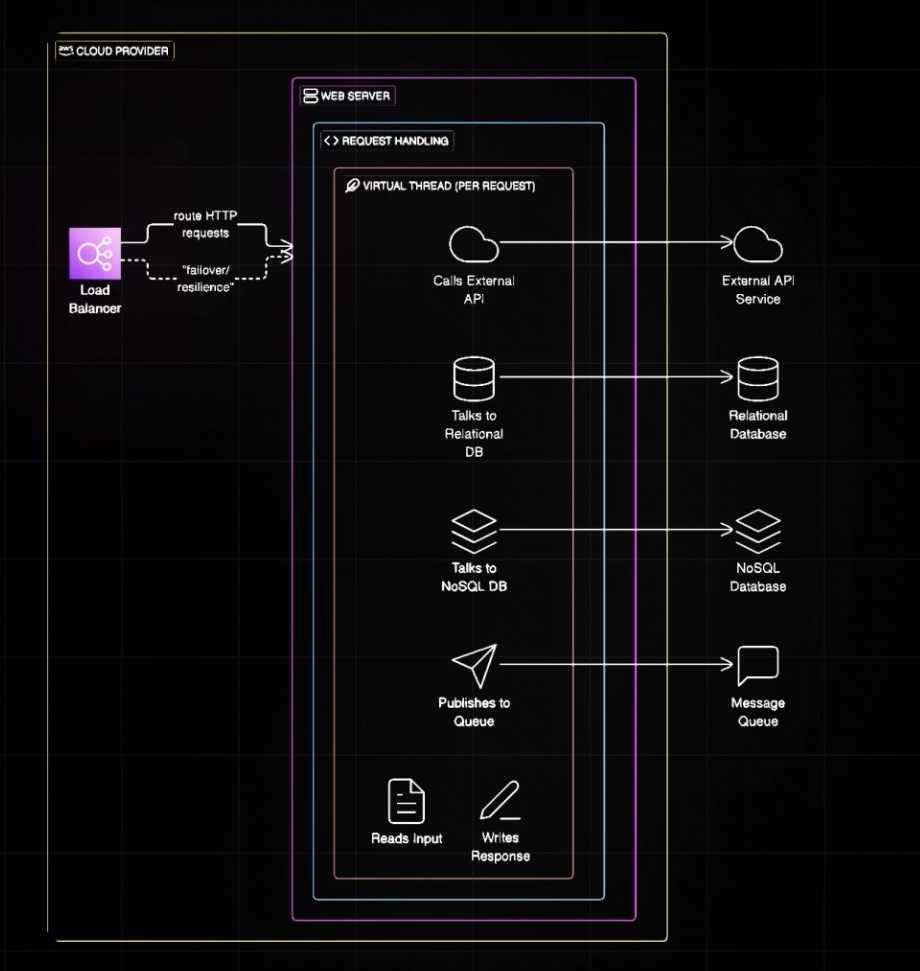
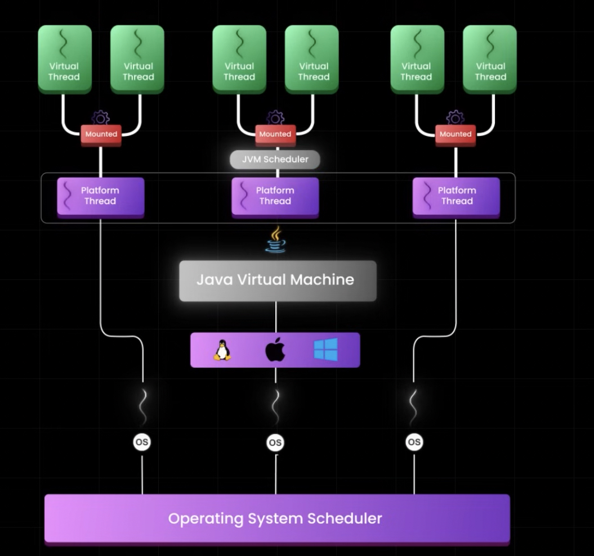
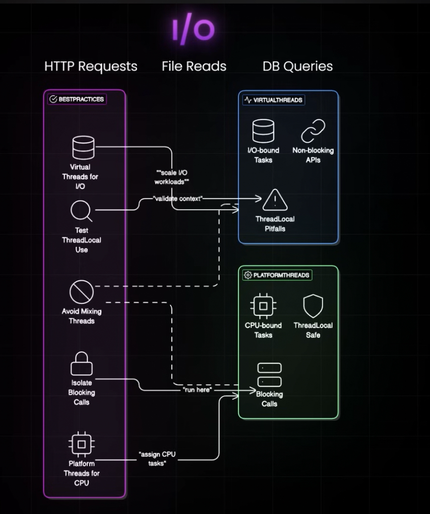

## 📌 6. Fairness of Locks

**Concept:** FIFO ordering for thread access — useful under heavy contention.

```java
Lock fairLock = new ReentrantLock(true);  // true ⇒ fair
```

---

## 📌 7. Read-Write Lock (`ReentrantReadWriteLock`)

**Concept:** Multiple readers OR one writer for higher throughput.

```java
ReadWriteLock rw = new ReentrantReadWriteLock();
rw.readLock().lock();
try { /* read data */ } finally { rw.readLock().unlock(); }
```
<div id="ReentrantReadWriteLock"></div>
<details>
<summary><b>🔴🔴🔴 <font color="red">🌍📄 🔒 ReentrantLock vs ReentrantReadWriteLock</font> 🔴🔴🔴</b></summary>
<br>
<blockquote>

Love this question — this comparison is **asked very often** to test if you understand *when to scale read performance* vs *simple mutual exclusion*.

Here’s a **clean interview-ready comparison**:

---

# 🔒 `ReentrantLock` vs `ReentrantReadWriteLock`

| Feature                              | **ReentrantLock**                                 | **ReentrantReadWriteLock**                          |
|--------------------------------------|---------------------------------------------------|-----------------------------------------------------|
| **Lock Type**                        | Exclusive lock only                               | Two locks: **Read Lock** + **Write Lock**           |
| **Concurrency Level**                | Only **one thread** at a time                     | **Multiple readers** OR **one writer**              |
| **Best Use Case**                    | Write-heavy or equal read/write workload          | Read-heavy systems                                  |
| **Performance in Read-Heavy System** | Slower (reads block each other)                   | Faster (reads run in parallel)                      |
| **Write Behavior**                   | Only one thread can write                         | Only one writer, blocks readers & writers           |
| **Read Behavior**                    | Reads also require exclusive lock                 | Many threads can read simultaneously                |
| **Lock Upgrade (Read → Write)**      | Not applicable                                    | ❌ Not supported (can cause deadlock)                |
| **Lock Downgrade (Write → Read)**    | Not applicable                                    | ✅ Supported                                         |
| **Fairness Option**                  | Yes (`new ReentrantLock(true)`)                   | Yes (`new ReentrantReadWriteLock(true)`)            |
| **Interruptible Locking**            | Yes (`lockInterruptibly()`)                       | Yes (for both read & write locks)                   |
| **Try Lock Support**                 | Yes (`tryLock()`)                                 | Yes (`tryLock()` on both locks)                     |
| **Complexity**                       | Simple to use                                     | More complex                                        |
| **Memory Overhead**                  | Lower                                             | Higher (manages two lock types)                     |
| **Starvation Risk**                  | Lower                                             | Writers may starve in non-fair mode                 |
| **Typical Real Example**             | Updating a shared counter, transaction processing | Cache systems, configuration stores, search engines |

---

## 🧠 Simple Way to Remember

| Situation                      | Use This                   |
|--------------------------------|----------------------------|
| Most operations modify data    | **ReentrantLock**          |
| Most operations just read data | **ReentrantReadWriteLock** |

---

## 🎯 Interview One-Liner

> “ReentrantLock provides mutual exclusion for all operations, while ReentrantReadWriteLock improves scalability by allowing multiple concurrent readers but still ensures exclusive writes.”

---

If you'd like, I can next give:
✅ Code showing **performance difference**
✅ Example of **lock downgrading**
✅ Example of **writer starvation**


> [⬆️ Back to Top / Close](#ReentrantReadWriteLock)
</blockquote>
</details>

---

## 📌 8. Deadlock Prevention

**Concept:** Avoid circular waits by consistent lock ordering.

```java
synchronized(a) {
    synchronized(b) {
        // no deadlock if ordering is consistent
    }
}
```

<div id="deadlockprevention"></div>
<details>
<summary><b>🔴🔴🔴 <font color="red">🌍📄 📌 ✏️🖊️ Deadlock Example — Pen & Paper</font> 🔴🔴🔴</b></summary>
<br>
<blockquote>

---

# ✏️🖊️ Deadlock Example — Pen & Paper

Two people:

* Person A needs **Pen → Paper**
* Person B needs **Paper → Pen**

Both grab one resource and wait forever for the other.

---

### 🧠 Deadlock Conditions (Interview Theory)

Deadlock happens when all 4 are true:

1. **Mutual Exclusion** – Only one thread can use a resource
2. **Hold and Wait** – Thread holds one resource while waiting for another
3. **No Preemption** – Resource can't be forcibly taken
4. **Circular Wait** – Threads wait in a cycle

Our pen-paper example satisfies all four.

---

### 💻 Java Deadlock Code Example

```java
public class DeadlockPenPaper {

    private static final Object pen = new Object();
    private static final Object paper = new Object();

    public static void main(String[] args) {

        Thread personA = new Thread(() -> {
            synchronized (pen) {
                System.out.println("Person A grabbed the PEN ✏️");
                sleep(100);

                System.out.println("Person A waiting for PAPER...");
                synchronized (paper) {
                    System.out.println("Person A grabbed PAPER 📄");
                }
            }
        });

        Thread personB = new Thread(() -> {
            synchronized (paper) {
                System.out.println("Person B grabbed the PAPER 📄");
                sleep(100);

                System.out.println("Person B waiting for PEN...");
                synchronized (pen) {
                    System.out.println("Person B grabbed PEN ✏️");
                }
            }
        });

        personA.start();
        personB.start();
    }

    private static void sleep(long ms) {
        try {
            Thread.sleep(ms);
        } catch (InterruptedException e) {
            Thread.currentThread().interrupt();
        }
    }
}
```

---

### 🧪 What Happens When You Run This

### Output will stop like this:

```
Person A grabbed the PEN ✏️
Person B grabbed the PAPER 📄
Person A waiting for PAPER...
Person B waiting for PEN...
```

💥 Program **FREEZES FOREVER**

Why?

| Thread   | Holds | Waiting For |
|----------|-------|-------------|
| Person A | Pen   | Paper       |
| Person B | Paper | Pen         |

➡ Circular wait = Deadlock

---

## 🔍 How to Detect Deadlock (Interview Bonus)

Run:

```
jstack <pid>
```

You will see something like:

```
Found one Java-level deadlock:
Thread-0 waiting to lock paper
Thread-1 waiting to lock pen
```

<div id="deadlockdetection"></div>
<details>
<summary><b>🔴🔴🔴 <font color="red">🌍📄 📌DEAD LOCK DETECTION</font> 🔴🔴🔴</b></summary>
<br>
<blockquote>

Love this question — **deadlock detection** is a *senior-level debugging skill*. Let’s make it crystal clear and practical.

---

# 🔍 How to Detect a Deadlock in Java (Step-by-Step)

When a program **freezes** and CPU usage is low, a deadlock might be the cause. Java gives us tools to confirm it.

---

## 🧠 What Is Happening Internally?

In a deadlock:

* Thread A holds Lock 1 and waits for Lock 2
* Thread B holds Lock 2 and waits for Lock 1

Both are stuck in **BLOCKED state forever**

We need to inspect **thread states + lock ownership**

---

# 🛠 Method 1 — Using `jstack` (Most Common Interview Answer)

### 🟢 Step 1: Find the Process ID (PID)

Run your Java program, then in terminal:

**Mac/Linux**

```bash
jps
```

**Windows**

```bash
jps -l
```

You’ll see:

```
12345 DeadlockPenPaper
```

👉 `12345` is the PID

---

### 🟢 Step 2: Take Thread Dump

```bash
jstack 12345
```

This prints **all thread stack traces**

---

### 🟢 Step 3: Look for the Deadlock Section

At the bottom you may see:

```
Found one Java-level deadlock:
=============================
"Thread-0":
  waiting to lock monitor 0x000000001, object "paper"
  which is held by "Thread-1"

"Thread-1":
  waiting to lock monitor 0x000000002, object "pen"
  which is held by "Thread-0"
```

### 💡 What This Means

| Thread   | Holding | Waiting For |
| -------- | ------- | ----------- |
| Thread-0 | pen     | paper       |
| Thread-1 | paper   | pen         |

Circular wait confirmed ✅

Java JVM **automatically detects** monitor deadlocks and prints this summary.

---

# 🛠 Method 2 — Using VisualVM (GUI Way)


1. Open **VisualVM**
2. Attach to running Java process
3. Go to **Threads tab**
4. Click **Thread Dump**
5. Deadlocked threads appear in **red** with lock details

Great for demos in interviews.

---

# 🛠 Method 3 — Using JConsole

Similar to VisualVM:

1. Open `jconsole`
2. Connect to process
3. Go to **Threads**
4. Click **Detect Deadlock**

It explicitly shows:

```
Deadlock detected involving threads:
Thread-0 and Thread-1
```

---

# 🔎 What to Look for in Thread Dump (Manual Way)

Even if JVM doesn't auto-detect (rare cases with `Lock` API), check:

### 🚩 Signs of Deadlock

| Symptom                      | Meaning               |
|------------------------------|-----------------------|
| Thread state = BLOCKED       | Waiting for a monitor |
| Locked ownable synchronizers | Shows held locks      |
| Waiting to lock              | Shows requested lock  |

Example:

```
Thread-0 state: BLOCKED
  waiting to lock <0x1234> (a java.lang.Object)
  locked <0x5678> (a java.lang.Object)
```

Find another thread that has **locked `<0x1234>`** and waits for `<0x5678>` → Deadlock

---

# ⚠️ Important Interview Point

`jstack` automatically detects **monitor deadlocks** (`synchronized`)

But for **ReentrantLock deadlocks**, JVM may not auto-report → you must analyze thread dump manually.

---

# 🎯 Interview Answer (Perfect Summary)

> “Deadlocks are detected by taking a thread dump using jstack. The JVM identifies circular waits between threads and prints a ‘Found one Java-level deadlock’ section showing which thread holds which lock and what it’s waiting for.”

---

If you'd like, next I can show:
✅ Thread dump of a `ReentrantLock` deadlock
✅ How production monitoring tools detect deadlocks
✅ How to write code to detect deadlocks programmatically


> [⬆️ Back to Top / Close](#deadlockdetection)
</blockquote>
</details>

---

# 🛡️ How to Fix It

Always acquire locks in the **same order**.

```java
// FIXED ORDER: Always Pen → Paper
synchronized (pen) {
    synchronized (paper) {
        // safe
    }
}
```

---

# 🎯 Interview One-Liner

> "Deadlock occurs when two threads hold resources the other needs and wait forever. It can be prevented by maintaining a consistent lock ordering."

---

If you'd like next, I can show:
✅ Deadlock using `ReentrantLock`
✅ Deadlock prevention with `tryLock()`
✅ Real production deadlock case (DB + Cache)


> [⬆️ Back to Top / Close](#deadlockprevention)
</blockquote>
</details>

---

## 📌 9. Thread Communication (`wait/notify`)

**Concept:** Threads coordinate via object monitors.

```java
synchronized(queue) {
    while(queue.isEmpty()) queue.wait();
    queue.notifyAll();
}
```
<div id="threadcommunication"></div>
<details>
<summary><b>🔴🔴🔴 <font color="red">🌍📄 📌 Thread Communication</font> 🔴🔴🔴</b></summary>
<br>
<blockquote>

---

## 🧠 Producer–Consumer Example (Classic Inter-Thread Communication)
Here’s a **clear, fully-runnable Producer–Consumer example** demonstrating *thread communication* with `wait()` and `notifyAll()` (classic Java inter-thread communication). This mirrors exactly how two threads coordinate over a shared buffer: the producer waits when full, the consumer waits when empty. ([GeeksforGeeks][1])

### 📌 What it demonstrates

* ✔ Producer thread produces items into a buffer
* ✔ Consumer thread consumes from that buffer
* ✔ Producer waits when buffer full
* ✔ Consumer waits when buffer empty
* ✔ Uses `wait()` / `notifyAll()` for communication between threads ([GeeksforGeeks][2])

---

## ✅ Full Java Code (Runnable)

```java
import java.util.LinkedList;
import java.util.Queue;

public class ProducerConsumerExample {

    private static final int CAPACITY = 5;
    private final Queue<Integer> buffer = new LinkedList<>();

    // Produce items
    public void produce() throws InterruptedException {
        int value = 0;
        while (true) {
            synchronized (buffer) {
                // Wait if buffer is full
                while (buffer.size() == CAPACITY) {
                    System.out.println("Buffer full. Producer waiting...");
                    buffer.wait();
                }

                System.out.println("Producing: " + value);
                buffer.add(value++);
                
                // Notify consumer that an item is available
                buffer.notifyAll();
            }

            Thread.sleep(500); // simulate production time
        }
    }

    // Consume items
    public void consume() throws InterruptedException {
        while (true) {
            synchronized (buffer) {
                // Wait if buffer is empty
                while (buffer.isEmpty()) {
                    System.out.println("Buffer empty. Consumer waiting...");
                    buffer.wait();
                }

                int item = buffer.remove();
                System.out.println("Consuming: " + item);
                
                // Notify producer that space is available
                buffer.notifyAll();
            }

            Thread.sleep(1000); // simulate consumption time
        }
    }

    public static void main(String[] args) {
        ProducerConsumerExample pc = new ProducerConsumerExample();

        Thread producer = new Thread(() -> {
            try {
                pc.produce();
            } catch (InterruptedException e) {
                Thread.currentThread().interrupt();
            }
        }, "Producer");

        Thread consumer = new Thread(() -> {
            try {
                pc.consume();
            } catch (InterruptedException e) {
                Thread.currentThread().interrupt();
            }
        }, "Consumer");

        producer.start();
        consumer.start();
    }
}
```

---

## 🧠 How It Works (Step-By-Step)

### 🟡 Producer Thread

1. Synchronizes on the shared buffer
2. If buffer is full (`size == CAPACITY`), calls `buffer.wait()`
3. When space available: produces item and adds to buffer
4. Calls `buffer.notifyAll()` to wake waiting threads
5. Repeats continuously ([GeeksforGeeks][2])

### 🟢 Consumer Thread

1. Synchronizes on same buffer
2. If buffer is empty, calls `buffer.wait()` to pause
3. When item available: consumes from buffer
4. Calls `buffer.notifyAll()` to wake waiting threads
5. Repeats continuously ([GeeksforGeeks][2])

---

## 🧠 Why Wait & NotifyWork

* `wait()` tells the thread to release the lock and sleep until another thread calls `notifyAll()`
* `notifyAll()` wakes *all* waiting threads so they can re-check conditions
* We always use `wait()`/`notifyAll()` inside a *loop* to re-check buffer state (important!) ([GeeksforGeeks][2])

---

## 🧪 Expected Output Behavior

```
Producing: 0
Consuming: 0
Producing: 1
Producing: 2
...
Buffer full. Producer waiting...
Consuming: 2
...
Buffer empty. Consumer waiting...
Producing: 5
...
```

You’ll see the producer and consumer **alternating correctly** depending on buffer state.

---

## 🧠 Interview-Ready Explanation

> *“We use a shared queue with mutual exclusion (`synchronized`) and inter-thread coordination (`wait()` / `notifyAll()`) so that the producer waits when the buffer is full and the consumer waits when the buffer is empty. This ensures threads efficiently communicate and avoid busy-waiting.”* ([GeeksforGeeks][1])

---

## ⚠️ Common Pitfalls (Ask Yourself)

* ❌ Forgetting to use `while` instead of `if` around `wait()`
* ✔ Always check condition in a loop to handle *spurious wakeups* ([javarevisited.blogspot.com][3])
 
---

## 📌 Bonus Tip

A modern alternative for real production code uses `BlockingQueue` from `java.util.concurrent`, which handles waiting internally and avoids explicit wait/notify calls. ([codesignal.com][4])

---

If you want, I can next show:
✔ Producer-Consumer using `BlockingQueue`
✔ Same example with multiple producers & consumers
✔ High-level comparison: wait/notify vs Lock + Condition

[1]: https://www.geeksforgeeks.org/java/producer-consumer-solution-using-threads-java/?utm_source=chatgpt.com "Producer-Consumer Solution using Threads in Java"
[2]: https://www.geeksforgeeks.org/java/inter-thread-communication-java/?utm_source=chatgpt.com "Inter-thread Communication in Java"
[3]: https://javarevisited.blogspot.com/2015/07/how-to-use-wait-notify-and-notifyall-in.html?utm_source=chatgpt.com "How to use wait, notify and notifyAll in Java - Producer ..."
[4]: https://codesignal.com/learn/courses/concurrent-collections-in-action/lessons/building-a-producer-consumer-system-with-blockingqueue?utm_source=chatgpt.com "Building a Producer-Consumer System with BlockingQueue"


> [⬆️ Back to Top / Close](#threadcommunication)
</blockquote>
</details>


<div id="blockingqueue"></div>
<details>
<summary><b>🔴🔴🔴 <font color="red">🌍📄 📌 🧵 Producer–Consumer Using BlockingQueue best than wait() and notify()</font> 🔴🔴🔴</b></summary>
<br>
<blockquote>

Perfect — this is the **modern, production-ready** way to solve Producer–Consumer.
No manual `wait()` / `notify()` headaches. The queue handles thread communication internally.

---

# 🧵 Producer–Consumer Using `BlockingQueue`

We’ll use **`ArrayBlockingQueue`**, a bounded thread-safe queue.

### 🧠 What happens automatically

| Situation                | What `BlockingQueue` Does               |
| ------------------------ | --------------------------------------- |
| Queue full               | Producer **blocks** on `put()`          |
| Queue empty              | Consumer **blocks** on `take()`         |
| No explicit locks needed | Thread communication handled internally |

---

## 🧪 Real-World Scenario

Imagine:

* **Producer** = Order service generating orders
* **Consumer** = Payment service processing them


---

## ✅ Fully Runnable Code

```java
import java.util.concurrent.ArrayBlockingQueue;
import java.util.concurrent.BlockingQueue;

public class BlockingQueueExample {

    private static final int CAPACITY = 5;

    public static void main(String[] args) {

        BlockingQueue<Integer> queue = new ArrayBlockingQueue<>(CAPACITY);

        // Producer Thread
        Runnable producer = () -> {
            int value = 0;
            try {
                while (true) {
                    System.out.println("Producing: " + value);
                    queue.put(value); // Blocks if queue is full
                    value++;
                    Thread.sleep(500); // simulate production delay
                }
            } catch (InterruptedException e) {
                Thread.currentThread().interrupt();
            }
        };

        // Consumer Thread
        Runnable consumer = () -> {
            try {
                while (true) {
                    int item = queue.take(); // Blocks if queue is empty
                    System.out.println("Consuming: " + item);
                    Thread.sleep(1000); // simulate processing delay
                }
            } catch (InterruptedException e) {
                Thread.currentThread().interrupt();
            }
        };

        Thread producerThread = new Thread(producer, "Producer");
        Thread consumerThread = new Thread(consumer, "Consumer");

        producerThread.start();
        consumerThread.start();
    }
}
```

---

## 🧠 What You’ll See When Running

### When queue has space

```
Producing: 0
Producing: 1
Producing: 2
```

### When queue becomes full

Producer **automatically waits**

### When consumer removes items

```
Consuming: 0
Consuming: 1
```

Producer resumes automatically

---

# 🎯 Why This Is Better Than wait/notify

| Feature                   | wait/notify           | BlockingQueue     |
|---------------------------|-----------------------|-------------------|
| Manual synchronization    | Required              | ❌ Not needed      |
| Risk of bugs              | High                  | Low               |
| Code readability          | Complex               | Simple            |
| Spurious wakeups handling | Developer must handle | Built-in          |
| Production readiness      | Rarely used now       | Standard approach |

---

## 🧠 Interview One-Liner

> “BlockingQueue internally handles thread coordination, blocking producers when full and consumers when empty, eliminating the need for manual wait/notify.”

---

## 🔥 Variants You Should Know

| Class                   | Use Case                              |
|-------------------------|---------------------------------------|
| `ArrayBlockingQueue`    | Bounded queue (fixed size)            |
| `LinkedBlockingQueue`   | Optionally bounded, higher throughput |
| `PriorityBlockingQueue` | Processes elements by priority        |
| `DelayQueue`            | Elements become available after delay |

---

<div id="allblockingqueues"></div>
<details>
<summary><b>🔴🔴🔴 <font color="red">🌍📄 📌All BlockingQueues Examples</font> 🔴🔴🔴</b></summary>
<br>
<blockquote>

Below are **4 separate runnable examples**, each showing how a different `BlockingQueue` is used in real scenarios.

---

# 🧵 1️⃣ `ArrayBlockingQueue` — Fixed Capacity (Backpressure)

**Use case:** Limited buffer like order processing system

```java
import java.util.concurrent.ArrayBlockingQueue;
import java.util.concurrent.BlockingQueue;

public class ArrayBlockingQueueDemo {
    public static void main(String[] args) {

        BlockingQueue<Integer> queue = new ArrayBlockingQueue<>(3); // fixed size

        Runnable producer = () -> {
            try {
                for (int i = 1; i <= 6; i++) {
                    System.out.println("Producing: " + i);
                    queue.put(i); // blocks if full
                    Thread.sleep(500);
                }
            } catch (InterruptedException e) {
                Thread.currentThread().interrupt();
            }
        };

        Runnable consumer = () -> {
            try {
                while (true) {
                    Integer item = queue.take(); // blocks if empty
                    System.out.println("Consuming: " + item);
                    Thread.sleep(1000);
                }
            } catch (InterruptedException e) {
                Thread.currentThread().interrupt();
            }
        };

        new Thread(producer).start();
        new Thread(consumer).start();
    }
}
```

---

# 🧵 2️⃣ `LinkedBlockingQueue` — High Throughput

**Use case:** Logging system or event processing pipeline

```java
import java.util.concurrent.LinkedBlockingQueue;

public class LinkedBlockingQueueDemo {
    public static void main(String[] args) {

        LinkedBlockingQueue<String> queue = new LinkedBlockingQueue<>(); // optionally bounded

        Runnable producer = () -> {
            try {
                for (int i = 1; i <= 5; i++) {
                    queue.put("Log Event " + i);
                    System.out.println("Generated log " + i);
                    Thread.sleep(300);
                }
            } catch (InterruptedException e) {
                Thread.currentThread().interrupt();
            }
        };

        Runnable consumer = () -> {
            try {
                while (true) {
                    String log = queue.take();
                    System.out.println("Processing: " + log);
                    Thread.sleep(800);
                }
            } catch (InterruptedException e) {
                Thread.currentThread().interrupt();
            }
        };

        new Thread(producer).start();
        new Thread(consumer).start();
    }
}
```

---

# 🧵 3️⃣ `PriorityBlockingQueue` — Priority-Based Processing

**Use case:** Task scheduler (high priority first)

```java
import java.util.concurrent.PriorityBlockingQueue;

class Task implements Comparable<Task> {
    int priority;
    String name;

    Task(int priority, String name) {
        this.priority = priority;
        this.name = name;
    }

    @Override
    public int compareTo(Task other) {
        return Integer.compare(other.priority, this.priority); // higher first
    }
}

public class PriorityBlockingQueueDemo {
    public static void main(String[] args) {

        PriorityBlockingQueue<Task> queue = new PriorityBlockingQueue<>();

        new Thread(() -> {
            queue.put(new Task(1, "Low priority task"));
            queue.put(new Task(5, "High priority task"));
            queue.put(new Task(3, "Medium priority task"));
        }).start();

        new Thread(() -> {
            try {
                while (true) {
                    Task task = queue.take();
                    System.out.println("Processing: " + task.name);
                    Thread.sleep(1000);
                }
            } catch (InterruptedException e) {
                Thread.currentThread().interrupt();
            }
        }).start();
    }
}
```

Output will process **High → Medium → Low**

---

# 🧵 4️⃣ `DelayQueue` — Scheduled Tasks

**Use case:** Retry system, cache expiry, scheduled jobs

```java
import java.util.concurrent.*;

class DelayedTask implements Delayed {
    private final long startTime;
    private final String name;

    DelayedTask(String name, long delayMillis) {
        this.name = name;
        this.startTime = System.currentTimeMillis() + delayMillis;
    }

    @Override
    public long getDelay(TimeUnit unit) {
        long diff = startTime - System.currentTimeMillis();
        return unit.convert(diff, TimeUnit.MILLISECONDS);
    }

    @Override
    public int compareTo(Delayed other) {
        return Long.compare(this.getDelay(TimeUnit.MILLISECONDS),
                            other.getDelay(TimeUnit.MILLISECONDS));
    }

    public String getName() {
        return name;
    }
}

public class DelayQueueDemo {
    public static void main(String[] args) {

        DelayQueue<DelayedTask> queue = new DelayQueue<>();

        queue.put(new DelayedTask("Task 1", 3000));
        queue.put(new DelayedTask("Task 2", 1000));
        queue.put(new DelayedTask("Task 3", 2000));

        new Thread(() -> {
            try {
                while (true) {
                    DelayedTask task = queue.take(); // waits until delay expires
                    System.out.println("Executing: " + task.getName() +
                            " at " + System.currentTimeMillis());
                }
            } catch (InterruptedException e) {
                Thread.currentThread().interrupt();
            }
        }).start();
    }
}
```

Tasks execute in **delay order**, not insertion order.

---

# 🎯 Interview Summary Table

| Queue                 | Ordering       | Blocking Behavior              | Best For                      |
|-----------------------|----------------|--------------------------------|-------------------------------|
| ArrayBlockingQueue    | FIFO           | Bounded                        | Backpressure systems          |
| LinkedBlockingQueue   | FIFO           | Optional bound                 | High throughput pipelines     |
| PriorityBlockingQueue | Priority-based | Unbounded                      | Task schedulers               |
| DelayQueue            | Time-based     | Elements available after delay | Timers, retries, cache expiry |

---

If you'd like, next I can show:
✅ `SynchronousQueue` example
✅ Producer-Consumer with Executors
✅ Graceful shutdown of BlockingQueue systems


> [⬆️ Back to Top / Close](#allblockingqueues)
</blockquote>
</details>

> [⬆️ Back to Top / Close](#blockingqueue)
</blockquote>
</details>

---

## 📌 10. Thread Safety Techniques

**Concept:** Immutability and atomic operations boost predictability.

```java
AtomicInteger ai = new AtomicInteger(0);
ai.incrementAndGet();
```

---

## 📌 11. Lambda Expressions for Threads

**Concept:** Cleaner thread code using Java 8 lambdas.

```java
new Thread(() -> System.out.println("Lambda Thread")).start();
```

<div id="lambdas"></div>
<details>
<summary><b>🔴🔴🔴 <font color="red">🚀 What is a Lambda in Java?</font> 🔴🔴🔴</b></summary>
<br>
<blockquote>


## 🚀 What is a Lambda in Java?

A **lambda expression** is a short way to write an **implementation of a functional interface** (an interface with exactly **one abstract method**).

👉 Introduced in **Java 8**
👉 Still heavily used in **Java 17/21 (LTS versions)**

---

## 🧠 Before Lambda (Old Way)

```java
Runnable r = new Runnable() {
    @Override
    public void run() {
        System.out.println("Running...");
    }
};
```

---

## ⚡ With Lambda (Modern Way)

```java
Runnable r = () -> System.out.println("Running...");
```

Same behavior. **Much less boilerplate.**

---

## 📌 Lambda Syntax

```
(parameters) -> { body }
```

### Examples

| Case                | Lambda                                       |
|---------------------|----------------------------------------------|
| No parameters       | `() -> System.out.println("Hi")`             |
| One parameter       | `x -> x * x`                                 |
| Multiple parameters | `(a, b) -> a + b`                            |
| Multiple statements | `(a, b) -> { int sum = a + b; return sum; }` |

---

## 🎯 Functional Interface (Key Rule)

A lambda works **only with functional interfaces**.

### Example

```java
@FunctionalInterface
interface Calculator {
    int add(int a, int b);
}
```

Lambda implementation:

```java
Calculator c = (a, b) -> a + b;
System.out.println(c.add(5, 3)); // 8
```

---

## 🧩 Common Built-in Functional Interfaces

Java provides many in `java.util.function`

| Interface       | Method              | Example                      |
|-----------------|---------------------|------------------------------|
| `Predicate<T>`  | `boolean test(T t)` | `x -> x > 10`                |
| `Function<T,R>` | `R apply(T t)`      | `x -> x * 2`                 |
| `Consumer<T>`   | `void accept(T t)`  | `x -> System.out.println(x)` |
| `Supplier<T>`   | `T get()`           | `() -> new Date()`           |

---

## Example with Predicate

```java
Predicate<Integer> isEven = x -> x % 2 == 0;
System.out.println(isEven.test(4)); // true
```

---

## 🔄 Lambdas + Collections (Very Important)

### Sorting

```java
List<String> names = Arrays.asList("Raj", "Amit", "Zara");

names.sort((a, b) -> a.compareTo(b));
```

Or shorter:

```java
names.sort(String::compareTo);
```

---

### Iterating

```java
names.forEach(name -> System.out.println(name));
```

---

## 🌊 Lambdas with Streams (Most Asked in Interviews)

```java
List<Integer> nums = Arrays.asList(1,2,3,4,5);

nums.stream()
    .filter(n -> n % 2 == 0)
    .map(n -> n * n)
    .forEach(System.out::println);
```

Output:

```
4
16
```

---

## 🧠 Why Lambdas Matter

| Benefit            | Explanation                           |
|--------------------|---------------------------------------|
| Less code          | No anonymous class noise              |
| Functional style   | Works with streams                    |
| Easier concurrency | Used in Executors & CompletableFuture |
| Better readability | Express *what*, not *how*             |

---

## ⚠️ Important Interview Concepts

### 1️⃣ Variable Capture (Effectively Final)

```java
int x = 10;
Runnable r = () -> System.out.println(x); // OK

x = 20; // ❌ Compile error
```

Lambda can only use variables that are **final or effectively final**.

---

### 2️⃣ `this` Reference

Inside lambda, `this` refers to **enclosing class**, not a new object like anonymous class.

---

### 3️⃣ Checked Exceptions

Lambdas don’t handle checked exceptions well without wrapping.

---

# 🔥 Real-World Usage

| Scenario          | Lambda Usage                                   |
|-------------------|------------------------------------------------|
| Multithreading    | `new Thread(() -> doWork()).start();`          |
| Event handling    | Button click listeners                         |
| Data processing   | Streams API                                    |
| Async programming | `CompletableFuture.supplyAsync(() -> fetch())` |

---

# 🎯 Interview One-Liner

> "A lambda expression is a concise way to implement a functional interface, enabling functional-style programming and seamless use with streams and concurrency APIs."

---

If you want, next I can explain:
✅ Method references (`::`)
✅ Streams deep dive
✅ Functional interfaces custom vs built-in


> [⬆️ Back to Top / Close](#lambdas)
</blockquote>
</details>

---

## 📌 12. Thread Pooling (Executor Framework)

**Concept:** Efficient task execution with pools.

```java
ExecutorService pool = Executors.newFixedThreadPool(4);
pool.submit(() -> System.out.println("Task executed"));
pool.shutdown();
```





<div id=“executor”></div>
<details>
<summary><b>🔴🔴🔴 <font color="red">🌍📄 📌🧵 Executors Framework — Senior Level Guide</font> 🔴🔴🔴</b></summary>
<br>
<blockquote>

# 🧵 Executors Framework — Senior Level Guide

The Executors framework (in `java.util.concurrent`) provides a **high-level API for managing threads**, separating **task submission** from **thread management**.

---

## 🧠 Why Executors Exist

Manual thread handling is expensive and hard:

* ❌ Creating threads per task
* ❌ No reuse
* ❌ Hard to control lifecycle
* ❌ Risk of resource exhaustion

Executors solve this via **thread pools**.

---

# 🏗 Core Architecture

```
Task (Runnable/Callable)
        ↓
Executor / ExecutorService
        ↓
Thread Pool (ThreadPoolExecutor)
        ↓
Worker Threads
```

---

# 🔹 1. `Executor` vs `ExecutorService`

| Interface         | Purpose                                  |
|-------------------|------------------------------------------|
| `Executor`        | Simple task execution (`execute()`)      |
| `ExecutorService` | Full lifecycle control + result handling |

---

## Basic Example

```java
ExecutorService executor = Executors.newFixedThreadPool(3);

executor.submit(() -> {
    System.out.println("Task executed by " + Thread.currentThread().getName());
});

executor.shutdown();
```

---

# 🔹 2. Types of Thread Pools

### 🟢 Fixed Thread Pool

```java
ExecutorService executor = Executors.newFixedThreadPool(4);
```

* ✔ Reuses fixed number of threads
* ✔ Good for CPU-bound tasks

---

### 🟡 Cached Thread Pool

```java
ExecutorService executor = Executors.newCachedThreadPool();
```

* ✔ Creates threads as needed
* ✔ Good for short-lived async tasks
* ⚠ Can grow unbounded → OOM risk

---

### 🔵 Single Thread Executor

```java
ExecutorService executor = Executors.newSingleThreadExecutor();
```

* ✔ Guarantees sequential execution
* ✔ Used for ordered processing

---

### 🟣 Scheduled Thread Pool

```java
ScheduledExecutorService scheduler = Executors.newScheduledThreadPool(2);

scheduler.scheduleAtFixedRate(() -> {
    System.out.println("Heartbeat...");
}, 0, 5, TimeUnit.SECONDS);
```

* ✔ Replacement for `Timer`

---

## 🔹 3. Under the Hood — `ThreadPoolExecutor`

All factory methods return a **ThreadPoolExecutor**

```java
ThreadPoolExecutor executor = new ThreadPoolExecutor(
        2,                      // corePoolSize
        4,                      // maximumPoolSize
        60, TimeUnit.SECONDS,   // idle thread timeout
        new ArrayBlockingQueue<>(10), // work queue
        new ThreadPoolExecutor.AbortPolicy() // rejection policy
);
```

---

## 🧠 Key Parameters Explained

| Parameter        | Meaning                                   |
|------------------|-------------------------------------------|
| corePoolSize     | Threads always kept alive                 |
| maximumPoolSize  | Max threads allowed                       |
| keepAliveTime    | Time idle threads wait before termination |
| workQueue        | Where tasks wait                          |
| rejectionHandler | What happens when queue is full           |

---

# 🔹 4. Task Submission Methods

| Method                | Description         |
|-----------------------|---------------------|
| `execute(Runnable)`   | No return           |
| `submit(Runnable)`    | Returns `Future<?>` |
| `submit(Callable<T>)` | Returns `Future<T>` |

---

## Example with Result

```java
Future<Integer> future = executor.submit(() -> 10 + 20);
System.out.println(future.get()); // 30
```

---

# 🔹 5. `Future` & Cancellation

```java
Future<?> future = executor.submit(task);
future.cancel(true); // interrupts thread
```

| Method          | Meaning         |
|-----------------|-----------------|
| `get()`         | Wait for result |
| `cancel()`      | Stop task       |
| `isDone()`      | Completed?      |
| `isCancelled()` | Cancelled?      |

---

# 🔹 6. Graceful Shutdown (IMPORTANT)

```java
executor.shutdown(); // stops accepting new tasks
executor.awaitTermination(5, TimeUnit.SECONDS);
```

Immediate stop:

```java
executor.shutdownNow(); // interrupts running tasks
```

---

# 🔹 7. Rejection Policies

When pool + queue are full:

| Policy              | Behavior                   |
|---------------------|----------------------------|
| AbortPolicy         | Throws exception (default) |
| CallerRunsPolicy    | Caller thread runs task    |
| DiscardPolicy       | Silently drops task        |
| DiscardOldestPolicy | Drops oldest task          |

---

# 🔹 8. ThreadFactory (Custom Threads)

```java
executor.setThreadFactory(r -> {
    Thread t = new Thread(r);
    t.setName("CustomPool-Thread");
    return t;
});
```

Useful for logging, monitoring.

---

# 🔹 9. Work Queues

| Queue Type            | Behavior       |
|-----------------------|----------------|
| ArrayBlockingQueue    | Bounded        |
| LinkedBlockingQueue   | Unbounded      |
| SynchronousQueue      | Direct handoff |
| PriorityBlockingQueue | Priority tasks |

---

# ⚠️ Senior-Level Pitfalls

### ❌ Using `newFixedThreadPool` with unbounded queue

Leads to **memory leaks**

### ❌ Forgetting `shutdown()`

App never terminates

### ❌ Blocking tasks inside small pool

Leads to **thread starvation deadlock**

---

# 🔥 Real-World Use Cases

| Scenario                    | Executor Type          |
|-----------------------------|------------------------|
| Web server request handling | Fixed thread pool      |
| Background async logging    | Single thread executor |
| Periodic health checks      | Scheduled pool         |
| Burst-based workloads       | Cached thread pool     |

---

# 🧠 Interview Deep Concepts

✔ Executors decouple task submission from execution
✔ ThreadPoolExecutor tuning prevents overload
✔ Always prefer bounded queues in production
✔ Monitor pool via JMX

---

# 🎯 Senior-Level Interview One-Liner

> “The Executors framework provides managed thread pools for scalable task execution. At senior level, it's crucial to understand ThreadPoolExecutor tuning, queue strategies, rejection policies, and proper shutdown handling.”

---

If you want next, I can go deeper into:

✅ Thread starvation deadlock
✅ ForkJoinPool vs ExecutorService
✅ CompletableFuture with Executors

> [⬆️ Back to Top / Close](#executor)
</blockquote>
</details>

<div id="callable"></div>
<details>
<summary><b>🔴🔴🔴 <font color="red">🌍📄🧵 Runnable vs Callable in Java</font> 🔴🔴🔴</b></summary>
<br>
<blockquote>
**Runnable vs Callable** is a *core Executors + multithreading* interview question.

Let’s break it down clearly and then see **working examples**.

---

# 🧵 Runnable vs Callable in Java

| Feature                   | Runnable                                   | Callable                 |
|---------------------------|--------------------------------------------|--------------------------|
| Package                   | `java.lang`                                | `java.util.concurrent`   |
| Method                    | `run()`                                    | `call()`                 |
| Returns result?           | ❌ No                                       | ✅ Yes                    |
| Throws checked exception? | ❌ No                                       | ✅ Yes                    |
| Used with Executor?       | Yes                                        | Yes                      |
| Future support            | Only via `submit(Runnable)` (returns null) | Yes, returns `Future<T>` |

---

# 🧠 1️⃣ Runnable — No Result

Used when you just want to **run a task**, not return anything.

### Example

```java
import java.util.concurrent.ExecutorService;
import java.util.concurrent.Executors;

public class RunnableExample {
    public static void main(String[] args) {
        ExecutorService executor = Executors.newSingleThreadExecutor();

        Runnable task = () -> {
            System.out.println("Runnable running in " + Thread.currentThread().getName());
        };

        executor.submit(task); // No result returned
        executor.shutdown();
    }
}
```

---

# 🧠 2️⃣ Callable — Returns Result

Used when task must **compute and return a value**

### Example

```java
import java.util.concurrent.*;

public class CallableExample {
    public static void main(String[] args) throws Exception {
        ExecutorService executor = Executors.newSingleThreadExecutor();

        Callable<Integer> task = () -> {
            System.out.println("Callable running in " + Thread.currentThread().getName());
            return 10 + 20;
        };

        Future<Integer> future = executor.submit(task);
        System.out.println("Result: " + future.get()); // blocks until result ready

        executor.shutdown();
    }
}
```

---

# 🔍 Key Difference in Action

| Runnable                 | Callable                     |
|--------------------------|------------------------------|
| Fire and forget          | Compute and return           |
| No checked exceptions    | Can throw checked exceptions |
| `Future<?>` returns null | `Future<T>` returns result   |

---

# 🧩 Runnable vs Callable with Future

Even Runnable can use Future:

```java
Future<?> future = executor.submit(() -> {
    System.out.println("Runnable task");
});
System.out.println(future.get()); // null
```

---

# 🏢 Real-World Usage

| Scenario               | Use      |
|------------------------|----------|
| Logging task           | Runnable |
| Email sending          | Runnable |
| Database query         | Callable |
| REST API call          | Callable |
| File processing result | Callable |

---

# 🎯 Interview One-Liner

> “Runnable is used for tasks that don’t return results, while Callable is used when a task needs to return a value or throw checked exceptions, typically used with Future.”

---

# 🧠 Senior Tip

Modern async systems often use **Callable internally via CompletableFuture**

```java
CompletableFuture.supplyAsync(() -> fetchData(), executor);
```

---

If you want next, I can show:
✅ Difference between `submit()` vs `execute()`

# ⚔️ Difference Between `execute()` and `submit()`

Both are used to send tasks to a thread pool, but they behave differently.

| Feature            | `execute()`                                            | `submit()`                         |
|--------------------|--------------------------------------------------------|------------------------------------|
| Defined in         | `Executor`                                             | `ExecutorService`                  |
| Return type        | `void`                                                 | `Future<?>` or `Future<T>`         |
| Can get result?    | ❌ No                                                   | ✅ Yes                              |
| Exception handling | Uncaught exception → thread’s UncaughtExceptionHandler | Exception captured inside `Future` |
| Use with Callable? | ❌ No                                                   | ✅ Yes                              |
| Typical use case   | Fire-and-forget tasks                                  | Tasks needing result or tracking   |

---

## 🧠 1️⃣ `execute()` — Fire and Forget

Used when you just want to run a task and don’t care about the result.

```java
import java.util.concurrent.ExecutorService;
import java.util.concurrent.Executors;

public class ExecuteExample {
    public static void main(String[] args) {
        ExecutorService executor = Executors.newFixedThreadPool(1);

        executor.execute(() -> {
            System.out.println("Task running");
            throw new RuntimeException("Error inside execute()");
        });

        executor.shutdown();
    }
}
```

### 🔍 Behavior

* If exception occurs → printed in console
* You **cannot capture it programmatically**

---

## 🧠 2️⃣ `submit()` — Trackable Task

Used when you need **result or exception handling**

```java
import java.util.concurrent.*;

public class SubmitExample {
    public static void main(String[] args) throws Exception {
        ExecutorService executor = Executors.newFixedThreadPool(1);

        Future<?> future = executor.submit(() -> {
            System.out.println("Task running");
            throw new RuntimeException("Error inside submit()");
        });

        try {
            future.get(); // Exception captured here
        } catch (ExecutionException e) {
            System.out.println("Caught exception: " + e.getCause());
        }

        executor.shutdown();
    }
}
```

### 🔍 Behavior

* Exception is **NOT printed automatically**
* It is wrapped inside `ExecutionException`
* You handle it using `future.get()`

---

## 🧠 With Callable (Only `submit()` Works)

```java
Callable<Integer> task = () -> 5 + 5;

Future<Integer> future = executor.submit(task);
System.out.println("Result: " + future.get());
```

`execute()` **cannot** run Callable.

---

# ⚠️ Important Senior-Level Difference

| Situation                | What Happens                           |
|--------------------------|----------------------------------------|
| Exception in `execute()` | Immediately visible in logs            |
| Exception in `submit()`  | Hidden unless `future.get()` is called |
| Ignoring Future          | You may silently lose failures ❗       |

This is why **production systems must check Futures or use structured async handling**.

---

# 🎯 Interview One-Liner

> "`execute()` is used for fire-and-forget tasks, while `submit()` returns a Future that allows result retrieval and exception handling."

---

If you want next, I can show:
✅ `Future` vs `CompletableFuture`
✅ How thread pools behave when tasks throw exceptions
✅ Real-world bug caused by ignoring `Future`
Beautiful topic — this is where **basic concurrency ends and modern async design begins**.

---

# ⚔️ `Future` vs `CompletableFuture` in Java

| Feature                | `Future`             | `CompletableFuture`                  |
|------------------------|----------------------|--------------------------------------|
| Introduced             | Java 5               | Java 8                               |
| Blocking?              | Yes (`get()` blocks) | No (supports async chaining)         |
| Result retrieval       | `get()`              | `get()` / async callbacks            |
| Manual completion      | ❌ No                 | ✅ Yes (`complete()`)                 |
| Chaining tasks         | ❌ No                 | ✅ Yes (`thenApply`, `thenCompose`)   |
| Combine tasks          | ❌ No                 | ✅ Yes (`thenCombine`, `allOf`)       |
| Exception handling     | Basic                | Advanced (`exceptionally`, `handle`) |
| Non-blocking style     | ❌ No                 | ✅ Yes                                |
| Used in modern systems | Rare                 | Very common                          |

---

# 🧠 1️⃣ `Future` — Old Style (Blocking)

A `Future` represents a result of an async task, but you must **block** to get it.

```java
import java.util.concurrent.*;

public class FutureExample {
    public static void main(String[] args) throws Exception {
        ExecutorService executor = Executors.newSingleThreadExecutor();

        Future<Integer> future = executor.submit(() -> {
            Thread.sleep(2000);
            return 42;
        });

        System.out.println("Waiting for result...");
        System.out.println("Result: " + future.get()); // BLOCKS

        executor.shutdown();
    }
}
```

### ❌ Problems with Future

* No chaining
* Hard to combine tasks
* Always blocking
* Poor error handling

---

# 🚀 2️⃣ `CompletableFuture` — Modern Async

Allows **non-blocking, chained, functional-style** async programming.

```java
import java.util.concurrent.CompletableFuture;

public class CompletableFutureExample {
    public static void main(String[] args) {

        CompletableFuture.supplyAsync(() -> {
            sleep(2000);
            return 10;
        })
        .thenApply(num -> num * 2)
        .thenAccept(result -> System.out.println("Result: " + result));

        sleep(3000); // keep main alive
    }

    private static void sleep(long ms) {
        try { Thread.sleep(ms); } catch (InterruptedException e) { }
    }
}
```

### 🟢 Flow

1. Task runs async
2. Result processed without blocking
3. Final consumer prints result

---

# 🔗 Chaining Multiple Async Calls

```java
CompletableFuture.supplyAsync(() -> fetchUser())
    .thenCompose(user -> fetchOrders(user))
    .thenAccept(orders -> System.out.println("Orders: " + orders));
```

This avoids nested callbacks and blocking.

---

# 🧩 Combining Multiple Futures

```java
CompletableFuture<Integer> f1 = CompletableFuture.supplyAsync(() -> 10);
CompletableFuture<Integer> f2 = CompletableFuture.supplyAsync(() -> 20);

f1.thenCombine(f2, (a, b) -> a + b)
  .thenAccept(System.out::println); // 30
```

---

# ⚠️ Exception Handling

### Future

```java
try {
    future.get();
} catch (ExecutionException e) {
    e.getCause().printStackTrace();
}
```

### CompletableFuture

```java
CompletableFuture.supplyAsync(() -> 10 / 0)
    .exceptionally(ex -> {
        System.out.println("Error: " + ex);
        return 0;
    })
    .thenAccept(System.out::println);
```

---

# 🏢 Real-World Usage

| Scenario                  | Use               |
|---------------------------|-------------------|
| REST API aggregation      | CompletableFuture |
| DB + Cache parallel fetch | CompletableFuture |
| Microservice calls        | CompletableFuture |
| Old legacy async tasks    | Future            |

---

# 🎯 Interview One-Liner

> “Future represents a blocking async result, while CompletableFuture enables non-blocking, chainable, and composable asynchronous workflows.”

---

# 🧠 Senior Insight

Most modern backend systems use:

```java
CompletableFuture.supplyAsync(task, customExecutor)
```

to avoid blocking threads and improve scalability.

---

If you want next, I can show:
✅ Real microservice call example with CompletableFuture
✅ Thread pool tuning for CompletableFuture
✅ Difference between `thenApply` vs `thenCompose`


> [⬆️ Back to Top / Close](#callable)
</blockquote>
</details>

---

## 📌 13. `CountDownLatch`

**Concept:** Wait for N threads to complete before proceeding.

```java
CountDownLatch latch = new CountDownLatch(3);
latch.countDown(); // called by worker threads
latch.await();     // waits for 0
```

<div id="latch"></div>
<details>
<summary><b>🔴🔴🔴 <font color="red">🌍📄📌What is `CountDownLatch`?</font> 🔴🔴🔴</b></summary>
<br>
<blockquote>

---

# 🧵 What is `CountDownLatch`?

A **synchronization aid** that allows one or more threads to **wait until a set of operations complete**.

Think of it as:

> “Don’t start the main work until all required services are ready.”

---

# 🏢 Real-World Scenario: Microservice Startup Coordination

Imagine a backend service that must wait for:

1. Database connection
2. Cache (Redis) connection
3. Message Queue connection

Only when **all 3 are ready** should the application start serving requests.


---

# 🧠 How CountDownLatch Fits Here

* Main thread waits using `latch.await()`
* Each service initialization thread calls `latch.countDown()`
* When count reaches **zero**, main thread continues

---

# ✅ Senior-Level Runnable Example

```java
import java.util.concurrent.CountDownLatch;
import java.util.concurrent.ExecutorService;
import java.util.concurrent.Executors;

public class ServiceStartupDemo {

    public static void main(String[] args) throws InterruptedException {

        int numberOfServices = 3;
        CountDownLatch latch = new CountDownLatch(numberOfServices);

        ExecutorService executor = Executors.newFixedThreadPool(numberOfServices);

        executor.submit(new Service("Database", 3000, latch));
        executor.submit(new Service("Cache", 2000, latch));
        executor.submit(new Service("MessageQueue", 4000, latch));

        System.out.println("Main thread waiting for services to be ready...");

        latch.await(); // Wait until all services are initialized

        System.out.println("All services are UP. Application is now LIVE 🚀");

        executor.shutdown();
    }
}

class Service implements Runnable {

    private final String serviceName;
    private final int startupTime;
    private final CountDownLatch latch;

    public Service(String serviceName, int startupTime, CountDownLatch latch) {
        this.serviceName = serviceName;
        this.startupTime = startupTime;
        this.latch = latch;
    }

    @Override
    public void run() {
        try {
            System.out.println(serviceName + " starting...");
            Thread.sleep(startupTime); // Simulate initialization
            System.out.println(serviceName + " is UP");
        } catch (InterruptedException e) {
            Thread.currentThread().interrupt();
        } finally {
            latch.countDown(); // Signal that this service is ready
            System.out.println(serviceName + " countdown. Remaining: " + latch.getCount());
        }
    }
}
```

---

# 🔍 What You’ll Observe

```
Main thread waiting for services to be ready...
Database starting...
Cache starting...
MessageQueue starting...
Cache is UP
Cache countdown. Remaining: 2
Database is UP
Database countdown. Remaining: 1
MessageQueue is UP
MessageQueue countdown. Remaining: 0
All services are UP. Application is now LIVE 🚀
```

Main thread **blocks** until all services finish.

---

# 🎯 Why This Is Senior-Level Usage

| Problem                             | Why Latch is Perfect    |
|-------------------------------------|-------------------------|
| Coordinating multiple startup tasks | Waits for all to finish |
| Avoiding race conditions            | Guarantees readiness    |
| Parallel initialization             | Faster startup          |
| Simple & efficient                  | No busy waiting         |

---

# ⚠️ Important Characteristics

| Feature                                                            | Behavior     |
|--------------------------------------------------------------------|--------------|
| One-time use                                                       | Cannot reset |
| Count only goes down                                               | No increment |
| Threads can only wait, not modify count (except countdown threads) |              |

---

# 🧠 Interview One-Liner

> “CountDownLatch allows one or more threads to wait until a set of operations complete, commonly used during service startup or parallel task coordination.”

---

# 🔄 When NOT to Use It

If you need:
✔ Reusable synchronization → Use `CyclicBarrier`
✔ Dynamic parties → Use `Phaser`

---

If you'd like, next I can show:
✅ CountDownLatch in load testing
✅ Difference between CountDownLatch vs CyclicBarrier
✅ Production bug caused by missing latch countdown


> [⬆️ Back to Top / Close](#latch)
</blockquote>
</details>

---

## 📌 14. `CyclicBarrier`

**Concept:** Multiple threads wait for each other before proceeding.

```java
CyclicBarrier barrier = new CyclicBarrier(3);
barrier.await(); // all 3 threads must arrive
```

<div id="cyclicbarrier"></div>
<details>
<summary><b>🔴🔴🔴 <font color="red">🌍📄📌CyclicBarrier</font> 🔴🔴🔴</b></summary>
<br>
<blockquote>

Absolutely! Let’s break down CyclicBarrier thoroughly so it’s “guide-worthy.”

---

# 🏗 CyclicBarrier — Senior-Level Guide

## 🧠 What Is CyclicBarrier?

It’s a synchronization tool that allows a set number of threads to meet (or "barrier") at a common point. Once all threads reach the barrier, they all proceed together. The key feature is that it’s reusable—once all threads cross, the barrier resets automatically.

## 🔄 How Is It Different From CountDownLatch?

| Feature                | CountDownLatch                   | CyclicBarrier                       |
|------------------------|----------------------------------|-------------------------------------|
| Reusability            | One-time use                     | Reusable for multiple cycles        |
| Purpose                | Waiting for tasks to finish once | Synchronizing threads repeatedly    |
| Dynamic Parties        | No                               | No (fixed number at creation)       |
| Action on Barrier Trip | No action by default             | Optional runnable when barrier hits |
| Await Timeout          | Supported                        | Supported                           |

---

## 🔹 Real-World Scenario: Simulation Cycles

Imagine a simulation (e.g., a game physics step or a financial model) where a group of threads each calculates part of a step, but you only proceed to the next step once all threads finish. CyclicBarrier ensures that each “round” of work only moves forward when everyone’s ready, and it resets for the next cycle.

---

## ✅ Runnable Example

```java
import java.util.concurrent.BrokenBarrierException;
import java.util.concurrent.CyclicBarrier;

public class CyclicBarrierDemo {

    public static void main(String[] args) {
        int numWorkers = 3;
        CyclicBarrier barrier = new CyclicBarrier(numWorkers, () -> 
            System.out.println("All threads reached barrier. Proceeding to next step.")
        );

        for (int i = 0; i < numWorkers; i++) {
            new Thread(new Worker(barrier), "Worker-" + (i + 1)).start();
        }
    }

    static class Worker implements Runnable {
        private final CyclicBarrier barrier;

        Worker(CyclicBarrier barrier) {
            this.barrier = barrier;
        }

        @Override
        public void run() {
            try {
                for (int step = 1; step <= 3; step++) {
                    System.out.println(Thread.currentThread().getName() + " working on step " + step);
                    Thread.sleep(1000);  // Simulate work
                    System.out.println(Thread.currentThread().getName() + " finished step " + step);

                    // Wait for all threads at the barrier
                    barrier.await();

                    // After all threads reach the barrier, they proceed to the next step
                }
            } catch (InterruptedException | BrokenBarrierException e) {
                Thread.currentThread().interrupt();
                System.out.println(Thread.currentThread().getName() + " interrupted or barrier broken!");
            }
        }
    }
}
```

### 📝 Key Points in the Example:

* We create a CyclicBarrier with 3 parties (threads).
* Each thread does work in multiple steps (here, 3 steps).
* After each step, the thread calls `barrier.await()`.
* Once all threads hit `await()`, the barrier executes its optional action (a message in this case) and then resets for the next step.

---

## 🔍 Deep-Dive Details

### 1. Awaiting at the Barrier

When a thread calls `await()`, it waits until all other threads (equal to the number of parties) reach the barrier. Once all threads are at the barrier, they all proceed.

* **Timeout:** You can call `await(timeout, unit)` to ensure threads won’t wait indefinitely. If the timeout expires before all threads arrive, the waiting thread throws `TimeoutException`.

* **BrokenBarrierException:** If one thread gets interrupted or times out, the barrier is broken, and other threads waiting on the barrier will get `BrokenBarrierException`.

### 2. Barrier Action (Optional)

You can provide a `Runnable` when creating the CyclicBarrier. This action runs once per cycle after all threads reach the barrier but before they proceed. For example, you might log progress or perform some summary action.

### 3. Reusability

Once all threads cross the barrier, it automatically resets for the next cycle. This makes it perfect for iterative or recurring phases of work (e.g., simulation steps, game ticks, data batch processing).

---

## ⚠️ Common Pitfalls (Senior-Level Notes)

1. **BrokenBarrierException:** If one thread fails to reach the barrier (e.g., it’s interrupted or times out), the barrier is broken. No further cycles will happen. Ensure you handle such scenarios gracefully, perhaps by logging and restarting the process.

2. **Deadlock Risk:** If fewer threads than required arrive at the barrier (e.g., one thread crashes), the others will wait forever unless you handle the timeout or interruption. Always ensure that your thread execution logic guarantees all expected threads reach the barrier, or handle exceptions robustly.

3. **Fixed Parties:** The number of parties is fixed at barrier creation. If your scenario needs dynamic thread counts, consider using a Phaser (which can add or remove parties dynamically).

---

## 🔧 When to Use CyclicBarrier

* When you have **repeated phases of work** that need coordination. Example: Simulation steps, iterative algorithms (e.g., parallel matrix multiplication, parallel sorting stages).
* When you need a **synchronization point** in each iteration, ensuring no thread gets ahead to the next phase.
* When you want to execute an action after each cycle (e.g., logging progress, updating a status).

---

## 🚫 When NOT to Use CyclicBarrier

* If you only need a one-time wait for multiple threads (use CountDownLatch instead).
* If the number of threads changes dynamically (use Phaser instead).
* If you need threads to wait for conditions other than thread arrival (use `Condition` with `ReentrantLock` for complex conditions).

---

## 🎯 Interview One-Liner

“CyclicBarrier is a reusable synchronization point where a fixed number of threads repeatedly meet at a barrier before proceeding, perfect for iterative tasks like simulation steps or batch processing where all threads must align before continuing.”

---

> [⬆️ Back to Top / Close](#cyclicbarrier)
</blockquote>
</details>
---

## 📌 15. `CompletableFuture`

**Concept:** Asynchronous computation chaining + non-blocking results.

```java
CompletableFuture.supplyAsync(() -> "Result")
                 .thenAccept(System.out::println);
```

<div id="completablefuture"></div>
<details>
<summary><b>🔴🔴🔴 <font color="red">🌍🚀 CompletableFuture — Senior Level Guide</font> 🔴🔴🔴</b></summary>
<br>
<blockquote>

Perfect — this is a **must-know modern Java concurrency topic**.
`CompletableFuture` is heavily used in **microservices, backend APIs, and cloud systems** for **non-blocking async workflows**.

Let’s go **senior-level**, production-focused.

---

## 🚀 CompletableFuture — Senior Level Guide

## 🧠 What is CompletableFuture?

`CompletableFuture` is an **asynchronous, non-blocking** computation framework that lets you:

* ✔ Run tasks in background
* ✔ Chain dependent tasks
* ✔ Combine multiple async calls
* ✔ Handle errors gracefully
* ✔ Avoid blocking threads

It is part of `java.util.concurrent` (Java 8+).

---

## 🧩 Why It’s Important in Real Systems

Modern backend systems often need to:

* Call multiple microservices in parallel
* Fetch DB + Cache simultaneously
* Aggregate multiple APIs
* Avoid blocking request threads

👉 CompletableFuture enables **parallel I/O** and **faster response times**

---

# 🏢 Real-World Scenario

### 🛒 E-commerce Product Page Aggregator

To load a product page, backend must fetch:

1. Product Info (Product Service)
2. Pricing Info (Pricing Service)
3. Inventory Status (Inventory Service)

Instead of calling them **one by one (slow)**, we call them **in parallel**.

---

# ✅ Production-Style Example

```java
import java.util.concurrent.*;

public class ProductAggregator {

    // Production systems always use custom thread pools
    private static final ExecutorService executor =
            Executors.newFixedThreadPool(10);

    public static void main(String[] args) {

        CompletableFuture<String> productFuture =
                CompletableFuture.supplyAsync(ProductAggregator::fetchProduct, executor);

        CompletableFuture<String> pricingFuture =
                CompletableFuture.supplyAsync(ProductAggregator::fetchPricing, executor);

        CompletableFuture<String> inventoryFuture =
                CompletableFuture.supplyAsync(ProductAggregator::fetchInventory, executor);

        // Combine all results
        CompletableFuture<String> finalResult =
                productFuture.thenCombine(pricingFuture, (product, price) ->
                        product + " | " + price)
                .thenCombine(inventoryFuture, (combined, inventory) ->
                        combined + " | " + inventory)
                .exceptionally(ex -> {
                    System.out.println("Error occurred: " + ex.getMessage());
                    return "Fallback Product Data";
                });

        // Block only at final stage (API response boundary)
        System.out.println("Final Response: " + finalResult.join());

        executor.shutdown();
    }

    private static String fetchProduct() {
        sleep(2000);
        return "Product: Laptop";
    }

    private static String fetchPricing() {
        sleep(1500);
        return "Price: $1200";
    }

    private static String fetchInventory() {
        sleep(1000);
        return "Stock: Available";
    }

    private static void sleep(long ms) {
        try { Thread.sleep(ms); } catch (InterruptedException e) { Thread.currentThread().interrupt(); }
    }
}
```

---

## 🔥 What’s Happening Here

| Step              | Explanation                               |
|-------------------|-------------------------------------------|
| `supplyAsync()`   | Runs tasks in parallel threads            |
| `thenCombine()`   | Merges results of two futures             |
| `exceptionally()` | Handles failure gracefully                |
| `join()`          | Waits for final result (only at boundary) |

---

# 🧠 Key CompletableFuture Operations

| Method            | Purpose                     |
|-------------------|-----------------------------|
| `runAsync()`      | Async task with no result   |
| `supplyAsync()`   | Async task returning result |
| `thenApply()`     | Transform result            |
| `thenAccept()`    | Consume result              |
| `thenCompose()`   | Chain dependent async calls |
| `thenCombine()`   | Combine independent futures |
| `allOf()`         | Wait for multiple futures   |
| `anyOf()`         | Wait for first completed    |
| `exceptionally()` | Handle error                |
| `handle()`        | Handle success + failure    |

---

# 🔗 Example: Dependent Calls (thenCompose)

```java
CompletableFuture.supplyAsync(() -> fetchUser())
    .thenCompose(user -> CompletableFuture.supplyAsync(() -> fetchOrders(user)));
```

Used when second call depends on first.

---

# ⚠️ Production Best Practices

### ❌ Don’t use common ForkJoinPool for blocking I/O

Always pass a **custom executor**

### ❌ Don’t block early

Use `.join()` only at API boundary

### ❌ Avoid nested futures

Use `thenCompose`, not `thenApply` returning future

---

# 🏗 Error Handling Pattern

```java
future.handle((result, ex) -> {
    if (ex != null) {
        log.error("Failed", ex);
        return fallback();
    }
    return result;
});
```

---

# 🧠 CompletableFuture vs Future

| Feature           | Future | CompletableFuture |
|-------------------|--------|-------------------|
| Blocking          | Yes    | No                |
| Chaining          | No     | Yes               |
| Combining         | No     | Yes               |
| Error handling    | Basic  | Advanced          |
| Manual completion | No     | Yes               |

---

# 🎯 Senior-Level Interview One-Liner

> “CompletableFuture enables non-blocking, composable asynchronous workflows, widely used in microservice orchestration and parallel I/O operations to improve latency and scalability.”

---

If you want next, I can show:
* ✅ `allOf()` with multiple microservices
* ✅ Timeouts with CompletableFuture
* ✅ Thread pool tuning for async systems

<div id="CompletableFutureAll"></div>
<details>
<summary><b>🔴🔴🔴 <font color="red">🌍🍔CompletableFutureProductionDemo Complete Production-Style Example</font> 🔴🔴🔴</b></summary>
<br>
<blockquote>

Perfect — let’s build **one realistic production-style scenario** that uses *almost all major `CompletableFuture` methods* in a single flow.

We’ll simulate a **Food Delivery App Order Processing System** 🍔🚴

When an order comes in, backend must:

1. Save order (async fire-and-forget log) → `runAsync`
2. Fetch user details → `supplyAsync`
3. Fetch restaurant details → `supplyAsync`
4. Apply discount based on user → `thenCompose`
5. Combine restaurant + discount → `thenCombine`
6. Notify kitchen (no result needed) → `thenAccept`
7. Wait for multiple background tasks → `allOf`
8. Use fastest delivery estimate → `anyOf`
9. Handle failures → `exceptionally`
10. Always log outcome → `handle`

---

# 🍔 Complete Production-Style Example

```java
import java.util.concurrent.*;

public class CompletableFutureProductionDemo {

    private static final ExecutorService executor = Executors.newFixedThreadPool(5);

    public static void main(String[] args) {

        // 1️⃣ Fire-and-forget async logging
        CompletableFuture.runAsync(() -> logOrder("Order123"), executor);

        // 2️⃣ Fetch user details
        CompletableFuture<String> userFuture =
                CompletableFuture.supplyAsync(() -> fetchUser("Order123"), executor);

        // 3️⃣ Fetch restaurant details
        CompletableFuture<String> restaurantFuture =
                CompletableFuture.supplyAsync(() -> fetchRestaurant("Order123"), executor);

        // 4️⃣ Dependent async call (discount depends on user)
        CompletableFuture<String> discountFuture =
                userFuture.thenCompose(user ->
                        CompletableFuture.supplyAsync(() -> fetchDiscount(user), executor)
                );

        // 5️⃣ Combine independent results
        CompletableFuture<String> orderSummaryFuture =
                restaurantFuture.thenCombine(discountFuture,
                        (restaurant, discount) ->
                                "Restaurant: " + restaurant + ", Discount: " + discount
                );

        // 6️⃣ Consume result (send notification)
        orderSummaryFuture.thenAccept(summary ->
                notifyKitchen(summary)
        );

        // 7️⃣ Wait for multiple futures
        CompletableFuture<Void> allTasks =
                CompletableFuture.allOf(userFuture, restaurantFuture, discountFuture);

        // 8️⃣ Get fastest delivery estimate
        CompletableFuture<String> fastDelivery =
                CompletableFuture.anyOf(
                        CompletableFuture.supplyAsync(() -> deliveryEstimate("Bike"), executor),
                        CompletableFuture.supplyAsync(() -> deliveryEstimate("Car"), executor)
                ).thenApply(Object::toString);

        // 9️⃣ Exception handling
        CompletableFuture<String> finalResponse =
                orderSummaryFuture
                        .thenCombine(fastDelivery, (summary, delivery) ->
                                summary + ", Delivery: " + delivery
                        )
                        .exceptionally(ex -> "Fallback Order Info");

        // 🔟 Always handle result or error
        finalResponse.handle((result, ex) -> {
            if (ex != null) {
                System.out.println("Order processing failed: " + ex.getMessage());
            } else {
                System.out.println("Final Order Response: " + result);
            }
            return null;
        }).join();

        executor.shutdown();
    }

    // ---- Simulated Services ----

    private static void logOrder(String orderId) {
        sleep(500);
        System.out.println("Order logged: " + orderId);
    }

    private static String fetchUser(String orderId) {
        sleep(1000);
        return "User123";
    }

    private static String fetchRestaurant(String orderId) {
        sleep(1200);
        return "PizzaHut";
    }

    private static String fetchDiscount(String user) {
        sleep(800);
        return "10% OFF";
    }

    private static void notifyKitchen(String summary) {
        System.out.println("Kitchen notified: " + summary);
    }

    private static String deliveryEstimate(String mode) {
        sleep(mode.equals("Bike") ? 1500 : 1000);
        return mode + " delivery in 30 mins";
    }

    private static void sleep(long ms) {
        try { Thread.sleep(ms); } catch (InterruptedException e) { Thread.currentThread().interrupt(); }
    }
}
```

---

# 🧠 What You Just Practiced

| Method          | Where Used                                  |
|-----------------|---------------------------------------------|
| `runAsync`      | Logging order                               |
| `supplyAsync`   | Fetch user/restaurant                       |
| `thenApply`     | Convert anyOf result                        |
| `thenAccept`    | Notify kitchen                              |
| `thenCompose`   | Fetch discount after user                   |
| `thenCombine`   | Merge restaurant + discount                 |
| `allOf`         | Wait for all background tasks               |
| `anyOf`         | Fastest delivery estimate                   |
| `exceptionally` | Fallback response                           |
| `handle`        | Final logging regardless of success/failure |

---

# 🎯 Interview One-Liner

> “CompletableFuture enables non-blocking orchestration of multiple dependent and independent async operations, commonly used in microservice aggregations and parallel I/O processing.”

---

If you want, next I can give:
✅ Timeout handling version
✅ Partial failure handling per service
✅ Comparison with reactive programming



> [⬆️ Back to Top / Close](#CompletableFutureAll)
</blockquote>
</details>

> [⬆️ Back to Top / Close](#completablefuture)
</blockquote>
</details>

---

## 🧠 Executive Summary

| Topic                 | Core Value                          |
|-----------------------|-------------------------------------|
| Threads               | Parallel execution units            |
| Synchronization       | Shared resource coordination        |
| Locks                 | Fine-grained control                |
| Executors             | Scalable task management            |
| Concurrency Utilities | Wait/Notify, Latches, Barriers      |
| Async                 | Non-blocking with CompletableFuture |

---

If you want, I can also expand this into a **condensed cheat sheet with runnable code examples** per topic (ready for copy-paste), or turn this into a **study roadmap** for interviews or certification.

[1]: https://www.youtube.com/watch?v=4aYvLz4E1Ts&utm_source=chatgpt.com "Java Multithreading: Synchronization, Locks, Executors, Deadlock ..."






