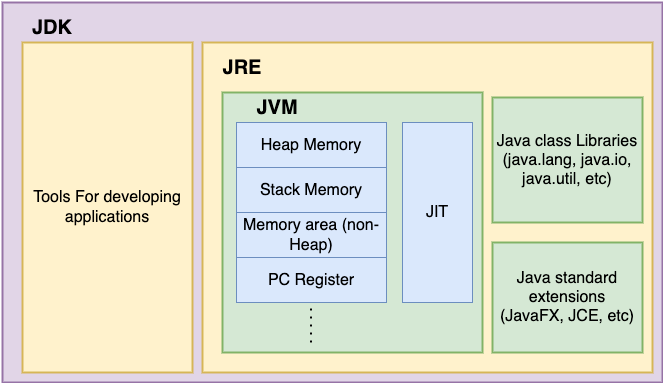
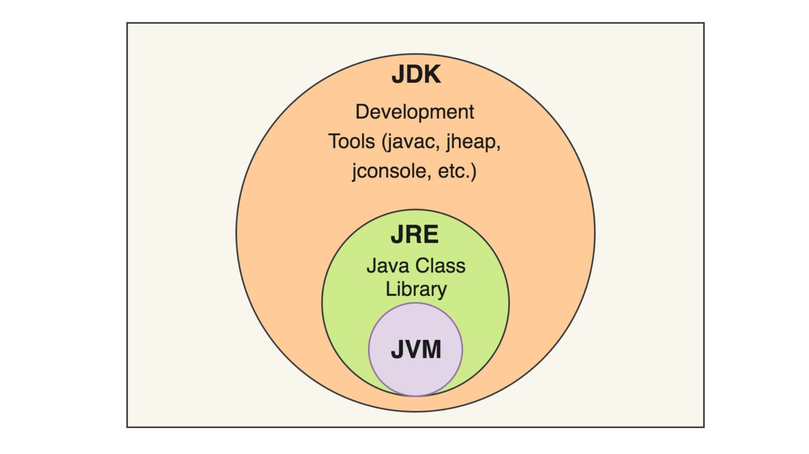

# JAVA Questions

**1. What is meant by the Local variable and the Instance variable?**

**Local variables** are defined in the method and scope of the variables exist inside the method itself.
**Instance variable** is defined inside the class and outside the method and the scope of the variables exists
throughout the class.


## Comparison between arrays and ArrayLists

| Feature                | Array                                                                                                     | ArrayList                                            |
|------------------------|-----------------------------------------------------------------------------------------------------------|------------------------------------------------------|
| **Size**               | Fixed size                                                                                                | Dynamic resizing                                     |
| **Type**               | Primitive types and objects. <br/> <br/>(Primitive types: int, short, long, float, double, char, boolean) | Only objects (uses wrapper classes for primitives)   |
| **Performance**        | Generally more efficient                                                                                  | Can be slower due to dynamic resizing                |
| **Methods**            | Limited built-in methods                                                                                  | Rich set of built-in methods                         |
| **Length/Size Access** | `array.length`                                                                                            | `ArrayList.size()`                                   |
| **Flexibility**        | Less flexible                                                                                             | More flexible                                        |
| **Practical Usage**    | Suitable for fixed-size collections                                                                       | Suitable for dynamic collections with resizing needs |

## Difference between String, String Builder, and String Buffer

| Feature             | String                  | StringBuilder                                    | StringBuffer                                                                              |
|---------------------|-------------------------|--------------------------------------------------|-------------------------------------------------------------------------------------------|
| **Mutability**      | Immutable               | Mutable                                          | Mutable                                                                                   |
| **Performance**     | Creates new instances   | Efficient for in-place changes                   | Similar to StringBuilder, with additional synchronization                                 |
| **Synchronization** | Not synchronized        | Not synchronized (not thread-safe)               | Synchronized (thread-safe)                                                                |
| **Usage**           | Infrequent changes      | Frequent changes, single-threaded environment    | Frequent changes, multi-threaded environment (or when explicit synchronization is needed) |
| **Example**         | `String str = "Hello";` | `StringBuilder sb = new StringBuilder("Hello");` | `StringBuffer sb = new StringBuffer("Hello");`                                            |

### What is Java?

Java is a high-level, object-oriented programming language developed by Sun Microsystems (now owned by Oracle). It is known for its platform independence, robustness, security features, and simplicity.

#### Features

- Object-oriented
- Platform independence (write once, run anywhere)
- Automatic memory management (garbage collection)
- **Strongly-typed** - *strict type-checking during compilation, variables and expressions must adhere to specific data types any attempt to mix incompatible types will result in a compile-time error*
- Built-in multithreading support
- Rich API and libraries

#### Advantages

- Portability
- Security
- Performance (with Just-In-Time compilation)
- Robustness

### Differentiate between JDK, JRE, and JVM

- **JVM (Java Virtual Machine):** It is an *abstract computing machine* that provides a *runtime environment*for executing Java bytecode. ***It converts bytecode into machine code.***
  - JVM performs the following key functions:
    - Bytecode Execution
    - Memory Management
    - Platform Independence
- **JRE (Java Runtime Environment):** It is a runtime environment required to run Java applications. It includes the ***JVM and core libraries.***
- **JDK (Java Development Kit):** It is a software development kit used for developing Java applications. It includes the ***JRE and development tools like the compiler and debugger***.




### Explain the main COMPONENTS of Java

1. Java Development Kit (JDK)
2. Java Virtual Machine (JVM)
3. Java Runtime Environment (JRE)
4. Java API (Application Programming Interface)
5. Java Compiler
6. Java Class Libraries

### What are the differences between the == operator and .equals() method in Java?

- **== operator:** It is used to compare PRIMITIVE DATA TYPES and OBJECT REFERENCES in Java. For objects, it compares **MEMORY ADDRESSES**.
- **.equals() method:** It is a *method* defined in the *Object class*, and it is used to compare the CONTENTS or VALUES of objects. It needs to be overridden in classes where meaningful comparison is required.

### What are access modifiers in Java? Explain their types and purposes

Access modifiers are *keywords* used to set the accessibility or visibility of classes, variables, methods, and constructors in Java.

#### Types

1. **public:** Accessible from anywhere.
2. **private:** Accessible only within the same class.
3. **protected:** Accessible within the same package or subclasses.
4. **Default (no modifier):** Accessible within the same package.

**Note:** DEFAULT access means accessible only within the same package. This means that classes within the same package can access it, but classes outside of the package cannot.

PROTECTED access, on the other hand, allows access *within the same package or by subclasses* (regardless of whether they are in the same package or not).

### **What is the difference between an abstract class and an interface in Java?**

- Abstract Class:
  - Can have abstract and concrete methods.
  - Can have member variables.
  - Cannot be instantiated.
  - Allows method implementations.
  - Supports single inheritance.

- Interface:
  - Can only have abstract methods (before Java 8).
  - Can only have static constants (before Java 8).
  - Cannot have member variables. only final i.e. CONSTANTS
  - Supports multiple inheritance (through interfaces).
  - Cannot be instantiated.
    - (after Java 8) allows method implementations.
      - Default Methods
      - Static Methods
      - private static/private methods
      - Interface Default Methods Inheritance: In this case, since MySubinterface extends MyInterface, it inherits the myMethod() default method from MyInterface. Therefore, any class implementing MySubinterface will also have access to the myMethod() implementation.
      - ```java
        interface MyInterface {
              default void myMethod() {
               System.out.println("Default method");
           }
        }
        interface MySubinterface extends MyInterface {
         // No method declaration here
         }
          class MyClass implements MySubinterface {
         // No need to implement myMethod() here
        }

         public class Main {
         public static void main(String[] args) {
              MyClass obj = new MyClass();
                obj.myMethod(); // Output: Default method
             }
          }
        ```
  In summary, interfaces in Java can now provide default method implementations, which can be inherited by subinterfaces and overridden by implementing classes. This allows for more flexibility in interface design and better code reuse.   
      
7. **How does exception handling work in Java? Explain the try-catch-finally block.**
   - Exception handling in Java allows handling **runtime errors** gracefully.
   - `try-catch-finally` block:
     - `try`: Encloses the code that might throw exceptions.
     - `catch`: Catches and handles exceptions thrown in the try block.
     - `finally`: Executes regardless of whether an exception occurs or not. It's typically used for cleanup tasks.
  
  ```java
public class FinallyExample {
    public static void main(String[] args) {
        BufferedReader reader = null;
        try {
            reader = new BufferedReader(new FileReader("example.txt"));
            String line = reader.readLine();
            System.out.println("Read line: " + line);
        } catch (IOException e) {
            System.out.println("An error occurred: " + e.getMessage());
        } finally {
            try {
                if (reader != null) {
                    reader.close(); // Cleanup: Close the BufferedReader
                }
            } catch (IOException e) {
                System.out.println("Error while closing reader: " + e.getMessage());
            }
        }
    }
}
  ```

### **What is method overloading and method overriding? Provide examples.**

- Method Overloading: It allows defining multiple methods with the same name but different parameters within the same class.

     ```java
     class Example {
         void display(int a) {
             // Code
         }

         void display(int a, int b) {
             // Code
         }
     }
     ```

- Method Overriding: It allows a subclass to provide a specific implementation of a method that is already defined in its superclass.

     ```java
     class Superclass {
         void display() {
             // Code
         }
     }

     class Subclass extends Superclass {
         @Override
         void display() {
             // Specific implementation
         }
     }
     ```

### **What is the difference between `StringBuilder` and `StringBuffer`?**

    - `StringBuilder`:
      - Introduced in JDK 5.
      - Not synchronized, not thread-safe.
      - More efficient in most cases.
      - Suitable for single-threaded environments.

    - `StringBuffer`:
      - Legacy class, introduced in JDK 1.0.
      - Synchronized, thread-safe.
      - Less efficient due to synchronization.
      - Suitable for multi-threaded environments.

### **What is the significance/Importance of the `static` keyword in Java?**

    - The `STATIC` keyword is used to create class-level variables and methods that belong to the CLASS rather than to any INSTANCE.
    - Variables and methods marked as `static` can be accessed directly using the class name without creating an instance of the class.
    - They are initialized only once when the class is loaded into memory.

### **How does MULTITHREADING work in Java? Explain synchronization and concurrency.**

    - MULTITHREADING in Java allows multiple threads to execute concurrently, sharing the same memory space.
    - SYNCHRONIZATION ensures that only ONE THREAD can access a shared resource at a time, preventing data corruption and race conditions.
    - CONCURRENCY refers to the ability of multiple threads to make progress simultaneously.

### What is the difference between `throw` and `throws` in Java?

- `throw` is used to *explicitly* throw an exception within a method or block.
- `throws` is used in *method declarations* to indicate that the method may throw certain exceptions, which are then handled by the caller or propagated upward.

### What is the `final` keyword used for in Java? Provide examples

- The `final` keyword is used to apply restrictions on class, method, and variable declarations. once we decalare something as `final` we cannoyt change it later
- `final` class: Cannot be subclassed.
- `final` method: Cannot be overridden in subclasses.
- `final` variable: Cannot be reassigned after initialization.

```java
final class Example {
    
    final int constant = 10;

          final void method() {
              // Code
          }
      }
```

### **What is the purpose of the `finalize()` method?**

- The `finalize()` method is called by the garbage collector before reclaiming the memory occupied by an object that is eligible for garbage collection.
- It allows an Object to perform CLEANUP OPERATIONS before being garbage collected.
- However, it's not recommended to rely on `finalize()` for critical resource cleanup due to uncertainty about when it will be called.

### **How does garbage collection work in Java?**

- Garbage collection in Java automatically manages memory by reclaiming memory occupied by objects that are no longer referenced.
- It involves three steps: Marking, sweeping, and compaction.
- Mark-and-sweep algorithm marks objects that are still reachable and then sweeps away unreferenced objects.
- Compaction rearranges memory to reduce fragmentation and improve memory utilization.

### **What is a singleton class? How do you implement it in Java?**

- A singleton class is a class that allows only one instance to be created and provides a global point of access to that instance.
- Implementation:

 ```java
 
      public class Singleton {
          private static Singleton instance;

          private Singleton() {}

          public static Singleton getInstance() {
              if (instance == null) {
                  instance = new Singleton();
              }
              return instance;
          }
      }

```

1. **Explain the `transient` and `volatile` keywords in Java.**
    - `transient`: Used to indicate that a variable should not be serialized during object serialization.
    - `volatile`: Used to indicate that a variable may be modified asynchronously by multiple threads, ensuring visibility of changes to other threads.

2. **What is Java's reflection API? How is it used?**
    - Java's reflection API allows inspection of classes, interfaces, fields, and methods at runtime.
    - It provides classes such as `Class`, `Method`, `Field`, etc., which allow programmatic access to class metadata.
    - Reflection is commonly used in frameworks like Spring and Hibernate for dependency injection and mapping Java objects to database tables.

3. **How does Java support platform independence?**
    - Java achieves platform independence through the use of the Java Virtual Machine (JVM).
    - Java code is compiled into bytecode, which is platform-independent and can be executed on any device with a JVM.
    - JVM implementations are available for various platforms (Windows, Linux, macOS, etc.), making Java applications portable.

4. **Explain the difference between `public`, `protected`, `private`, and package-private access modifiers.**
    - `public`: Accessible from anywhere.
    - `protected`: Accessible within the same package or subclasses.
    - `private`: Accessible only within the same class.
    - Package-private (default): Accessible within the same package but not outside.

5. **What are lambda expressions and functional interfaces in Java? Provide examples.**
    - Lambda expressions allow the concise representation of anonymous functions.
    - Functional interfaces are interfaces with a single abstract method, used as the target type for lambda expressions.

      ```java
      // Lambda expression example
      Runnable r = () -> System.out.println("Hello");

      // Functional interface example
      @FunctionalInterface
      interface MyInterface {
          void method();
      }
      ```

6. **What is the purpose of the `Comparable` and `Comparator` interfaces?**
    - `Comparable`: Allows objects to be compared based on their natural ordering. It defines a single method, `compareTo()`.
    - `Comparator`: Provides a way to define custom comparison logic for objects. It defines methods like `compare()`.

7. **Explain the difference between `==` and `.equals()` for comparing objects.**
    - `==` compares object references to check if they refer to the same memory location

### **Explain the difference between `ArrayList` and `LinkedList`.**

- `ArrayList`:
  - Implements the `List` interface.
  - Internally uses a dynamic array to store elements.
  - Good for random access and traversal.
  - Slower for insertion and deletion in the middle.

- `LinkedList`:
  - Implements the `List` and `Deque` interfaces.
  - Internally uses a doubly-linked list to store elements.
  - Good for frequent insertion and deletion.
  - Slower for random access and traversal.

### **What is the difference between `HashMap` and `HashTable`?**

    - `HashMap`:
      - Introduced in JDK 1.2.
      - Not synchronized, not thread-safe.
      - Allows one null key and multiple null values.
      - Iteration may not be ordered.

    - `HashTable`:
      - Legacy class, introduced in JDK 1.0.
      - Synchronized, thread-safe.
      - Does not allow null keys or values.
      - Iteration is ordered.

1. **What are the principles of Object-Oriented Programming (OOP) and how are they implemented in Java?**
    - Principles of OOP:
      - Encapsulation: Bundling data and methods that operate on the data into a single unit (class).
      - Inheritance: Ability of a class to inherit properties and behavior from another class.
      - Polymorphism: Ability to take different forms or have multiple implementations.
      - Abstraction: Hiding complex implementation details and showing only essential features.
    - Implemented in Java through classes, objects, inheritance, polymorphism, and interfaces.

### **Explain the concept of inheritance and its types in Java.**

    - Inheritance is a mechanism in which a new class (subclass) is derived from an existing class (superclass).
    - Types of inheritance in Java:
      - Single inheritance: One subclass extends one superclass.
      - Multilevel inheritance: A subclass becomes the superclass for another subclass.
      - Hierarchical inheritance: Multiple subclasses extend the same superclass.
      - Multiple inheritance (not directly supported in Java): A class inherits from multiple classes.
5. **Describe the concept of polymorphism in Java.**
    - Polymorphism means the ability of a method to do different things based on the object it is acting upon.
    - Types of polymorphism in Java:
      - Compile-time polymorphism (method overloading)
      - Runtime polymorphism (method overriding)


