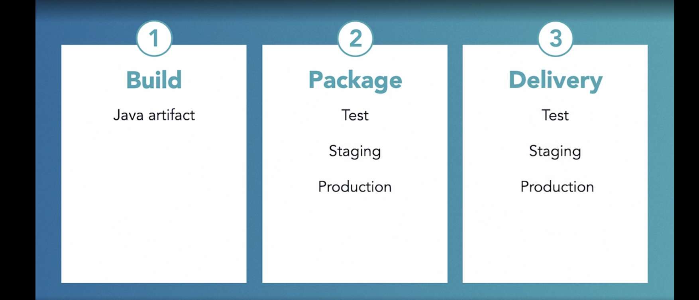
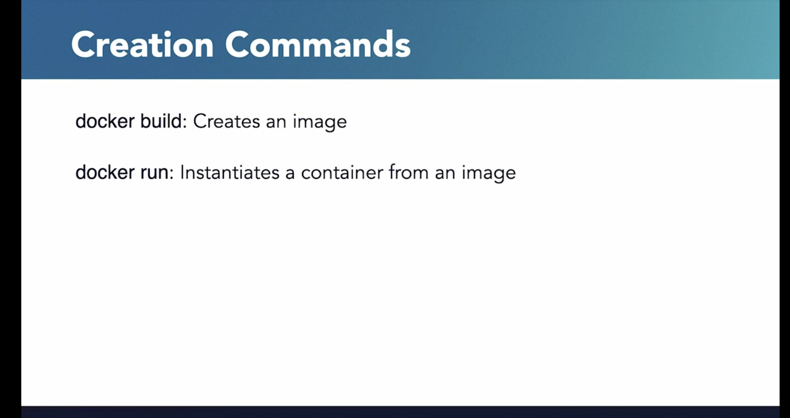
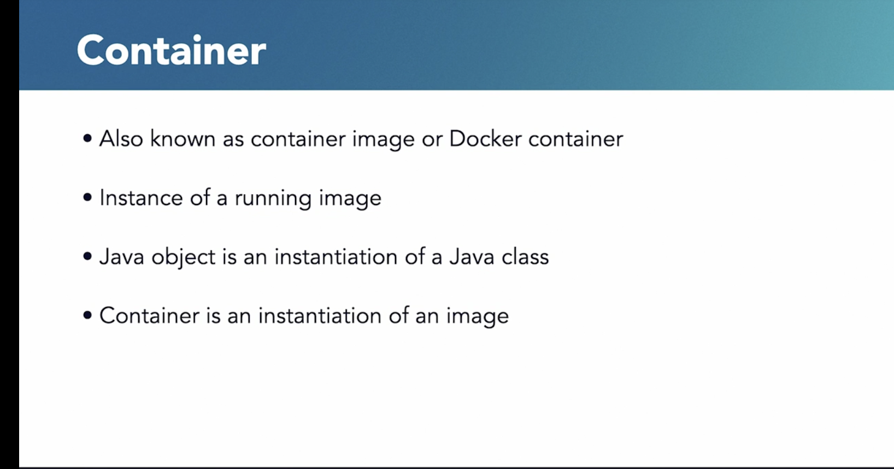
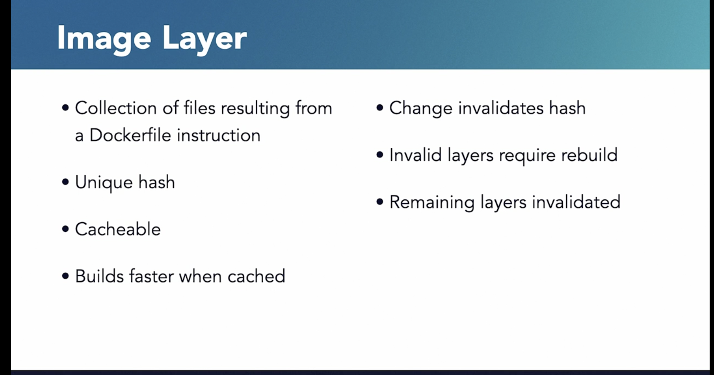
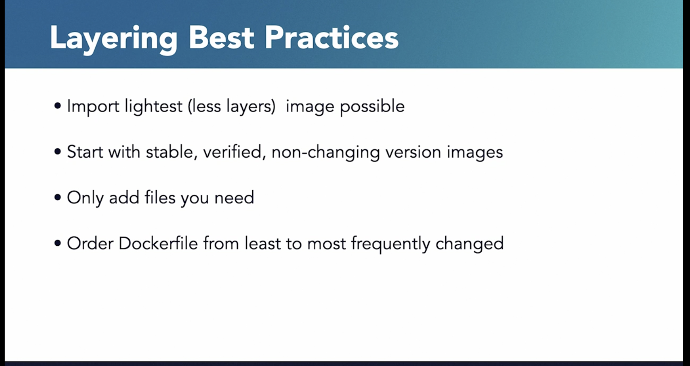
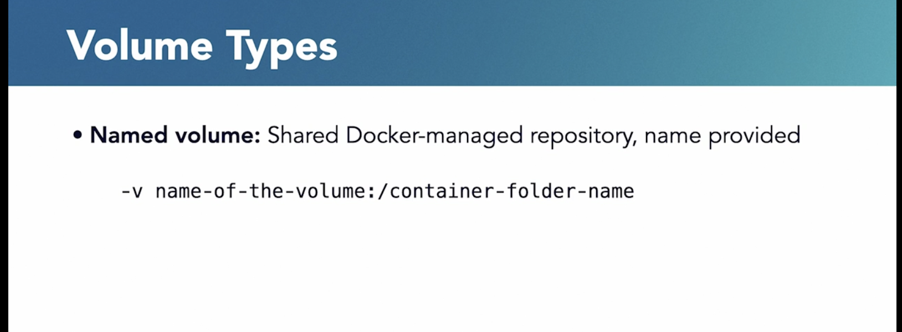
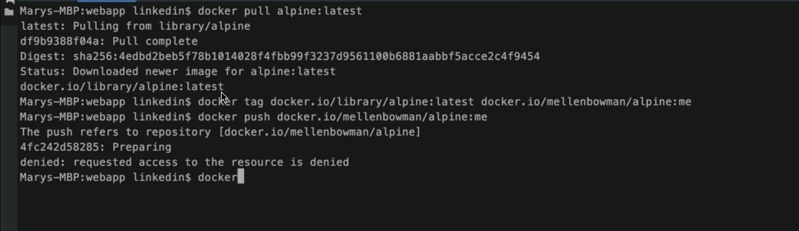
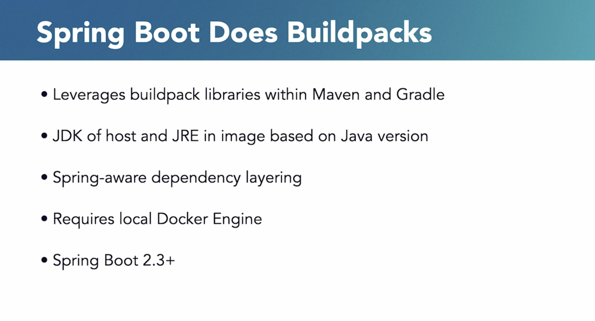

# 🚢 Docker Overview for Beginners and Beyond

> 📎 [View with Images on GitHub](https://github.com/Vishnusimha/Blogs/blob/main/Spring/Docker.md)

## 🌟 Introduction

Docker is a powerful tool designed to make it easier to create, deploy, and run applications using containers. Containers let you package up an application with everything it needs—code, runtime, libraries, and dependencies—so it runs quickly and reliably in any environment.

Think of it this way: Just as a shipping container standardizes how goods are transported across land and sea, Docker standardizes how software is built, shipped, and run—across local machines, servers, or the cloud.

Whether you're a developer, DevOps engineer, or simply curious about modern software delivery, understanding Docker is essential for working in today's tech landscape.

---

## 🧠 Key Concepts for Beginners

Before we dive deep, let's break down some important terms:

* **Image**: A snapshot of your app with all its dependencies (like a JAR file in Java).
* **Container**: A running instance of an image (like an object created from a class).
* **Dockerfile**: A script that defines how to build your image.
* **Docker CLI**: Command-line tool to manage Docker containers, images, volumes, and networks.
* **Docker Compose**: Tool for running multi-container apps with a single command.
* **Docker Hub**: A registry where Docker images can be stored and shared.

---

## 📦 Comparing Images, Containers, and Runtimes

### 🔹 Image (Container Image / Docker Image)

An **image** is a read-only template with instructions for creating a Docker container. It contains:

* A minimal operating system (e.g., Alpine Linux)
* Application binaries and dependencies
* Environment configurations
* Startup command

**Analogy (Java):**
Just like Java code is compiled into JAR files for distribution, Docker images are built and pushed to registries like Docker Hub.

---

### 🔹 Container

A **container** is a live, running instance of an image.

**Analogy (Java):**
Like how a Java class becomes usable only after instantiation (i.e., creating an object), an image becomes a running container when you start it.

---

### 🔹 Container Runtime (e.g., Docker Engine)

This is the software that runs containers on your system. It fetches images, sets up networking, mounts volumes, and manages the lifecycle of containers.

**Analogy (Java):**
Think of it as the Java Runtime Environment (JRE) that runs your compiled JARs.

---

## 📝 Docker Concepts Illustrated

📌 *Note: The original blog contains helpful images located at paths like `./dockerimages/36.png`. To view them properly, check the [original GitHub document](https://github.com/Vishnusimha/Blogs/blob/main/Spring/Docker.md).*

---

## 🧪 Quiz

<div align="center">
  
</div>


---

## 🚀 Introduction to Docker

Visual walkthrough of Docker basics using:

* Architecture diagrams
* Practical use cases
* Beginner-friendly best practices









---

## 🛠️ Writing Dockerfiles

A **Dockerfile** defines the steps to build an image.

Example:

```Dockerfile
FROM openjdk:17-jdk-slim
COPY target/myapp.jar app.jar
ENTRYPOINT ["java", "-jar", "app.jar"]
```


---

## 🖥️ Docker CLI Overview

Common Docker CLI commands organized by use case.

---

### 🔸 Image Management

* **Building Images**
  `docker build [OPTIONS] PATH | URL | -`
  *Example:* `docker build -t myapp:latest .`

* **Tagging Images**
  `docker tag SOURCE_IMAGE[:TAG] TARGET_IMAGE[:TAG]`
  *Example:* `docker tag myapp:latest myrepo/myapp:latest`

* **Listing Images**
  `docker images [OPTIONS] [REPOSITORY[:TAG]]`
  *Example:* `docker images`

* **Removing Images**
  `docker rmi [OPTIONS] IMAGE [IMAGE...]`
  *Example:* `docker rmi myapp:latest`

* **Pulling Images**
  `docker pull [OPTIONS] NAME[:TAG|@DIGEST]`
  *Example:* `docker pull ubuntu:latest`

* **Pushing Images**
  `docker push [OPTIONS] NAME[:TAG]`
  *Example:* `docker push myrepo/myapp:latest`

```bash
docker build -t myapp .
docker images
docker rmi myapp
```

---

### 🔸 Container Management
* **Creating Containers**
  `docker create [OPTIONS] IMAGE [COMMAND] [ARG...]`
  *Example:* `docker create --name mycontainer ubuntu`

* **Running Containers**
  `docker run [OPTIONS] IMAGE [COMMAND] [ARG...]`
  *Example:* `docker run -d -p 80:80 myapp:latest`

* **Starting/Stopping/Restarting Containers**
  `docker start`, `docker stop`, `docker restart`
  *Examples:*
  `docker start mycontainer`
  `docker stop mycontainer`
  `docker restart mycontainer`

* **Removing Containers**
  `docker rm [OPTIONS] CONTAINER [CONTAINER...]`
  *Example:* `docker rm mycontainer`

* **Viewing Container Logs**
  `docker logs [OPTIONS] CONTAINER`
  *Example:* `docker logs mycontainer`

* **Listing Containers**
  `docker ps [OPTIONS]`
  *Example:* `docker ps -a`

* **Executing Commands in a Running Container**
  `docker exec [OPTIONS] CONTAINER COMMAND [ARG...]`
  *Example:* `docker exec -it mycontainer bash`

* **Inspecting Containers**
  `docker inspect [OPTIONS] NAME|ID [NAME|ID...]`
  *Example:* `docker inspect mycontainer`

* **Copying Files To/From Containers**
  `docker cp [OPTIONS] CONTAINER:SRC_PATH DEST_PATH|-`
  *Example:* `docker cp mycontainer:/path/to/file /local/path`
  `docker cp [OPTIONS] SRC_PATH|- CONTAINER:DEST_PATH`
  *Example:* `docker cp /local/path mycontainer:/path/to/file`

```bash
docker run -d -p 8080:80 myapp
docker ps -a
docker logs <container_id>
```

---

### 🔸 Volume & Network Management

```bash
docker volume create mydata
docker network create mynet
```
* **Creating Networks**
  `docker network create [OPTIONS] NETWORK`
  *Example:* `docker network create mynetwork`

* **Listing Networks**
  `docker network ls`
  *Example:* `docker network ls`

* **Removing Networks**
  `docker network rm NETWORK [NETWORK...]`
  *Example:* `docker network rm mynetwork`

* **Connecting a Container to a Network**
  `docker network connect [OPTIONS] NETWORK CONTAINER`
  *Example:* `docker network connect mynetwork mycontainer`

* **Disconnecting a Container from a Network**
  `docker network disconnect [OPTIONS] NETWORK CONTAINER`
  *Example:* `docker network disconnect mynetwork mycontainer`

* **Creating Volumes**
  `docker volume create [OPTIONS] [VOLUME]`
  *Example:* `docker volume create myvolume`

* **Listing Volumes**
  `docker volume ls`
  *Example:* `docker volume ls`

* **Inspecting Volumes**
  `docker volume inspect VOLUME [VOLUME...]`
  *Example:* `docker inspect myvolume`

* **Removing Volumes**
  `docker volume rm VOLUME [VOLUME...]`
  *Example:* `docker volume rm myvolume`


---
#### Swarm and Service Management

* **Initializing a Swarm**
  `docker swarm init [OPTIONS]`
  *Example:* `docker swarm init`

* **Joining a Swarm**
  `docker swarm join [OPTIONS] [TOKEN] [ADDR...]`
  *Example:* `docker swarm join --token SWMTKN-1-xxx 192.168.1.1:2377`

* **Listing Nodes**
  `docker node ls`
  *Example:* `docker node ls`

* **Deploying a Service**
  `docker service create [OPTIONS] IMAGE [COMMAND] [ARG...]`
  *Example:* `docker service create --name myservice myapp:latest`

* **Listing Services**
  `docker service ls`
  *Example:* `docker service ls`

* **Inspecting Services**
  `docker service inspect [OPTIONS] SERVICE [SERVICE...]`
  *Example:* `docker service inspect myservice`

* **Scaling Services**
  `docker service scale SERVICE=REPLICAS [SERVICE=REPLICAS...]`
  *Example:* `docker service scale myservice=3`

* **Updating Services**
  `docker service update [OPTIONS] SERVICE`
  *Example:* `docker service update --image myapp:latest myservice`

* **Removing Services**
  `docker service rm SERVICE [SERVICE...]`
  *Example:* `docker service rm myservice`

---

#### Compose (Multi-Container Applications)

* **Starting Services**
  `docker-compose up [OPTIONS] [SERVICE...]`
  *Example:* `docker-compose up -d`

* **Stopping Services**
  `docker-compose down [OPTIONS]`
  *Example:* `docker-compose down`

* **Building Services**
  `docker-compose build [OPTIONS] [SERVICE...]`
  *Example:* `docker-compose build`

* **Viewing Logs**
  `docker-compose logs [OPTIONS] [SERVICE...]`
  *Example:* `docker-compose logs`

* **Scaling Services**
  `docker-compose scale SERVICE=NUM [SERVICE=NUM...]`
  *Example:* `docker-compose scale web=3`

* **Listing Containers**
  `docker-compose ps [OPTIONS] [SERVICE...]`
  *Example:* `docker-compose ps`

---
## 🧱 Understanding Docker Layers

Docker builds images in layers—each instruction in a Dockerfile creates a new layer.

Benefits:

* Faster builds
* Layer caching
* Smaller updates





---

## 📦 Volumes and Ports Best Practices

* Mount volumes for persistent data
* Expose only necessary ports
* Avoid hardcoding secrets





---

## 🏗️ Docker Registry & Tagging

Think of Docker registries like Maven repositories.

```bash
docker tag alpine:latest myusername/alpine:custom
docker push myusername/alpine:custom
```




---

## 🧩 Docker Orchestration

### 🔸 Manual Orchestration (The Hard Way)

Steps include:

* Creating custom networks
* Manually starting containers
* Managing dependencies using `docker run`
* Logging and health checks via CLI

---

### 🔸 Docker Compose (The Easy Way)

A `docker-compose.yml` file helps automate orchestration.

```yaml
version: '3'
services:
  db:
    image: postgres
    environment:
      POSTGRES_DB: blogdemo
      POSTGRES_PASSWORD: lmnop
    volumes:
      - postgres_data:/var/lib/postgresql/data
  app:
    build: ./blog-backend
    ports:
      - "8080:8080"
    depends_on:
      - db
volumes:
  postgres_data:
```

Run it with:

```bash
docker-compose up
```


---

## 🛡️ Docker Alternatives

* **Podman**: Rootless, Docker-compatible
* **Buildah**: Image builder without a daemon
* **Kubernetes**: Industry-standard container orchestration
* **LXC**: Linux container management





---

## 📘 Summary

| Concept        | Analogy                    | Description                    |
| -------------- | -------------------------- | ------------------------------ |
| Image          | Java JAR                   | Blueprint for containers       |
| Container      | Java Object                | Running instance of an image   |
| Dockerfile     | Build Script               | Defines how to build an image  |
| Docker CLI     | Terminal Commands          | Interface to manage Docker     |
| Docker Hub     | Maven Repository           | Stores/publishes images        |
| Docker Compose | Dev tool for orchestration | Manages multi-container setups |

---

## 📚 Learn More

* [LinkedIn Learning - Docker for Java Developers](https://github.com/LinkedInLearning/docker-for-java-developers-2452212/tree/02_05)
* [Official Docker Docs](https://docs.docker.com/)
* [My Docker Cheatsheet Repo](https://github.com/Vishnusimha/Blogs/blob/main/Spring/Docker.md)

---