# [Docker](https://github.com/Vishnusimha/Blogs/blob/main/Spring/Docker.md)
This page contains images. If there is any issue with loading, open it directly in [Github Link](https://github.com/Vishnusimha/Blogs/blob/main/Spring/Docker.md)

https://github.com/LinkedInLearning/docker-for-java-developers-2452212/tree/02_05

Repo for Docker LinkedIn course.

# Comparing images to containers

Selecting transcript lines in this section will navigate to timestamp in the video
[Tutor] So
, given that introduction to containerization concepts, let's get down to actual terminology Image.
Also known as container image or in this course, a Docker image. An image is an immutable artifact composed of files.
It encapsulates a desired operating system, environment, the application, and a run command. We use tools to build an
image.
Consider the Java Ecosystem. Java does not execute directly from Java source code.
The source must be compiled into a byte code archive, usually a Java archive or JAR.
JAR files can be installed into the local Maven.m2 repository or shared to server registries like Maven Central,
Artifactory, or Nexus.
Likewise, the containerization ecosystem requires a pre-built application image. We use tools to build an image.
Images once built are installed into a local registry, or could be shared to remote registries like Docker Hub.
The next term is container runtime. Also known as a container engine.
The container runtime is a platform for running images, just as a Java Runtime is a platform for running JARs.
In this course, we will be using the Docker Container Engine. The last term is container, also known as Docker
containers or running container.

##### A container is the actual instance of a running image on a container runtime. Just like an object is an instantiation of a Java class, a container is an instantiation of an image.

## Quiz

  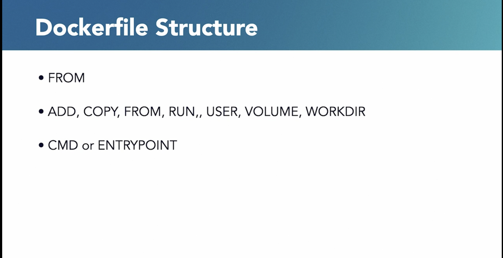

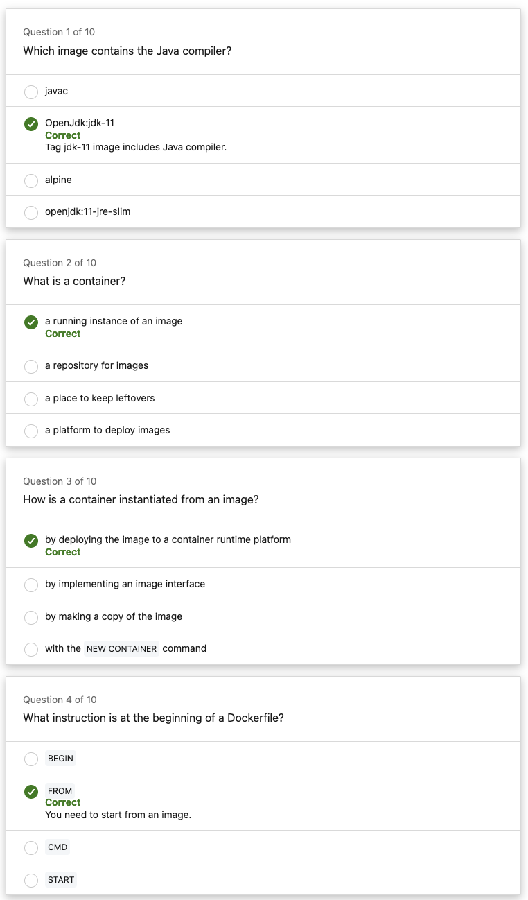

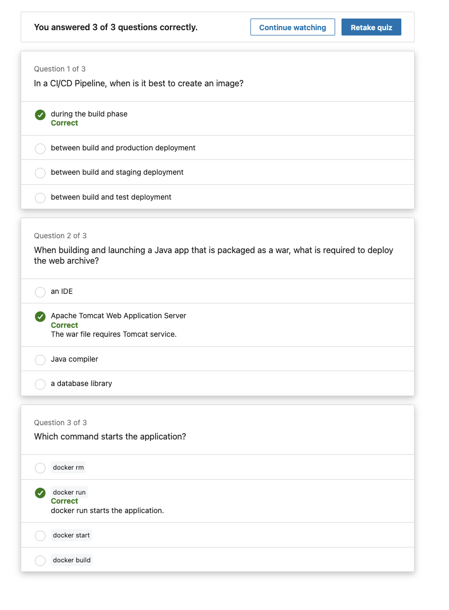
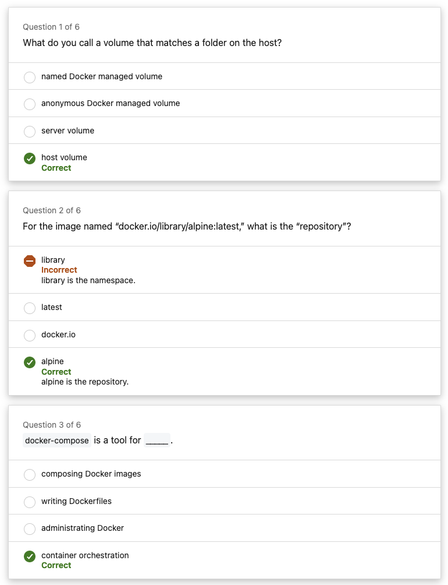

## Intro to docker

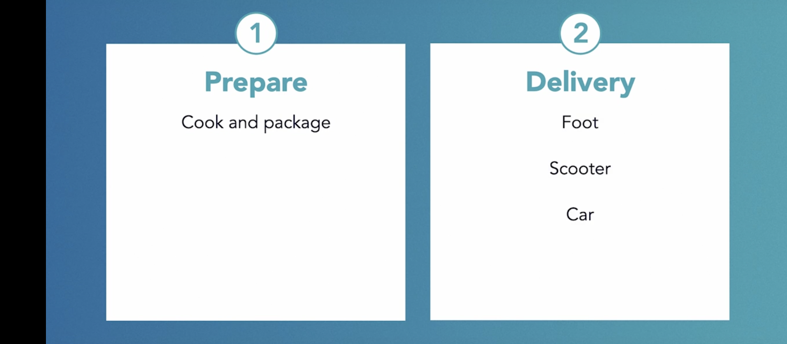

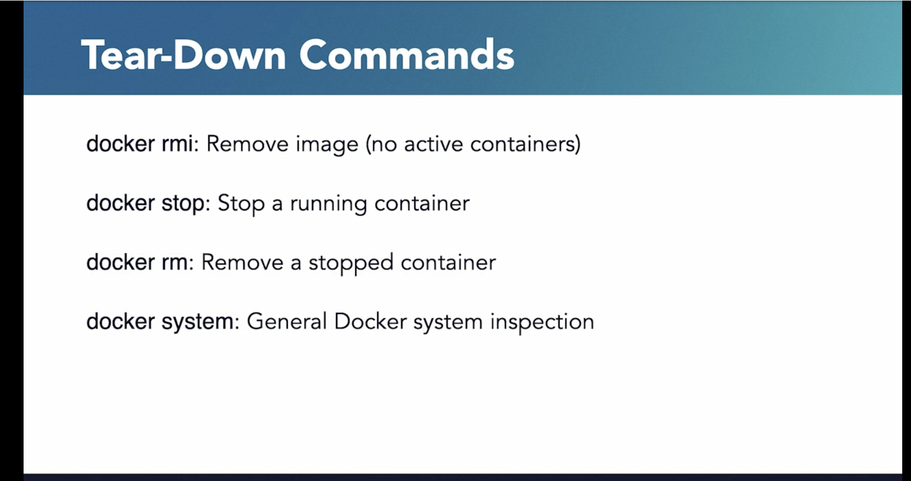

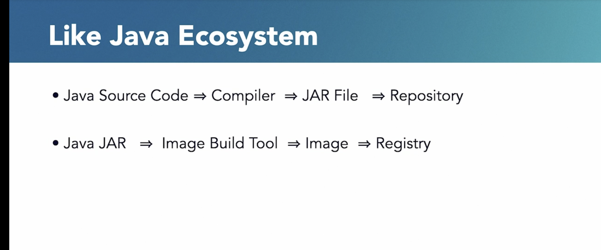

### Writing docker files

### Docker CLI

### Layering Docker

layer it better to get low memory docker image.

#### Layering Docker : best practices : Volumes and Ports

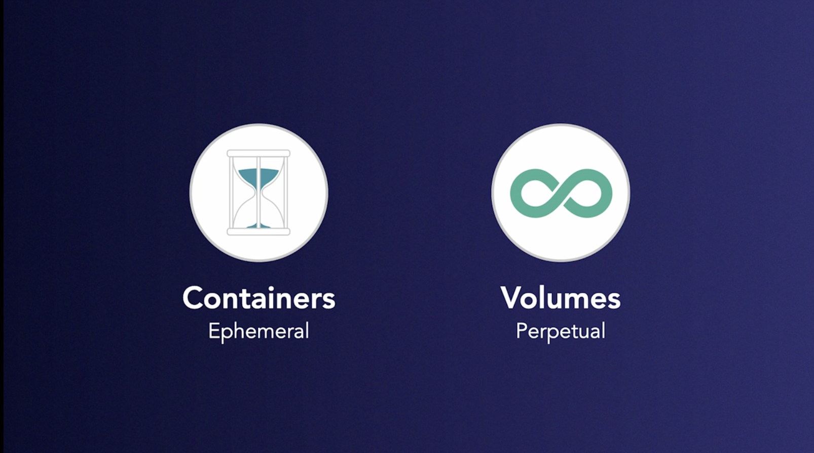

#### Layering Docker : best practices : Docker registry

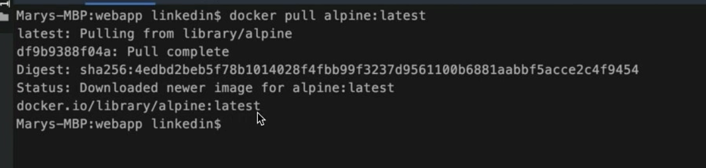
Pulling an image from docker registry, it's similar to maven like how to download some libs by specifying it in gradle
files.

Notice the last line there, **docker.io** is the **URL** of the registry, **library** is the **name space**, **alpine**
is the **repository**, and **latest** is the **tag**.

Now, what if I want to share my images I create? All I need to do is **retag** it and _**send it to a name space**_. You
may have noticed on Docker Hub it showed that I was logged into my free account called mellenbowman I want to make a
copy of Alpine latest, and upload it to my namespace. So first I have to tag it. (typing) So I'm going to change the tag
of **docker.io/library/alpine:latest** and retag it to **docker.io/mellenbowman/alpine**. And I'm going to give it a tag
of me. Beautiful now, I want to push that up to my account.

docker push **docker.io/mellenbowman/alpine:me**

pushed to her own registry.

## Docker Orchestration: Startup

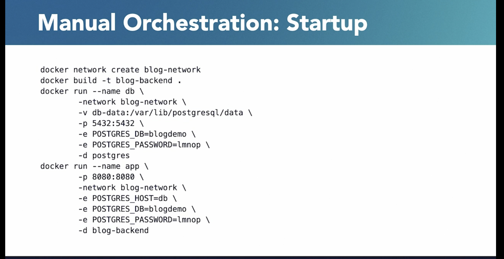
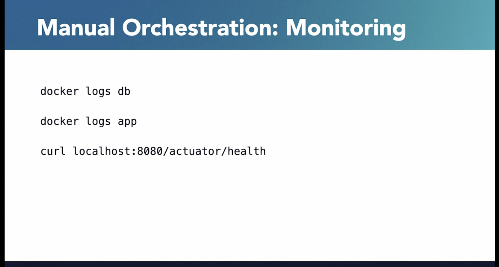

Container orchestration with Docker Compose

- [Instructor] In the Docker Hub, there is a trove of images ready for usage. Here's one for Postgres, a database. So
  how do containers like web apps interact with other containers, such as Postgres? Let's go through an example. This is
  a Spring Boot web app that is a backend part of a message blog. The data model is a Blog class. And it's a JPA entity
  containing a message and an auto-generated identifier. There is a Spring Data repository interface for the data access
  layer. If you are not familiar with Spring Data repositories, I have a course in the library called Spring Data 2. The
  Application class is also a Spring Data MVC REST controller that exposes endpoints to create and view blog messages.
  So here's the API to list all the blogs. This is the API to create a blog. And then there is a silly API that actually
  stops the whole application. And we'll talk about that later. This is not a best practice to have a REST controller
  combined with the Spring Boot Application class. But this is just to help keep things simple and explain things
  better. Here's the application's properties file and it has all the properties for setting up access and the URLs and
  passwords and username to access the Postgres database. And finally, we have a Dockerfile and that will take this
  code, build it in Maven, and then run it as blogdemo.jar. Running related containers is called orchestration. This can
  be done manually or through tools such as Docker Compose, Docker Swarm, and Kubernetes. Let's see orchestration the
  hard way, which is manually. First, we create a network called blog-network. So any other containers included in that
  network can refer to each other by name. Next, we need to create an image for blog-backend then run the Postgres image
  to have a Postgres container. The -e allows environment variable settings to be passed in at runtime. And it has a
  volume, so it could persist data even after the container has stopped. And then next, we have to run the blog backend
  image as an app, and then we name it app and it's included in the blog-network. And from that reason, it can refer to
  the Postgres host just by db, by the name db. And here are the environment variables for the name of the database is
  blogdemo and the Postgres password is lmnop, just like set it up here as well. To manually monitor these containers,
  we'd have to manually go to docker logs on the db container or docker logs on the app container, or hit the curl of
  the actuator health to see if it's alive. And then finally, to tear it down, we'd have to do docker stop and docker
  remove. And if we wanted to remove the images, do docker rmi and then to remove the network we do a docker remove
  network. It's a lot of work. And if we want to do that manually, and of course if there's anything manual, there's
  always an automated tool. So we're going to see how Docker Compose can be used to automate orchestration. In order to
  start this, we have to have a docker-compose.yml file, that's the default name it's expected to be. And it's expected
  to follow the YML or YAML syntax. And once the YAML file has been created, simply used the docker-compose up command
  to start up all the containers and docker-compose down to tear them down. And there's a docker-compose daemon that
  provides monitoring out of the box. So let's look at our docker-compose.yml file. So all of the settings in this YAML
  file map directly to those Docker run command. So we have the image name is postgres, db is the container name. We
  have our volume set up here. Here's our environment variables that we had before for the db name and the password. And
  it's exposing the typical port for Postgres which is 5432. And here's something new that you didn't see on the Docker
  run command, which is always, so this is the monitoring part. So if an application or container goes down, the
  docker-compose daemon will start it back up automatically. And that's a setting that you can have, and I have that set
  here as always. And here's our app container and it's built from the blog-backend directory. And it just to show that
  the Docker compose is at the level out, just outside the blog-backend web folder to give context there. It exposes
  port 8080 as 8080. And here's our environment variables that we had before. And it depends on this db. And that's why
  we can say POSTGRES_HOST=db. And it will restart always if this needs to. And here's the declaration of the volume
  that's needed. So let's actually push that up there so I can have a terminal. Let's clear the screen. Make sure I'm in
  the right folder. There's the docker-compose. So I'm going to do my docker - compose up. So it's starting up, it's
  reading in the docker-compose file. I could run this in detach mode in the background but I wanted to be interactive
  and see that what's going on here. So we see it's starting up the web app, the blog web app. It's connecting to
  hibernate and we see the message that that has started. So let's go to another window here, a terminal window. We'll
  clear this screen. And I'm going to do a curl. Both will host 8080, just to say actuator/health, just for
  informational purposes to see that it's alive. And the status is up. Let's actually hit that endpoint called blogs.
  And I have already added some entries into this database for blogs. So these are just in JSON format. Some of the
  messages, this is a blog. Today had been a great today. Today is not such a great day. But just like four different
  messages that I've saved. Now let's hit that stop endpoint. And what's going to happen here is, it's actually stops
  the web application. And we told docker-compose, if anything happens, restart it automatically. So we hit the curl
  command and it comes back, oh, something's happened there. So empty reply. So let's go back to Local. And we see that
  it stopped. There was a shut down message. That was actually a system out print line message in the stop endpoint. It
  stop and it's automatically restarting again. And going back over here. And I get my data back. Now, if I wanted to
  take it down, I did docker-compose up in detach mode. I could just do it in the same window, say docker-compose down,
  but I'll do it in this other window here, docker-compose down. So that's going to take everything down for me. That's
  declared in the docker-compose file. A lot easier than having to manually do all that. Docker-compose is a very simple
  orchestration tool. And honestly, it's not used very much in production. It's used a lot as a time saver in developer
  machines. But it can be, it's not that it can't, but more popular production tools are Kubernetes or Docker Swarm. And
  there's other cloud offerings by Amazon AWS, Google Cloud, and Microsoft Azure. Lessons for all of these can be found
  in the LinkedIn library.

### Docker Alternatives

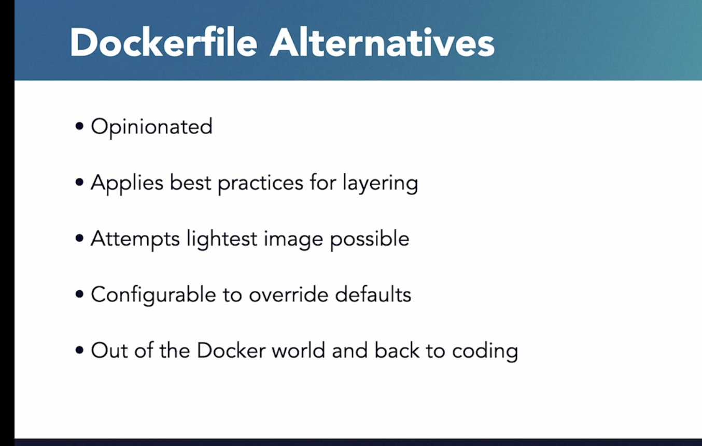
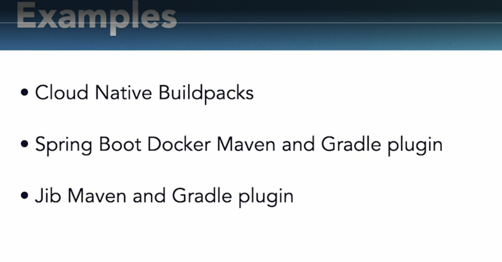

Here is a list of common Docker commands, categorized by their primary functions such as building images, managing
containers, and deploying services:

## Image Management

    Building Images
        docker build [OPTIONS] PATH | URL | -
            Example: docker build -t myapp:latest .

    Tagging Images
        docker tag SOURCE_IMAGE[:TAG] TARGET_IMAGE[:TAG]
            Example: docker tag myapp:latest myrepo/myapp:latest

    Listing Images
        docker images [OPTIONS] [REPOSITORY[:TAG]]
            Example: docker images

    Removing Images
        docker rmi [OPTIONS] IMAGE [IMAGE...]
            Example: docker rmi myapp:latest

    Pulling Images
        docker pull [OPTIONS] NAME[:TAG|@DIGEST]
            Example: docker pull ubuntu:latest

    Pushing Images
        docker push [OPTIONS] NAME[:TAG]
            Example: docker push myrepo/myapp:latest

## Container Management

    Creating Containers
        docker create [OPTIONS] IMAGE [COMMAND] [ARG...]
            Example: docker create --name mycontainer ubuntu

    Running Containers
        docker run [OPTIONS] IMAGE [COMMAND] [ARG...]
            Example: docker run -d -p 80:80 myapp:latest

    Starting/Stopping/Restarting Containers
        docker start [OPTIONS] CONTAINER [CONTAINER...]
            Example: docker start mycontainer
        docker stop [OPTIONS] CONTAINER [CONTAINER...]
            Example: docker stop mycontainer
        docker restart [OPTIONS] CONTAINER [CONTAINER...]
            Example: docker restart mycontainer

    Removing Containers
        docker rm [OPTIONS] CONTAINER [CONTAINER...]
            Example: docker rm mycontainer

    Viewing Container Logs
        docker logs [OPTIONS] CONTAINER
            Example: docker logs mycontainer

    Listing Containers
        docker ps [OPTIONS]
            Example: docker ps -a

    Executing Commands in a Running Container
        docker exec [OPTIONS] CONTAINER COMMAND [ARG...]
            Example: docker exec -it mycontainer bash

    Inspecting Containers
        docker inspect [OPTIONS] NAME|ID [NAME|ID...]
            Example: docker inspect mycontainer

    Copying Files To/From Containers
        docker cp [OPTIONS] CONTAINER:SRC_PATH DEST_PATH|-
            Example: docker cp mycontainer:/path/to/file /local/path
        docker cp [OPTIONS] SRC_PATH|- CONTAINER:DEST_PATH
            Example: docker cp /local/path mycontainer:/path/to/file

## Network Management

    Creating Networks
        docker network create [OPTIONS] NETWORK
            Example: docker network create mynetwork

    Listing Networks
        docker network ls
            Example: docker network ls

    Removing Networks
        docker network rm NETWORK [NETWORK...]
            Example: docker network rm mynetwork

    Connecting a Container to a Network
        docker network connect [OPTIONS] NETWORK CONTAINER
            Example: docker network connect mynetwork mycontainer

    Disconnecting a Container from a Network
        docker network disconnect [OPTIONS] NETWORK CONTAINER
            Example: docker network disconnect mynetwork mycontainer

## Volume Management

    Creating Volumes
        docker volume create [OPTIONS] [VOLUME]
            Example: docker volume create myvolume

    Listing Volumes
        docker volume ls
            Example: docker volume ls

    Inspecting Volumes
        docker volume inspect VOLUME [VOLUME...]
            Example: docker volume inspect myvolume

    Removing Volumes
        docker volume rm VOLUME [VOLUME...]
            Example: docker volume rm myvolume

## Swarm and Service Management

    Initializing a Swarm
        docker swarm init [OPTIONS]
            Example: docker swarm init

    Joining a Swarm
        docker swarm join [OPTIONS] [TOKEN] [ADDR...]
            Example: docker swarm join --token SWMTKN-1-xxx 192.168.1.1:2377

    Listing Nodes
        docker node ls
            Example: docker node ls

    Deploying a Service
        docker service create [OPTIONS] IMAGE [COMMAND] [ARG...]
            Example: docker service create --name myservice myapp:latest

    Listing Services
        docker service ls
            Example: docker service ls

    Inspecting Services
        docker service inspect [OPTIONS] SERVICE [SERVICE...]
            Example: docker service inspect myservice

    Scaling Services
        docker service scale SERVICE=REPLICAS [SERVICE=REPLICAS...]
            Example: docker service scale myservice=3

    Updating Services
        docker service update [OPTIONS] SERVICE
            Example: docker service update --image myapp:latest myservice

    Removing Services
        docker service rm SERVICE [SERVICE...]
            Example: docker service rm myservice

## Compose (Multi-Container Applications)

    Starting Services
        docker-compose up [OPTIONS] [SERVICE...]
            Example: docker-compose up -d

    Stopping Services
        docker-compose down [OPTIONS]
            Example: docker-compose down

    Building Services
        docker-compose build [OPTIONS] [SERVICE...]
            Example: docker-compose build

    Viewing Logs
        docker-compose logs [OPTIONS] [SERVICE...]
            Example: docker-compose logs

    Scaling Services
        docker-compose scale SERVICE=NUM [SERVICE=NUM...]
            Example: docker-compose scale web=3

    Listing Containers
        docker-compose ps [OPTIONS] [SERVICE...]
            Example: docker-compose ps

These commands cover most of the basic and advanced operations you might need when working with Docker to build, run,
manage, and deploy containerized applications.