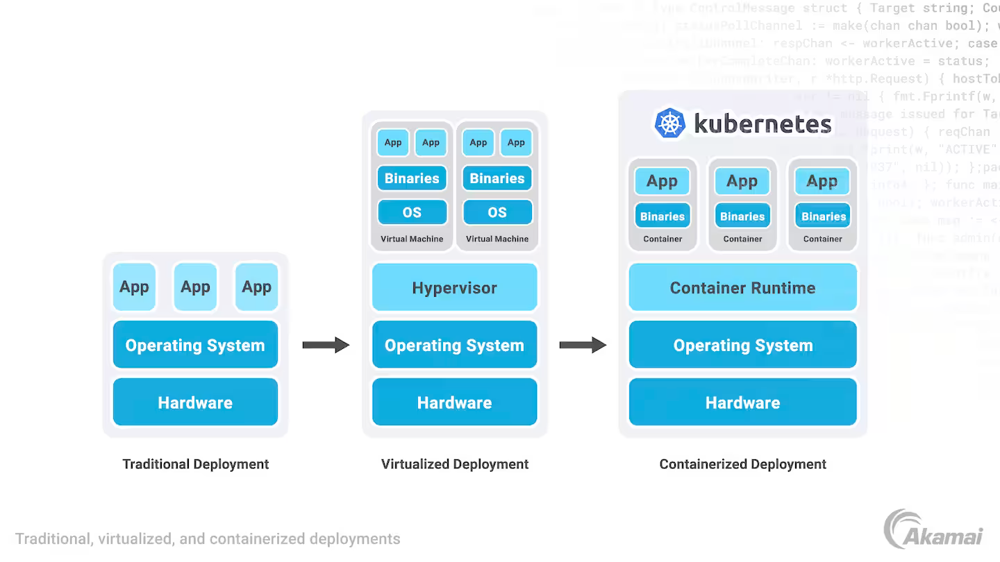
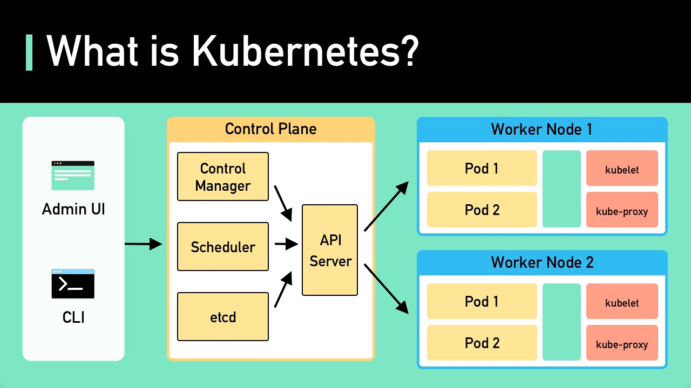
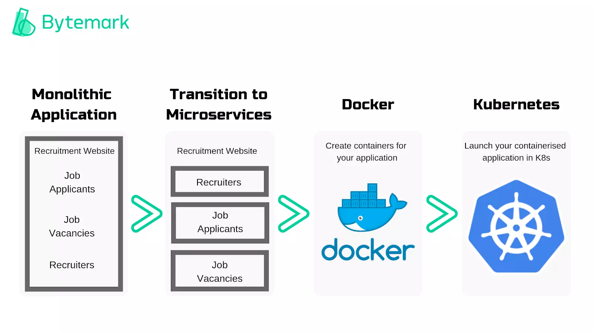
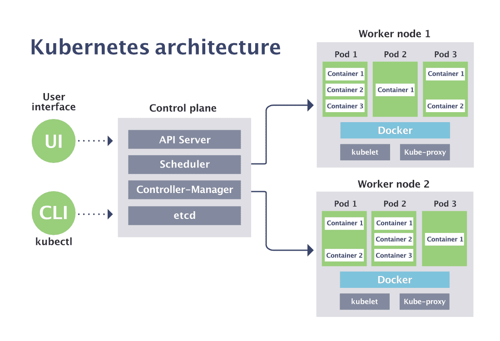
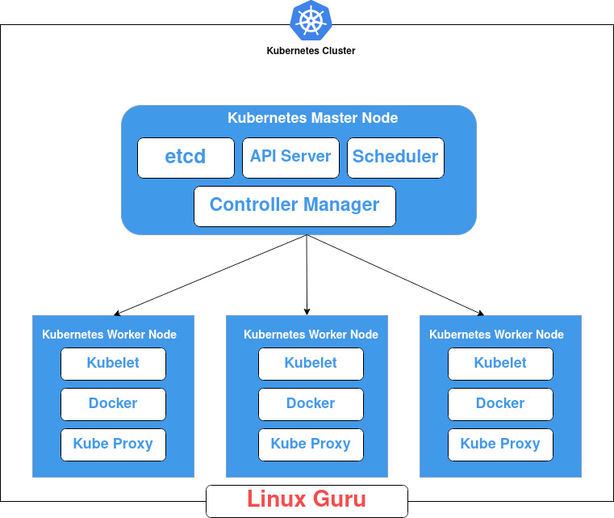
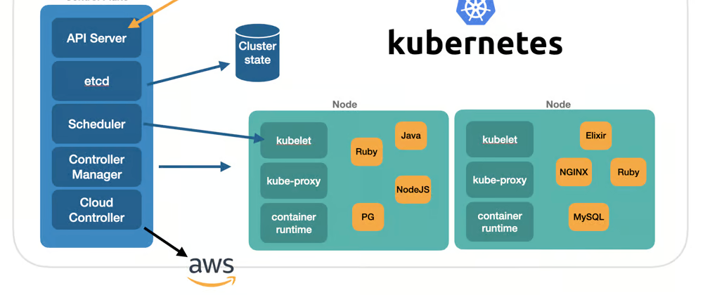

# [Kubernetes](https://github.com/Vishnusimha/Blogs/blob/main/Spring/Kubernetes.md)
This page contains images. If there is any issue with loading, open it directly in [Kubernetes](https://github.com/Vishnusimha/Blogs/blob/main/Spring/Kubernetes.md)








### Kubernetes Concepts

Kubernetes is a powerful open-source platform designed to automate deploying, scaling, and operating containerized
applications. Below is a structured overview of the basic concepts and components in Kubernetes:

---

#### **1. Cluster Architecture**

- **Cluster**: A Kubernetes cluster consists of a set of worker machines, called nodes, that run containerized
  applications. Every cluster has at least one worker node.

    - **Control Plane**: Manages the Kubernetes cluster. Components include:
        - **API Server (`kube-apiserver`)**: Frontend for the Kubernetes control plane. It exposes the Kubernetes API.
        - **Etcd**: A consistent and highly available key-value store used as Kubernetes' backing store for all cluster
          data.
        - **Scheduler (`kube-scheduler`)**: Watches for newly created Pods that have no node assigned and selects a node
          for them to run on.
        - **Controller Manager (`kube-controller-manager`)**: Runs controller processes, which regulate the state of the
          cluster.
        - **Cloud Controller Manager**: Integrates with cloud provider APIs, managing cloud-specific aspects of the
          cluster.

    - **Node (Worker Node)**: Executes the applications and consists of:
        - **Kubelet**: An agent that ensures containers are running in a Pod.
        - **Kube-proxy**: Maintains network rules and handles networking for the Pods.
        - **Container Runtime**: Software responsible for running containers (e.g., Docker, containerd).

---

#### **2. Basic Kubernetes Objects**

- **Pod**: The smallest and simplest Kubernetes object. Represents a single instance of a running process in your
  cluster. A Pod can contain one or more containers.

- **Service**: An abstraction which defines a logical set of Pods and a policy by which to access them. Services enable
  communication between different parts of your application.

- **Volume**: A directory containing data, accessible to the containers in a Pod. Volumes are used for persistent
  storage.

---

#### **3. Higher-Level Kubernetes Objects**

- **Deployment**: Manages a set of identical Pods, ensuring the specified number of replicas are running. Used for
  rolling updates and rollbacks.

- **ReplicaSet**: Ensures a specified number of Pod replicas are running at any given time. Typically used by
  Deployments.

- **StatefulSet**: Manages the deployment and scaling of a set of Pods, with unique identities, often used for stateful
  applications.

- **DaemonSet**: Ensures that all (or some) nodes run a copy of a Pod. Useful for running background tasks like log
  collection.

- **Job**: Creates one or more Pods and ensures that a specified number of them successfully terminate. Used for batch
  jobs.

- **CronJob**: Manages time-based Jobs, similar to cron in Unix/Linux.

---

#### **4. Configuration and Secrets**

- **ConfigMap**: Allows you to decouple configuration artifacts from image content to keep containerized applications
  portable.

- **Secret**: Used to store and manage sensitive information, such as passwords, OAuth tokens, and SSH keys.

---

#### **5. Networking**

- **Cluster Networking**: Ensures that all Pods can communicate with each other without Network Address Translation (
  NAT).

- **Service Networking**: Provides a stable IP address and DNS name for a set of Pods, enabling discovery and load
  balancing.

- **Ingress**: Manages external access to the services in a cluster, typically HTTP. Provides load balancing, SSL
  termination, and name-based virtual hosting.

---

#### **6. Storage**

- **PersistentVolume (PV)**: A piece of storage in the cluster that has been provisioned by an administrator or
  dynamically provisioned using Storage Classes.

- **PersistentVolumeClaim (PVC)**: A request for storage by a user. It is similar to a Pod but instead of requesting
  compute resources, it requests storage resources.

- **StorageClass**: Provides a way for administrators to describe the "classes" of storage they offer. Different classes
  might map to quality-of-service levels, backup policies, or arbitrary policies.

---

#### **7. Access Control**

- **Role-Based Access Control (RBAC)**: A method of regulating access to computer or network resources based on the
  roles of individual users within your organization.

- **ServiceAccount**: Provides an identity for processes that run in a Pod.

---

#### **8. Helm**

- **Helm**: A package manager for Kubernetes, which allows you to define, install, and upgrade complex Kubernetes
  applications using charts.

---

### Summary

Kubernetes provides a comprehensive and scalable platform for managing containerized applications. It handles the
complexity of orchestrating containers, offering features such as automatic scaling, rolling updates, and service
discovery. By leveraging Kubernetes, organizations can achieve higher efficiency and resilience in deploying and
managing applications.

Sure! Here's a comprehensive list of commonly used Kubernetes commands with brief descriptions:

### Kubernetes CLI (`kubectl`) Commands

#### **1. Cluster Operations**

- **Get Cluster Info**:
  ```bash
  kubectl cluster-info
  ```
- **View All Nodes**:
  ```bash
  kubectl get nodes
  ```

#### **2. Basic Resource Management**

- **List Resources**:
  ```bash
  kubectl get <resource_type>
  kubectl get pods
  kubectl get services
  kubectl get deployments
  ```
- **Describe Resource**:
  ```bash
  kubectl describe <resource_type> <resource_name>
  kubectl describe pod my-pod
  ```
- **Create Resources**:
  ```bash
  kubectl create -f <file.yaml>
  kubectl create -f pod.yaml
  ```
- **Apply Configuration Changes**:
  ```bash
  kubectl apply -f <file.yaml>
  kubectl apply -f deployment.yaml
  ```
- **Delete Resources**:
  ```bash
  kubectl delete <resource_type> <resource_name>
  kubectl delete pod my-pod
  kubectl delete -f <file.yaml>
  kubectl delete -f pod.yaml
  ```

#### **3. Pods Management**

- **Get All Pods**:
  ```bash
  kubectl get pods
  ```
- **Get Pods with Detailed Information**:
  ```bash
  kubectl get pods -o wide
  ```
- **Get Pods with Labels**:
  ```bash
  kubectl get pods --show-labels
  ```
- **Describe Pod**:
  ```bash
  kubectl describe pod <pod_name>
  kubectl describe pod my-pod
  ```
- **Delete Pod**:
  ```bash
  kubectl delete pod <pod_name>
  kubectl delete pod my-pod
  ```
- **Logs of a Pod**:
  ```bash
  kubectl logs <pod_name>
  kubectl logs my-pod
  ```
- **Execute Command in a Pod**:
  ```bash
  kubectl exec -it <pod_name> -- <command>
  kubectl exec -it my-pod -- /bin/bash
  ```

#### **4. Services Management**

- **Get All Services**:
  ```bash
  kubectl get services
  ```
- **Describe Service**:
  ```bash
  kubectl describe service <service_name>
  kubectl describe service my-service
  ```
- **Delete Service**:
  ```bash
  kubectl delete service <service_name>
  kubectl delete service my-service
  ```

#### **5. Deployments and ReplicaSets**

- **Get All Deployments**:
  ```bash
  kubectl get deployments
  ```
- **Describe Deployment**:
  ```bash
  kubectl describe deployment <deployment_name>
  kubectl describe deployment my-deployment
  ```
- **Scale Deployment**:
  ```bash
  kubectl scale deployment <deployment_name> --replicas=<number_of_replicas>
  kubectl scale deployment my-deployment --replicas=3
  ```
- **Update Deployment**:
  ```bash
  kubectl set image deployment/<deployment_name> <container_name>=<new_image>
  kubectl set image deployment/my-deployment my-container=nginx:1.16.1
  ```
- **Rollout Status**:
  ```bash
  kubectl rollout status deployment/<deployment_name>
  kubectl rollout status deployment/my-deployment
  ```
- **Rollout Undo**:
  ```bash
  kubectl rollout undo deployment/<deployment_name>
  kubectl rollout undo deployment/my-deployment
  ```
- **Get All ReplicaSets**:
  ```bash
  kubectl get replicasets
  ```

#### **6. ConfigMaps and Secrets**

- **Create ConfigMap**:
  ```bash
  kubectl create configmap <configmap_name> --from-literal=<key>=<value>
  kubectl create configmap my-config --from-literal=key1=value1
  ```
- **Create Secret**:
  ```bash
  kubectl create secret generic <secret_name> --from-literal=<key>=<value>
  kubectl create secret generic my-secret --from-literal=password=my-password
  ```
- **Get ConfigMaps**:
  ```bash
  kubectl get configmaps
  ```
- **Get Secrets**:
  ```bash
  kubectl get secrets
  ```

#### **7. Namespaces**

- **Get All Namespaces**:
  ```bash
  kubectl get namespaces
  ```
- **Create Namespace**:
  ```bash
  kubectl create namespace <namespace_name>
  kubectl create namespace my-namespace
  ```
- **Delete Namespace**:
  ```bash
  kubectl delete namespace <namespace_name>
  kubectl delete namespace my-namespace
  ```
- **Set Default Namespace**:
  ```bash
  kubectl config set-context --current --namespace=<namespace_name>
  kubectl config set-context --current --namespace=my-namespace
  ```

#### **8. Persistent Volumes and Claims**

- **Get PersistentVolumes (PV)**:
  ```bash
  kubectl get pv
  ```
- **Get PersistentVolumeClaims (PVC)**:
  ```bash
  kubectl get pvc
  ```

#### **9. Monitoring and Debugging**

- **Get Resource Usage (CPU/Memory)**:
  ```bash
  kubectl top nodes
  kubectl top pods
  ```
- **Describe Node**:
  ```bash
  kubectl describe node <node_name>
  kubectl describe node my-node
  ```

#### **10. Miscellaneous**

- **Explain Command**:
  ```bash
  kubectl explain <resource_type>
  kubectl explain pod
  ```
- **Port Forwarding**:
  ```bash
  kubectl port-forward <pod_name> <local_port>:<pod_port>
  kubectl port-forward my-pod 8080:80
  ```
- **Copy Files To/From Container**:
  ```bash
  kubectl cp <file_path> <pod_name>:<container_path>
  kubectl cp <pod_name>:<container_path> <file_path>
  kubectl cp /local/path/to/file my-pod:/container/path/to/file
  kubectl cp my-pod:/container/path/to/file /local/path/to/file
  ```

These commands cover the most common operations you would perform with `kubectl` in managing a Kubernetes cluster. Each
command provides powerful options for administering Kubernetes resources efficiently.