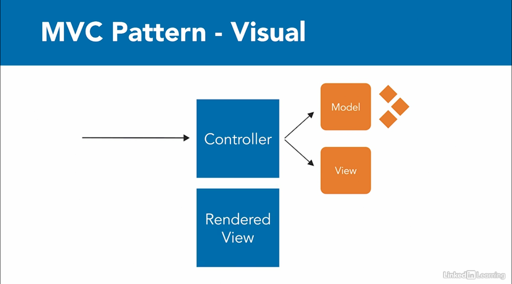

Best practice instead of using @AutoWired, because for in such case its difficult to test. now since we have constructor
its easy to test.

# Spring Boot Interview Questions

1.     Spring vs Spring Boot
2.     What is Spring Boot and mention the need for it?
3.     Mention the advantages of Spring Boot
4.     Mention a few features of Spring Boot.
5.     Explain how to create a Spring Boot application using Maven.
6.     Mention the possible sources of external configuration.
7.     Can you explain what happens in the background when a Spring Boot Application is “Run as Java Application”?
8.     What are the Spring Boot starters and what are the available starters?
9.     Explain Spring Actuator and its advantages.
10.     What is Spring Boot dependency management?

1.Spring vs Spring Boot:

Spring is a comprehensive framework for building enterprise Java applications. It provides support for various modules
such as dependency injection, aspect-oriented programming, data access, transaction management, and more.

Spring Boot, on the other hand, is a framework built on top of the Spring framework that aims to simplify the process of
setting up and configuring Spring applications. It provides conventions and auto-configurations, reducing the need for
manual configuration and boilerplate code.

2. What is Spring Boot and mention the need for it:

Spring Boot is an opinionated framework designed to simplify the development and deployment of Spring-based
applications. It aims to provide a streamlined experience by reducing configuration overhead and allowing developers to
quickly bootstrap Spring applications.

The need for Spring Boot arises from the complexity and verbosity of configuring Spring applications manually. Spring
Boot eliminates much of this complexity by providing default configurations and sensible conventions, allowing
developers to focus more on writing business logic rather than configuring the application.

3. Advantages of Spring Boot:

   Simplified configuration: Spring Boot provides auto-configuration and sensible defaults, reducing the need for manual
   configuration.
   Rapid development: With Spring Boot's convention over configuration approach, developers can quickly bootstrap
   projects and start coding.
   Embedded servers: Spring Boot includes embedded servers like Tomcat, Jetty, or Undertow, allowing applications to be
   easily packaged and deployed as standalone JAR files.
   Production-ready features: Spring Boot includes features like metrics, health checks, and externalized configuration,
   making applications production-ready out of the box.
   Integration with Spring ecosystem: Spring Boot seamlessly integrates with other Spring projects like Spring Data,
   Spring Security, and Spring Cloud.

4. Features of Spring Boot:

   Auto-configuration: Spring Boot automatically configures beans based on classpath and property settings.
   Embedded servers: Spring Boot includes embedded servers like Tomcat, Jetty, or Undertow.
   Dependency management: Spring Boot manages dependencies through starter POMs.
   Externalized configuration: Spring Boot allows configuration to be externalized using property files, YAML files,
   environment variables, or command-line arguments.
   Actuator: Spring Boot Actuator provides production-ready features like monitoring, metrics, and health checks.

5. How to create a Spring Boot application using Maven:

To create a Spring Boot application using Maven, you can use the Spring Initializr web tool or the Spring Boot CLI.
Alternatively, you can manually configure a Maven project with Spring Boot dependencies.

Here's how you can create a Spring Boot application using Maven manually:

    Create a new Maven project:

    bash

mvn archetype:generate -DgroupId=com.example -DartifactId=my-spring-boot-app
-DarchetypeArtifactId=maven-archetype-quickstart -DinteractiveMode=false

Add Spring Boot starter dependencies to pom.xml:

xml

<dependency>
    <groupId>org.springframework.boot</groupId>
    <artifactId>spring-boot-starter-web</artifactId>
</dependency>

Create a main class with @SpringBootApplication annotation:

java

    package com.example;

    import org.springframework.boot.SpringApplication;
    import org.springframework.boot.autoconfigure.SpringBootApplication;

    @SpringBootApplication
    public class MySpringBootApplication {

        public static void main(String[] args) {
            SpringApplication.run(MySpringBootApplication.class, args);
        }
    }

6. Possible sources of external configuration:

Spring Boot allows external configuration to be provided from various sources:

    Property files: application.properties or application.yml
    YAML files: application.yml
    Environment variables
    Command-line arguments
    Profile-specific property files (e.g., application-dev.properties for the dev profile)
    Custom property sources using @PropertySource annotation

7. What happens in the background when a Spring Boot Application is “Run as Java Application”:

When a Spring Boot application is run as a Java application, Spring Boot's embedded server (e.g., Tomcat) is started,
and the application context is initialized based on auto-configurations and component scanning. Spring Boot scans the
classpath for beans and auto-configures them based on the presence of certain dependencies and properties.

8. Spring Boot starters and available starters:

Spring Boot starters are a set of convenient dependency descriptors that allow you to quickly set up and configure
common use cases in Spring applications. Some available starters include:

    spring-boot-starter-web: Starter for building web applications using Spring MVC.
    spring-boot-starter-data-jpa: Starter for using Spring Data JPA.
    spring-boot-starter-security: Starter for securing Spring applications using Spring Security.
    spring-boot-starter-test: Starter for testing Spring Boot applications.
    spring-boot-starter-actuator: Starter for using Spring Boot Actuator.

9. Spring Actuator and its advantages:

Spring Boot Actuator provides production-ready features to monitor and manage Spring Boot applications. Some advantages
include:

    Health checks: Provides insights into the health of application components.
    Metrics: Exposes metrics about application behavior and performance.
    Auditing: Tracks and exposes information about HTTP requests.
    Environment details: Exposes information about application properties and environment variables.
    Custom endpoints: Allows developers to create custom management endpoints for specific monitoring needs.

10. Spring Boot dependency management:

Spring Boot dependency management simplifies dependency management in Spring Boot applications by providing a set of
curated dependencies and their corresponding versions. This allows developers to declare dependencies using starter POMs
without worrying about version conflicts or compatibility issues. Additionally, Spring Boot's dependency management
plugin automatically manages versions and dependencies, reducing the need for manual configuration.

---

## what is system design ? what questions interviewer may ask a spring boot developer on this topic ?

System design refers to the process of designing the architecture, components, and interactions of a software system to
meet specified requirements. It involves making decisions about various aspects such as scalability, reliability,
performance, security, and maintainability. System design encompasses both high-level architecture design and low-level
component design.

For a Spring Boot developer, system design questions might focus on how they would design and implement various
components of a system using Spring Boot and related technologies. Here are some interview questions a Spring Boot
developer might encounter in a system design interview:

1. **Explain the architecture of a typical Spring Boot application.**
    - This question assesses the candidate's understanding of the overall structure of a Spring Boot application,
      including controllers, services, repositories, and how they interact.

2. **How would you design a microservices architecture using Spring Boot?**
    - This question evaluates the candidate's knowledge of microservices principles and how they would implement them
      using Spring Boot, including service discovery, communication between services, and handling distributed data.

3. **What are the advantages and disadvantages of using Spring Boot for building microservices?**
    - This question assesses the candidate's ability to critically evaluate technology choices and consider trade-offs
      in system design.

4. **Explain how you would implement security in a Spring Boot application.**
    - This question tests the candidate's understanding of security concepts such as authentication, authorization, and
      encryption, and how they would implement them using Spring Security.

5. **How would you design a caching strategy for a Spring Boot application?**
    - This question evaluates the candidate's ability to improve performance by implementing caching mechanisms using
      technologies like Spring Cache or external caching solutions like Redis.

6. **Describe how you would handle database interactions efficiently in a Spring Boot application.**
    - This question assesses the candidate's knowledge of best practices for database access, including techniques like
      connection pooling, ORM frameworks like Hibernate, and optimizing queries.

7. **Explain how you would ensure scalability in a Spring Boot application.**
    - This question tests the candidate's understanding of scalability principles and how they would design the
      application to handle increasing loads, including techniques like load balancing, horizontal scaling, and
      distributed caching.

8. **What considerations would you take into account when designing the logging and monitoring system for a Spring Boot
   application?**
    - This question evaluates the candidate's ability to design robust logging and monitoring solutions using frameworks
      like Logback, Log4j, or external monitoring tools like Prometheus and Grafana.

9. **How would you design the messaging system for communication between components in a distributed Spring Boot
   application?**
    - This question assesses the candidate's understanding of messaging patterns such as publish-subscribe and
      point-to-point, and how they would implement them using technologies like RabbitMQ or Kafka.

10. **Explain how you would ensure fault tolerance and resilience in a Spring Boot application.**
- This question tests the candidate's ability to design for failure by implementing strategies such as circuit breakers,
  retries, and fallback mechanisms using frameworks like Hystrix or Resilience4j.

These questions cover various aspects of system design relevant to a Spring Boot developer, including architecture,
scalability, security, performance, and fault tolerance. It's essential for the candidate to demonstrate a solid
understanding of these concepts and their practical application in designing and building robust software systems.